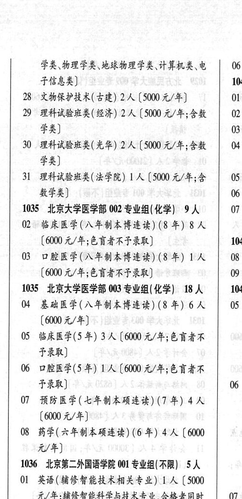

# 1035 北京大学医学部

- PDF页码：3
- 书内页码：52
- 专业组：2；专业条目：6

## 002专业组

- 选科要求：化学
- 招生计划：9 人
- 校验：review

| 专业代码 | 专业名称 | 计划人数 | 学费（元/年） | 备注/完整OCR内容 |
|---|---|---:|---:|---|
| 03 | 口腔医学(入年制本博连读) (8 年) 1A 08 |  | 6000 | 6000 元/年;色盲者不子录取] 09 |

<details><summary>本专业组OCR原文</summary>

```text
1035 ”北京大学医学部 002 专业组( 化学) 9人   07
03 口腔医学(入年制本博连读) (8 年) 1A   08
[6000 元/年;色盲者不子录取]         09
```
</details>

## 003专业组

- 选科要求：化学
- 招生计划：18 人
- 校验：review

| 专业代码 | 专业名称 | 计划人数 | 学费（元/年） | 备注/完整OCR内容 |
|---|---|---:|---:|---|
| 04 | 基础医学(八年制本博连读) (8 年) | 6 | 6000 | \| 05 (6000 元/年] |
| 05 | 临床医学(5 年) | 3 | 6000 | 【6000 元/年;色盲者不 FRR) |
| 06 | 口腔医学(5年) 1A ( |  | 600 | 600 元/年;色育者不 FRR) 06 |
| 07 | 预防医学(七年制本硕连读) (7 年) | 4 | 6000 | [6000元/年] |
| 08 | 药学( 六年制本硕连读) (6 #) 4A ( |  | 6000 | 6000 元/年] |

<details><summary>本专业组OCR原文</summary>

```text
1035 ”北京大学医学部 003 专业组(化学) 18 人   1041
04 基础医学(八年制本博连读) (8 年) 6人 | 05
(6000 元/年]
05 临床医学(5 年) 3 人【6000 元/年;色盲者不
FRR)
06 口腔医学(5年) 1A (600 元/年;色育者不
FRR)                  06
07 预防医学(七年制本硕连读) (7 年) 4 人
[6000元/年]
08 药学( 六年制本硕连读) (6 #) 4A (6000
元/年]
```
</details>

## 附：院校完整OCR原文

```text
--- PDF第3页（书内第52页），第2栏 ---
1035 ”北京大学医学部 002 专业组( 化学) 9人   07
2 “临床医学(入年制本博连读) (8 年) 8 人
(6000 元/年;色谨者不子录取]         104
03 口腔医学(入年制本博连读) (8 年) 1A   08
[6000 元/年;色盲者不子录取]         09
1035 ”北京大学医学部 003 专业组(化学) 18 人   1041
04 基础医学(八年制本博连读) (8 年) 6人 | 05
(6000 元/年]
05 临床医学(5 年) 3 人【6000 元/年;色盲者不
FRR)
06 口腔医学(5年) 1A (600 元/年;色育者不
FRR)                  06
07 预防医学(七年制本硕连读) (7 年) 4 人
[6000元/年]
08 药学( 六年制本硕连读) (6 #) 4A (6000
元/年]
```

## 源图

