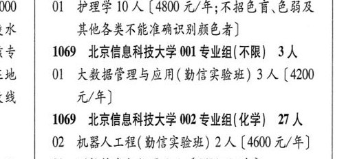

# 1068 北京协和医学院

- PDF页码：8
- 书内页码：57
- 专业组：1；专业条目：0

## 001专业组

- 选科要求：化学
- 招生计划：10 人
- 校验：review

| 专业代码 | 专业名称 | 计划人数 | 学费（元/年） | 备注/完整OCR内容 |
|---|---|---:|---:|---|
|  | 结构化OCR未稳定切分，请查看下方原文及源图 |  |  |  |

<details><summary>本专业组OCR原文</summary>

```text
1068 北京协和医学院 001 专业组( 化学) 10 人
000 | Ol 护理学10 人[4800 元/年;不招色盲色弱及
水     其他各类不能准确识别颜色者]
```
</details>

## 附：院校完整OCR原文

```text
--- PDF第8页（书内第57页），第2栏 ---
1068 北京协和医学院 001 专业组( 化学) 10 人
000 | Ol 护理学10 人[4800 元/年;不招色盲色弱及
水     其他各类不能准确识别颜色者]
```

## 源图

