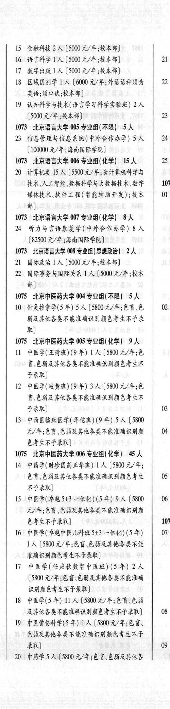
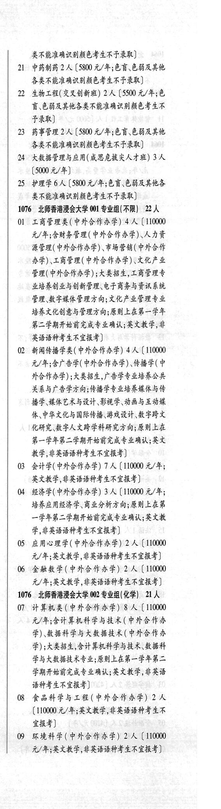

# 1075 北京中医药大学

- PDF页码：9
- 书内页码：58
- 专业组：3；专业条目：16

## 004专业组

- 选科要求：不限
- 招生计划：5 人
- 校验：ok

| 专业代码 | 专业名称 | 计划人数 | 学费（元/年） | 备注/完整OCR内容 |
|---|---|---:|---:|---|
| 10 | 针灸推拿学(5 年) | 5 | 5800 | 【5800元/年;色盲\色 \| 02 弱及其他各类不能准确识别颜色考生不予录 he) |

<details><summary>本专业组OCR原文</summary>

```text
1075 北京中医药大学 004 专业组(不限) 5人
10 针灸推拿学(5 年) 5 人【5800元/年;色盲\色 | 02
弱及其他各类不能准确识别颜色考生不予录
he)
```
</details>

## 005专业组

- 选科要求：化学
- 招生计划：OCR未稳定识别 人
- 校验：review

| 专业代码 | 专业名称 | 计划人数 | 学费（元/年） | 备注/完整OCR内容 |
|---|---|---:|---:|---|
| 11 | 中医学(王琦班)(9 年) 1A ( |  | 5800 | 5800 元/年;色 盲,色弱及其他各类不能准确识别颜色考生不 FRR) |
| 12 | PEE(RRH) (OF) 3A ( |  | 5800 | 5800 元/年;色 盲.色弱及其他各类不能准确识别颜色考生不 FRE) 03 |
| 13 | “中西医临床医学(华伦班)(9 年) 5A ( |  | 5800 | 5800 元/年;色盲\色弱及其他各类不能准确识别颜 4 EFERF RK) |

<details><summary>本专业组OCR原文</summary>

```text
1075 北京中医药大学 005 专业组(化学) 9A 盲,色弱及其他各类不能准确识别颜色考生不
11 中医学(王琦班)(9 年) 1A (5800 元/年;色
盲,色弱及其他各类不能准确识别颜色考生不
FRR)
12 PEE(RRH) (OF) 3A (5800 元/年;色
盲.色弱及其他各类不能准确识别颜色考生不
FRE)                  03
13 “中西医临床医学(华伦班)(9 年) 5A (5800
元/年;色盲\色弱及其他各类不能准确识别颜   4
EFERF RK)
```
</details>

## 006专业组

- 选科要求：化学
- 招生计划：4 人
- 校验：review

| 专业代码 | 专业名称 | 计划人数 | 学费（元/年） | 备注/完整OCR内容 |
|---|---|---:|---:|---|
| 14 | 中药学(时珍国药正华班) 1A ( |  | 5800 | 5800 元/年; 色育、色台及其他各类不能准确识别颜色考生 05 不予录取)] |
| 15 | 中医学(草越5+3 一体化)(5年) | 9 |  | [5800 \| 06 元/年;色盲\色能及其他各类不能准确识别颜 色考生不巴录取] 1076 |
| 16 | 中医学(齐越中医儿科班 +3 一体化) (5 年) 07 LA ( |  | 5800 | 5800 元/年;色盲.色弱及其他各类不能 准确识别颜色考生不予录取] |
| 17 | 中医学(任应秋数智中医班) (5 年) | 2 | 5800 | (5800 元/年;色育\色弱及其他各类不能准确 识别颜色考生不予录取] |
| 18 | 中医学(5年) | 11 |  | (5800 0/4; 68. 68 及其他各类不能准确识别颜色考生不耶录取] 08 |
| 19 | 中医骨伤科学(5 年) 1A ( |  | 5800 | 5800 元/年;色盲、 色能及其他各类不能准确识别颜色考生不也 录取)] 09 |
| 20 | 中药学 | 5 | 5800 | 【5800 元/年;色盲\色弱及其他各 类不能准确识别颜色考生不予录取] |
| 21 | 中药制药 | 2 | 5800 | [5800 元/年;色育\色弱及其他 各类不能准确识别颜色考生不予录取] |
| 22 | 生物工程(交叉创新班) | 2 | 5500 | 【5500 元/年;色 讶色弱及其他各类不能准确识别颜色考生不 FRR) |
| 23 | 药事管理 | 2 |  | 【5800 4/4; EF CHAK 各类不能准确识别颜色考生不耶录取] |
| 24 | 大数据管理与应用(成思危拔夫人才班) | 3 | 5000 | [5000 元/年] |
| 25 | 护理学 | 6 | 5800 | [5800 元/年;色育\色弱及其他各 类不能准确识别颜色考生不予录取] |

<details><summary>本专业组OCR原文</summary>

```text
1075 北京中医药大学 006 专业组(化学) 4 人
14 中药学(时珍国药正华班) 1A (5800 元/年;
色育、色台及其他各类不能准确识别颜色考生   05
不予录取)]
15 ,中医学(草越5+3 一体化)(5年) 9人 [5800 | 06
元/年;色盲\色能及其他各类不能准确识别颜
色考生不巴录取]              1076
16 中医学(齐越中医儿科班 +3 一体化) (5 年)   07
LA (5800 元/年;色盲.色弱及其他各类不能
准确识别颜色考生不予录取]
17 中医学(任应秋数智中医班) (5 年) 2 人
(5800 元/年;色育\色弱及其他各类不能准确
识别颜色考生不予录取]
18 中医学(5年) 11 人(5800 0/4; 68. 68
及其他各类不能准确识别颜色考生不耶录取]   08
19 中医骨伤科学(5 年) 1A (5800 元/年;色盲、
色能及其他各类不能准确识别颜色考生不也
录取)]                   09
20 中药学5人【5800 元/年;色盲\色弱及其他各
类不能准确识别颜色考生不予录取]
21 中药制药 2 人[5800 元/年;色育\色弱及其他
各类不能准确识别颜色考生不予录取]
22 生物工程(交叉创新班) 2 人【5500 元/年;色
讶色弱及其他各类不能准确识别颜色考生不
FRR)
23 药事管理 2 人【5800 4/4; EF CHAK
各类不能准确识别颜色考生不耶录取]
24 大数据管理与应用(成思危拔夫人才班) 3 人
[5000 元/年]
25 护理学6人[5800 元/年;色育\色弱及其他各
类不能准确识别颜色考生不予录取]
```
</details>

## 附：院校完整OCR原文

```text
--- PDF第9页（书内第58页），第2栏 ---
1075 北京中医药大学 004 专业组(不限) 5人
10 针灸推拿学(5 年) 5 人【5800元/年;色盲\色 | 02
弱及其他各类不能准确识别颜色考生不予录
he)
1075 北京中医药大学 005 专业组(化学) 9A
11 中医学(王琦班)(9 年) 1A (5800 元/年;色
盲,色弱及其他各类不能准确识别颜色考生不
FRR)
12 PEE(RRH) (OF) 3A (5800 元/年;色
盲.色弱及其他各类不能准确识别颜色考生不
FRE)                  03
13 “中西医临床医学(华伦班)(9 年) 5A (5800
元/年;色盲\色弱及其他各类不能准确识别颜   4
EFERF RK)
1075 北京中医药大学 006 专业组(化学) 4 人
14 中药学(时珍国药正华班) 1A (5800 元/年;
色育、色台及其他各类不能准确识别颜色考生   05
不予录取)]
15 ,中医学(草越5+3 一体化)(5年) 9人 [5800 | 06
元/年;色盲\色能及其他各类不能准确识别颜
色考生不巴录取]              1076
16 中医学(齐越中医儿科班 +3 一体化) (5 年)   07
LA (5800 元/年;色盲.色弱及其他各类不能
准确识别颜色考生不予录取]
17 中医学(任应秋数智中医班) (5 年) 2 人
(5800 元/年;色育\色弱及其他各类不能准确
识别颜色考生不予录取]
18 中医学(5年) 11 人(5800 0/4; 68. 68
及其他各类不能准确识别颜色考生不耶录取]   08
19 中医骨伤科学(5 年) 1A (5800 元/年;色盲、
色能及其他各类不能准确识别颜色考生不也
录取)]                   09
20 中药学5人【5800 元/年;色盲\色弱及其他各

--- PDF第9页（书内第58页），第3栏 ---
类不能准确识别颜色考生不予录取]
21 中药制药 2 人[5800 元/年;色育\色弱及其他
各类不能准确识别颜色考生不予录取]
22 生物工程(交叉创新班) 2 人【5500 元/年;色
讶色弱及其他各类不能准确识别颜色考生不
FRR)
23 药事管理 2 人【5800 4/4; EF CHAK
各类不能准确识别颜色考生不耶录取]
24 大数据管理与应用(成思危拔夫人才班) 3 人
[5000 元/年]
25 护理学6人[5800 元/年;色育\色弱及其他各
类不能准确识别颜色考生不予录取]
```

## 源图


