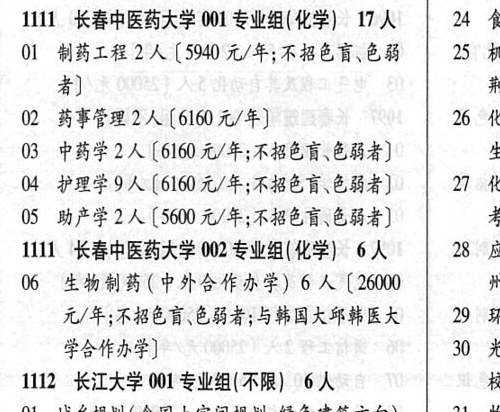

# 1111 长春中医药大学

- PDF页码：13
- 书内页码：62
- 专业组：2；专业条目：5

## 001专业组

- 选科要求：化学
- 招生计划：17 人
- 校验：review

| 专业代码 | 专业名称 | 计划人数 | 学费（元/年） | 备注/完整OCR内容 |
|---|---|---:|---:|---|
| 02 | BFE 2A ( |  | 610 | 610 元/年] 26 化 |
| 03 | 中药学 | 2 | 6160 | 【6160 元/年;不招色盲、色弱者] cz |
| 04 | 护理学 | 9 | 6160 | [6160 元/年;不招色盲\色弱者] 27 化 |
| 05 | 助产学 | 2 |  | 【5600 A/F; ABE EHS) 考， |

<details><summary>本专业组OCR原文</summary>

```text
1111 长春中医药大学 001 专业组(化学) 17 人   24 食
02 BFE 2A (610 元/年]          26 化
03 中药学 2 人【6160 元/年;不招色盲、色弱者]    cz
04 护理学9人[6160 元/年;不招色盲\色弱者]   27 化
05 助产学2 人【5600 A/F; ABE EHS)     考，
```
</details>

## 002专业组

- 选科要求：化学
- 招生计划：6 人
- 校验：sum-corrected

| 专业代码 | 专业名称 | 计划人数 | 学费（元/年） | 备注/完整OCR内容 |
|---|---|---:|---:|---|
| 06 | 生物制药(中外合作办学) | 6 |  | 【26000 州 元/年;不招色盲\色能者;与韩国大印韩医大“\| 29 环: 学合作办学] 30 光\| |

<details><summary>本专业组OCR原文</summary>

```text
1111 长春中医药大学 002 专业组(化学) 6A   28 应| 元/年;不招色盲\色能者;与韩国大印韩医大“| 29 环:
06 生物制药(中外合作办学) 6 人【26000      州
元/年;不招色盲\色能者;与韩国大印韩医大“| 29 环:
学合作办学]                30 光|
```
</details>

## 附：院校完整OCR原文

```text
--- PDF第13页（书内第62页），第2栏 ---
1111 长春中医药大学 001 专业组(化学) 17 人   24 食
OL 制药工程 2 人【5940 A/F; BERBER | 25 机
者]                     cE
02 BFE 2A (610 元/年]          26 化
03 中药学 2 人【6160 元/年;不招色盲、色弱者]    cz
04 护理学9人[6160 元/年;不招色盲\色弱者]   27 化
05 助产学2 人【5600 A/F; ABE EHS)     考，
1111 长春中医药大学 002 专业组(化学) 6A   28 应|
06 生物制药(中外合作办学) 6 人【26000      州
元/年;不招色盲\色能者;与韩国大印韩医大“| 29 环:
学合作办学]                30 光|
```

## 源图

