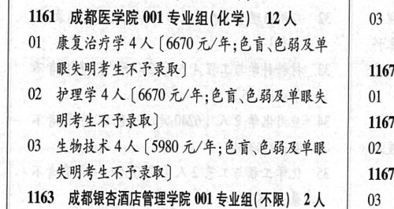

# 1161 成都医学院

- PDF页码：17
- 书内页码：66
- 专业组：1；专业条目：3

## 001专业组

- 选科要求：化学
- 招生计划：OCR未稳定识别 人
- 校验：review

| 专业代码 | 专业名称 | 计划人数 | 学费（元/年） | 备注/完整OCR内容 |
|---|---|---:|---:|---|
| 01 | 康复治疗学 | 4 | 6670 | 【6670元/年;色盲色弱及单 有眼失明考生不予录取] 1167 |
| 02 | PRELA (60 A/F; ER EHAEMA \| 01 4 明考生不予录取] 1167 |  |  | 02 PRELA (60 A/F; ER EHAEMA \| 01 4 明考生不予录取] 1167 |
| 03 | 生物技术 | 4 | 5980 | 【5980 元/年;色盲、色弱及单眼 02 3 失明考生不予录取] 1167 |

<details><summary>本专业组OCR原文</summary>

```text
1161 成都医学院 001 专业组(化学) 12 A     03 4 有眼失明考生不予录取]            1167
Ol 康复治疗学4 人【6670元/年;色盲色弱及单
有眼失明考生不予录取]            1167
02 PRELA (60 A/F; ER EHAEMA | 01 4
明考生不予录取]              1167
03 生物技术4 人【5980 元/年;色盲、色弱及单眼   02 3
失明考生不予录取]             1167
```
</details>

## 附：院校完整OCR原文

```text
--- PDF第17页（书内第66页），第2栏 ---
1161 成都医学院 001 专业组(化学) 12 A     03 4
Ol 康复治疗学4 人【6670元/年;色盲色弱及单
有眼失明考生不予录取]            1167
02 PRELA (60 A/F; ER EHAEMA | 01 4
明考生不予录取]              1167
03 生物技术4 人【5980 元/年;色盲、色弱及单眼   02 3
失明考生不予录取]             1167
```

## 源图

