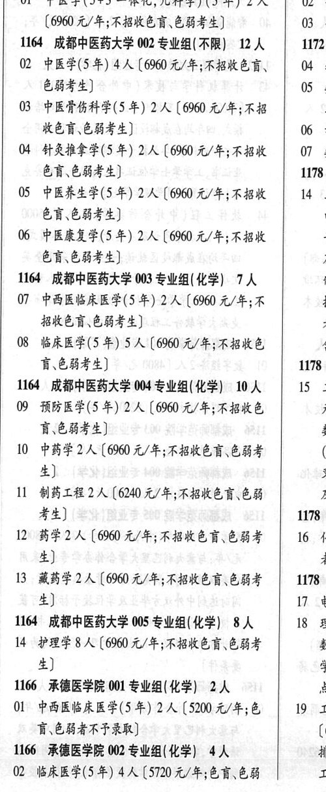

# 1164 成都中医药大学

- PDF页码：17
- 书内页码：66
- 专业组：5；专业条目：15

## 001专业组

- 选科要求：不限
- 招生计划：2 人
- 校验：sum-corrected

| 专业代码 | 专业名称 | 计划人数 | 学费（元/年） | 备注/完整OCR内容 |
|---|---|---:|---:|---|
| 01 | 中医学(5+3 一体化,儿科学) (5 年) | 2 | 6960 | 02 4 (6960 元/年;不招收色盲、色弱考生] 03 4 |

<details><summary>本专业组OCR原文</summary>

```text
1164 成都中医药大学 001 专业组(不限】 2A   oO 3 (6960 元/年;不招收色盲、色弱考生]      03 4
Ol 中医学(5+3 一体化,儿科学) (5 年) 2 人   02 4
(6960 元/年;不招收色盲、色弱考生]      03 4
```
</details>

## 002专业组

- 选科要求：不限
- 招生计划：12 人
- 校验：review

| 专业代码 | 专业名称 | 计划人数 | 学费（元/年） | 备注/完整OCR内容 |
|---|---|---:|---:|---|
| 02 | 中医学(5年) | 4 |  | 【6960 A/F; ROKER, \| 04 ¥ 6844) 05 4 |
| 03 | 中医骨伤科学(5 年) 2A ( |  | 6900 | 6900 元/年;不招 KER EBS) 06 4 |
| 04 | 针灸推拿学(5 年) 2A ( |  | 6000 | 6000 元/年;不招收 \| 07 ¥ 色盲色弱考生] 1178 |
| 05 | 中医养生学(5 年) 2A ( |  | 6900 | 6900 元/年;不招收 \| 14 2 |
| 65 | 6844) 电 |  |  | 65,6844) 电 |
| 06 | 中医康复学(5 年) 2A ( |  | 6960 | 6960 元/年;不招收 7 6H.E8F2) 及 |

<details><summary>本专业组OCR原文</summary>

```text
1164 成都中医药大学 002 专业组(不限】 12 人   1172
02 中医学(5年) 4人【6960 A/F; ROKER, | 04 ¥
6844)                 05 4
03 中医骨伤科学(5 年) 2A (6900 元/年;不招
KER EBS)              06 4
04 针灸推拿学(5 年) 2A (6000 元/年;不招收 | 07 ¥
色盲色弱考生]               1178
05 中医养生学(5 年) 2A (6900 元/年;不招收 | 14 2
65,6844)                 电
06 中医康复学(5 年) 2A (6960 元/年;不招收    7
6H.E8F2)                及
```
</details>

## 003专业组

- 选科要求：化学
- 招生计划：7 人
- 校验：review

| 专业代码 | 专业名称 | 计划人数 | 学费（元/年） | 备注/完整OCR内容 |
|---|---|---:|---:|---|
| 07 | 中西医临床医学(5 年) 2A ( |  | 6960 | 6960 元/年;不 ¥ BREW EHF 4) 4 |
| 08 | 临床医学(5 年) | 5 | 6960 | 【6960 元/年;不招收色 4 讶色弱考生] 1178 |

<details><summary>本专业组OCR原文</summary>

```text
1164 成都中医药大学 003 专业组(化学) 7 人     #
07 中西医临床医学(5 年) 2A (6960 元/年;不    ¥
BREW EHF 4)               4
08 临床医学(5 年) 5 人【6960 元/年;不招收色     4
讶色弱考生]               1178
```
</details>

## 004专业组

- 选科要求：化学
- 招生计划：10 人
- 校验：review

| 专业代码 | 专业名称 | 计划人数 | 学费（元/年） | 备注/完整OCR内容 |
|---|---|---:|---:|---|
| 09 | 预防医学(5 年) 2A ( |  | 6900 | 6900 元/年;不招收色 元 育\色境考生] i |
| 10 | 中药学 | 2 |  | [6960 A/F; ABKED CHF (3 4) 5 |
| 11 | 制药工程 | 2 |  | 【6240 4/4; KBKED EB 及 考生] 1178 |
| 12 | 药学 | 2 | 6960 | 【6960 元/年;不招收色盲、色弱考 16 化 4) 者 |
| 13 | 藏药学 | 2 | 6960 | [6960 元/年;不招收色育\色弱考 \| 1178 ， 生] ne |

<details><summary>本专业组OCR原文</summary>

```text
1164 成都中医药大学 004 专业组( 化学) 10 人   15 x
09 预防医学(5 年) 2A (6900 元/年;不招收色     元
育\色境考生]                 i
10 中药学2 人[6960 A/F; ABKED CHF    (3
4)                      5
11 制药工程2人【6240 4/4; KBKED EB    及
考生]                   1178
12 药学2 人【6960 元/年;不招收色盲、色弱考   16 化
4)                      者
13 藏药学2 人[6960 元/年;不招收色育\色弱考 | 1178 ，
生]                 ne
```
</details>

## 005专业组

- 选科要求：化学
- 招生计划：8 人
- 校验：ok

| 专业代码 | 专业名称 | 计划人数 | 学费（元/年） | 备注/完整OCR内容 |
|---|---|---:|---:|---|
| 14 | 护理学 | 8 | 6960 | [6960 元/年;不招收色盲色弱考 数 生] 学 |

<details><summary>本专业组OCR原文</summary>

```text
1164 成都中医药大学 005 专业组(化学) 8 人   18 2
14 护理学8 人[6960 元/年;不招收色盲色弱考     数
生]                      学
```
</details>

## 附：院校完整OCR原文

```text
--- PDF第17页（书内第66页），第2栏 ---
1164 成都中医药大学 001 专业组(不限】 2A   oO 3
Ol 中医学(5+3 一体化,儿科学) (5 年) 2 人   02 4
(6960 元/年;不招收色盲、色弱考生]      03 4
1164 成都中医药大学 002 专业组(不限】 12 人   1172
02 中医学(5年) 4人【6960 A/F; ROKER, | 04 ¥
6844)                 05 4
03 中医骨伤科学(5 年) 2A (6900 元/年;不招
KER EBS)              06 4
04 针灸推拿学(5 年) 2A (6000 元/年;不招收 | 07 ¥
色盲色弱考生]               1178
05 中医养生学(5 年) 2A (6900 元/年;不招收 | 14 2
65,6844)                 电
06 中医康复学(5 年) 2A (6960 元/年;不招收    7
6H.E8F2)                及
1164 成都中医药大学 003 专业组(化学) 7 人     #
07 中西医临床医学(5 年) 2A (6960 元/年;不    ¥
BREW EHF 4)               4
08 临床医学(5 年) 5 人【6960 元/年;不招收色     4
讶色弱考生]               1178
1164 成都中医药大学 004 专业组( 化学) 10 人   15 x
09 预防医学(5 年) 2A (6900 元/年;不招收色     元
育\色境考生]                 i
10 中药学2 人[6960 A/F; ABKED CHF    (3
4)                      5
11 制药工程2人【6240 4/4; KBKED EB    及
考生]                   1178
12 药学2 人【6960 元/年;不招收色盲、色弱考   16 化
4)                      者
13 藏药学2 人[6960 元/年;不招收色育\色弱考 | 1178 ，
生]                 ne
1164 成都中医药大学 005 专业组(化学) 8 人   18 2
14 护理学8 人[6960 元/年;不招收色盲色弱考     数
生]                      学
```

## 源图

