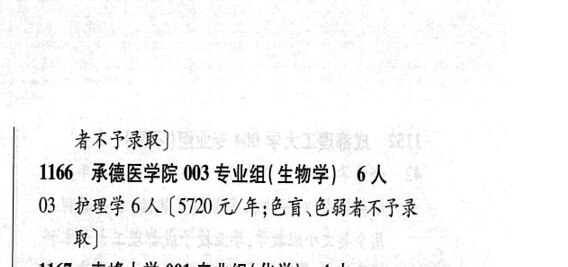

# 1166 承德医学院

- PDF页码：17
- 书内页码：66
- 专业组：3；专业条目：3

## 001专业组

- 选科要求：化学
- 招生计划：OCR未稳定识别 人
- 校验：review

| 专业代码 | 专业名称 | 计划人数 | 学费（元/年） | 备注/完整OCR内容 |
|---|---|---:|---:|---|
| 01 | 中西医临床医学(5 年) 2A ( |  | 5200 | 5200 元/年;色 19 x: BH ERFAF RR) [6 |

<details><summary>本专业组OCR原文</summary>

```text
1166 承德医学院 001 专业组( 化学) 2A       点 BH ERFAF RR)               [6
Ol 中西医临床医学(5 年) 2A (5200 元/年;色   19 x:
BH ERFAF RR)               [6
```
</details>

## 002专业组

- 选科要求：化学
- 招生计划：4 人
- 校验：ok

| 专业代码 | 专业名称 | 计划人数 | 学费（元/年） | 备注/完整OCR内容 |
|---|---|---:|---:|---|
| 02 | 临床医学(5 年) | 4 | 5720 | 【5720 元/年;色盲、色能 = 者不予录取] |

<details><summary>本专业组OCR原文</summary>

```text
1166 承德医学院 002 专业组( 化学) 4人       排
02 临床医学(5 年) 4 人【5720 元/年;色盲、色能     =
者不予录取]
```
</details>

## 003专业组

- 选科要求：生物学
- 招生计划：6 人
- 校验：ok

| 专业代码 | 专业名称 | 计划人数 | 学费（元/年） | 备注/完整OCR内容 |
|---|---|---:|---:|---|
| 03 | 护理学 | 6 | 5720 | [5720 元/年;色育\色弱者不子录 取] |

<details><summary>本专业组OCR原文</summary>

```text
1166 ”承德医学院 003 专业组( 生物学) 6人
03 护理学6人[5720 元/年;色育\色弱者不子录
取]
```
</details>

## 附：院校完整OCR原文

```text
--- PDF第17页（书内第66页），第2栏 ---
1166 承德医学院 001 专业组( 化学) 2A       点
Ol 中西医临床医学(5 年) 2A (5200 元/年;色   19 x:
BH ERFAF RR)               [6
1166 承德医学院 002 专业组( 化学) 4人       排
02 临床医学(5 年) 4 人【5720 元/年;色盲、色能     =

--- PDF第17页（书内第66页），第3栏 ---
者不予录取]
1166 ”承德医学院 003 专业组( 生物学) 6人
03 护理学6人[5720 元/年;色育\色弱者不子录
取]
```

## 源图


