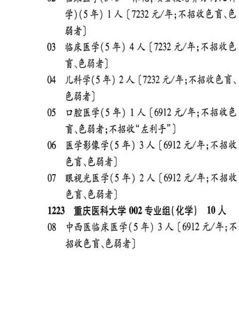
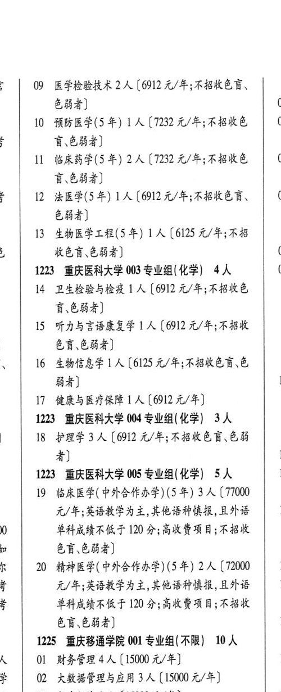

# 1223 重庆医科大学

- PDF页码：20
- 书内页码：69
- 专业组：5；专业条目：15

## 001专业组

- 选科要求：化学
- 招生计划：14 人
- 校验：review

| 专业代码 | 专业名称 | 计划人数 | 学费（元/年） | 备注/完整OCR内容 |
|---|---|---:|---:|---|
| 02 | BARE(5+3 一体化,硕士段培养方向儿科 学)(5年) | 1 | 7232 | [7232 元/年;不招收色盲、色 84) |
| 03 | 临床医学(5 年) 4A ( |  | 1232 | 1232 元/年;不招收色 言\色弱者] |
| 04 | 儿科学(5年) | 2 | 7232 | [7232 元/年;不招收色盲、 84) |
| 05 | 口腔医学(5 年) 1A ( |  | 6912 | 6912 元/年;不招收色 讶.色弱者;不招收"左利手"] |
| 06 | 医学影像学(5 年) | 3 | 6912 | 【6912 元/年;不招收 色盲\色弱者] |
| 07 | 眼视光医学(5 年) | 2 | 6912 | 【6912 元/年;不招收 &F,.b84) |

<details><summary>本专业组OCR原文</summary>

```text
1223 重庆医科大学 001 专业组(化学) 14人
02 BARE(5+3 一体化,硕士段培养方向儿科
学)(5年) 1 人[7232 元/年;不招收色盲、色
84)
03 临床医学(5 年) 4A (1232 元/年;不招收色
言\色弱者]
04 儿科学(5年) 2 人[7232 元/年;不招收色盲、
84)
05 口腔医学(5 年) 1A (6912 元/年;不招收色
讶.色弱者;不招收"左利手"]
06 医学影像学(5 年) 3 人【6912 元/年;不招收
色盲\色弱者]
07 眼视光医学(5 年) 2 人【6912 元/年;不招收
&F,.b84)
```
</details>

## 002专业组

- 选科要求：化学
- 招生计划：10 人
- 校验：review

| 专业代码 | 专业名称 | 计划人数 | 学费（元/年） | 备注/完整OCR内容 |
|---|---|---:|---:|---|
| 08 | 中西医临床医学(5 年) | 3 | 6912 | 【6912 元/年;不 BKED CHA) 了 09 医学检验技术 2 人【6912 元/年;不招收色言、 84) 0 |
| 10 | 预防医学(5 年) 1A ( |  | 1232 | 1232 元/年;不招收色 \| 05 盲\色弱者] |
| 11 | 临床药学(5 年) | 2 | 7232 | 【7232 元/年;不招收色 0 F684) Z 12 法医学(5年) 1 人[6912 元/年;不招收色盲、 07 684) |
| 13 | 生物医学工程(5 年) LA ( |  | 6125 | 6125 元/年;不招 收色盲\色弱者] 0 |

<details><summary>本专业组OCR原文</summary>

```text
1223 重庆医科大学 002 专业组(化学) 10 人
08 中西医临床医学(5 年) 3 人【6912 元/年;不
BKED CHA)
了   09 医学检验技术 2 人【6912 元/年;不招收色言、
84)                 0
10 预防医学(5 年) 1A (1232 元/年;不招收色 | 05
盲\色弱者]
11 临床药学(5 年) 2 人【7232 元/年;不招收色   0
F684)
Z    12 法医学(5年) 1 人[6912 元/年;不招收色盲、    07
684)
13 生物医学工程(5 年) LA (6125 元/年;不招
收色盲\色弱者]              0
```
</details>

## 003专业组

- 选科要求：化学
- 招生计划：4 人
- 校验：review

| 专业代码 | 专业名称 | 计划人数 | 学费（元/年） | 备注/完整OCR内容 |
|---|---|---:|---:|---|
| 14 | 卫生检验与检疫 ] 人 |  | 6912 | 6912 元/年;不招收色 F684) |
| 15 | 听力与言语康复学 | 1 | 6912 | 【6912 元/年;不招收 色盲\色弱者] 、 16 生物信息学 1 人【6125 元/年;不招收色盲\色 4) 1 |
| 17 | 健康与医疗保障 ] 人 |  | 6912 | 6912 元/年] |

<details><summary>本专业组OCR原文</summary>

```text
1223 重庆医科大学 003 专业组(化学) 4人    0s
14 卫生检验与检疫 ] 人【6912 元/年;不招收色
F684)
15 听力与言语康复学 1 人【6912 元/年;不招收
色盲\色弱者]
、   16 生物信息学 1 人【6125 元/年;不招收色盲\色
4)                  1
17 健康与医疗保障 ] 人【6912 元/年]
```
</details>

## 004专业组

- 选科要求：化学
- 招生计划：3 人
- 校验：review

| 专业代码 | 专业名称 | 计划人数 | 学费（元/年） | 备注/完整OCR内容 |
|---|---|---:|---:|---|
|  | 结构化OCR未稳定切分，请查看下方原文及源图 |  |  |  |

<details><summary>本专业组OCR原文</summary>

```text
1223 重庆医科大学 004 专业组(化学) 3人
3   18 护理学3 人【6912 元/年;不招收色盲色弱
者]                   1
```
</details>

## 005专业组

- 选科要求：化学
- 招生计划：OCR未稳定识别 人
- 校验：review

| 专业代码 | 专业名称 | 计划人数 | 学费（元/年） | 备注/完整OCR内容 |
|---|---|---:|---:|---|
| 19 | 临床医学( 中外合作办学) (5 年) | 3 | 77000 | 【77000 元/年;英语教学为主,其他语种慎报,且外语 rk 0 单科成绩不低于 120 分;高收费项目;不招收 te 色盲、色弱者] 人 20 精神医学(中外合作办学) (5 年) 2 人【72000 1 加 元/年;英语教学为主,其他语种慎报,且外语 1 ; 单科成绩不低于 120 分;高收费项目;不招收 |
| 68 | 684) 1 |  |  | 68,684) 1 |

<details><summary>本专业组OCR原文</summary>

```text
1223 重庆医科大学 005 专业组(化学) SA    1 元/年;英语教学为主,其他语种慎报,且外语   rk
19 临床医学( 中外合作办学) (5 年) 3 人【77000
元/年;英语教学为主,其他语种慎报,且外语   rk
0    单科成绩不低于 120 分;高收费项目;不招收
te     色盲、色弱者]
人   20 精神医学(中外合作办学) (5 年) 2 人【72000   1
加     元/年;英语教学为主,其他语种慎报,且外语   1
;     单科成绩不低于 120 分;高收费项目;不招收
68,684)               1
```
</details>

## 附：院校完整OCR原文

```text
--- PDF第20页（书内第69页），第1栏 ---
1223 重庆医科大学 001 专业组(化学) 14人
OL 临床医学(5+3 一体化) (5 年) 1 人【7232
A/F FBKED CHF)
02 BARE(5+3 一体化,硕士段培养方向儿科
学)(5年) 1 人[7232 元/年;不招收色盲、色
84)
03 临床医学(5 年) 4A (1232 元/年;不招收色
言\色弱者]
04 儿科学(5年) 2 人[7232 元/年;不招收色盲、
84)
05 口腔医学(5 年) 1A (6912 元/年;不招收色
讶.色弱者;不招收"左利手"]
06 医学影像学(5 年) 3 人【6912 元/年;不招收
色盲\色弱者]
07 眼视光医学(5 年) 2 人【6912 元/年;不招收
&F,.b84)
1223 重庆医科大学 002 专业组(化学) 10 人
08 中西医临床医学(5 年) 3 人【6912 元/年;不
BKED CHA)

--- PDF第20页（书内第69页），第2栏 ---
了   09 医学检验技术 2 人【6912 元/年;不招收色言、
84)                 0
10 预防医学(5 年) 1A (1232 元/年;不招收色 | 05
盲\色弱者]
11 临床药学(5 年) 2 人【7232 元/年;不招收色   0
F684)
Z    12 法医学(5年) 1 人[6912 元/年;不招收色盲、    07
684)
13 生物医学工程(5 年) LA (6125 元/年;不招
收色盲\色弱者]              0
1223 重庆医科大学 003 专业组(化学) 4人    0s
14 卫生检验与检疫 ] 人【6912 元/年;不招收色
F684)
15 听力与言语康复学 1 人【6912 元/年;不招收
色盲\色弱者]
、   16 生物信息学 1 人【6125 元/年;不招收色盲\色
4)                  1
17 健康与医疗保障 ] 人【6912 元/年]
1223 重庆医科大学 004 专业组(化学) 3人
3   18 护理学3 人【6912 元/年;不招收色盲色弱
者]                   1
1223 重庆医科大学 005 专业组(化学) SA    1
19 临床医学( 中外合作办学) (5 年) 3 人【77000
元/年;英语教学为主,其他语种慎报,且外语   rk
0    单科成绩不低于 120 分;高收费项目;不招收
te     色盲、色弱者]
人   20 精神医学(中外合作办学) (5 年) 2 人【72000   1
加     元/年;英语教学为主,其他语种慎报,且外语   1
;     单科成绩不低于 120 分;高收费项目;不招收
68,684)               1
```

## 源图


