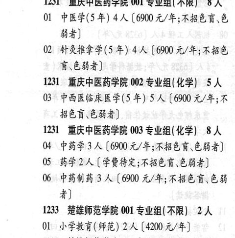

# 1231 重庆中医药学院

- PDF页码：21
- 书内页码：70
- 专业组：3；专业条目：6

## 001专业组

- 选科要求：不限
- 招生计划：8 人
- 校验：ok

| 专业代码 | 专业名称 | 计划人数 | 学费（元/年） | 备注/完整OCR内容 |
|---|---|---:|---:|---|
| 01 | 中医学(5年) | 4 | 6900 | 【6900 元/年;不招色育\色 84) |
| 02 | 针灸推拿学(5 年) | 4 | 6900 | 【6900 元/年;不招色 育\色弱者] |

<details><summary>本专业组OCR原文</summary>

```text
1231 重庆中医药学院 001 专业组(不限) 8 人
Ol 中医学(5年) 4 人【6900 元/年;不招色育\色
84)
02 针灸推拿学(5 年) 4 人【6900 元/年;不招色
育\色弱者]
```
</details>

## 002专业组

- 选科要求：化学
- 招生计划：5 人
- 校验：ok

| 专业代码 | 专业名称 | 计划人数 | 学费（元/年） | 备注/完整OCR内容 |
|---|---|---:|---:|---|
| 03 | 中西医临床医学(5 年) | 5 | 6900 | 【6900 元/年;不 BER ERS) |

<details><summary>本专业组OCR原文</summary>

```text
1231 重庆中医药学院 002 专业组(化学) 5 人
03 中西医临床医学(5 年) 5 人【6900 元/年;不
BER ERS)
```
</details>

## 003专业组

- 选科要求：化学
- 招生计划：8 人
- 校验：review

| 专业代码 | 专业名称 | 计划人数 | 学费（元/年） | 备注/完整OCR内容 |
|---|---|---:|---:|---|
| 04 | 中药学 | 3 | 6900 | [6900 元/年;不招色盲\色弱者] |
| 05 | 药学 | 2 | 学费待定 | [学费待定;不招色盲、色弱者] |
| 06 | 中药制药 3 A (6900 4/4; KHER EH 4) |  |  | 06 中药制药 3 A (6900 4/4; KHER EH 4) |

<details><summary>本专业组OCR原文</summary>

```text
131 重庆中医药学院 003 专业组(化学) 8 人
04 中药学3 人[6900 元/年;不招色盲\色弱者]
05 药学2 人[学费待定;不招色盲、色弱者]
06 中药制药 3 A (6900 4/4; KHER EH
4)
```
</details>

## 附：院校完整OCR原文

```text
--- PDF第21页（书内第70页），第1栏 ---
1231 重庆中医药学院 001 专业组(不限) 8 人
Ol 中医学(5年) 4 人【6900 元/年;不招色育\色
84)
02 针灸推拿学(5 年) 4 人【6900 元/年;不招色
育\色弱者]
1231 重庆中医药学院 002 专业组(化学) 5 人
03 中西医临床医学(5 年) 5 人【6900 元/年;不
BER ERS)
131 重庆中医药学院 003 专业组(化学) 8 人
04 中药学3 人[6900 元/年;不招色盲\色弱者]
05 药学2 人[学费待定;不招色盲、色弱者]
06 中药制药 3 A (6900 4/4; KHER EH
4)
```

## 源图

