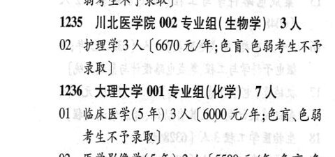

# 1235 川北医学院

- PDF页码：21
- 书内页码：70
- 专业组：2；专业条目：2

## 001专业组

- 选科要求：化学
- 招生计划：5 人
- 校验：ok

| 专业代码 | 专业名称 | 计划人数 | 学费（元/年） | 备注/完整OCR内容 |
|---|---|---:|---:|---|
| 01 | 医学影像学(5年) | 5 | 6670 | 【6670元/年;色盲色 HSLRF RR) |

<details><summary>本专业组OCR原文</summary>

```text
1235 川北医学院 001 专业组(化学) 5人
Ol 医学影像学(5年) 5人【6670元/年;色盲色
HSLRF RR)
```
</details>

## 002专业组

- 选科要求：生物学
- 招生计划：3 人
- 校验：ok

| 专业代码 | 专业名称 | 计划人数 | 学费（元/年） | 备注/完整OCR内容 |
|---|---|---:|---:|---|
| 02 | 护理学 | 3 | 6670 | 【6670 元/年;色盲色弱考生不巴 录取] |

<details><summary>本专业组OCR原文</summary>

```text
1235 川北医学院 002 专业组( 生物学) 3 人
02 护理学3 人【6670 元/年;色盲色弱考生不巴
录取]
```
</details>

## 附：院校完整OCR原文

```text
--- PDF第21页（书内第70页），第1栏 ---
1235 川北医学院 001 专业组(化学) 5人
Ol 医学影像学(5年) 5人【6670元/年;色盲色
HSLRF RR)
1235 川北医学院 002 专业组( 生物学) 3 人
02 护理学3 人【6670 元/年;色盲色弱考生不巴
录取]
```

## 源图

