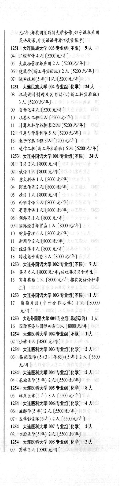
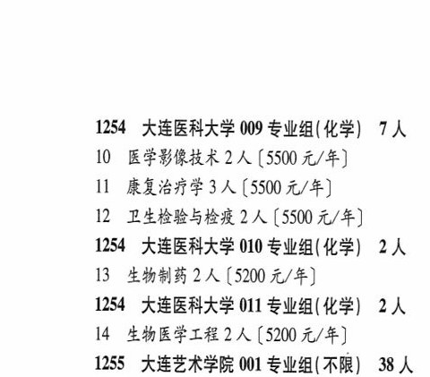

# 1254 大连医科大学

- PDF页码：23, 24
- 书内页码：72, 73
- 专业组：10；专业条目：13

## 002专业组

- 选科要求：不限
- 招生计划：OCR未稳定识别 人
- 校验：review

| 专业代码 | 专业名称 | 计划人数 | 学费（元/年） | 备注/完整OCR内容 |
|---|---|---:|---:|---|
| 02 | FLA (4800 4/#) |  |  | 02 FLA (4800 4/#) |

<details><summary>本专业组OCR原文</summary>

```text
1254 大连医科大学 002 专业组(不限) 1A
02 FLA (4800 4/#)
```
</details>

## 003专业组

- 选科要求：化学
- 招生计划：2 人
- 校验：review

| 专业代码 | 专业名称 | 计划人数 | 学费（元/年） | 备注/完整OCR内容 |
|---|---|---:|---:|---|
| 03 | ”临床医学(5+3 一体化) (5 年) 2A ( |  | 5500 | 5500 元/年] |

<details><summary>本专业组OCR原文</summary>

```text
1254 大连医科大学 003 专业组(化学) 2人
03 ”临床医学(5+3 一体化) (5 年) 2A (5500
元/年]
```
</details>

## 004专业组

- 选科要求：OCR未稳定识别
- 招生计划：2 人
- 校验：ok

| 专业代码 | 专业名称 | 计划人数 | 学费（元/年） | 备注/完整OCR内容 |
|---|---|---:|---:|---|
| 04 | 基础医学(5年) | 2 | 5500 | [5500元/年] |

<details><summary>本专业组OCR原文</summary>

```text
1254 大连医科大学 004 专业组(化学三 2 人
04 基础医学(5年)2人[5500元/年]
```
</details>

## 005专业组

- 选科要求：化学
- 招生计划：8 人
- 校验：ok

| 专业代码 | 专业名称 | 计划人数 | 学费（元/年） | 备注/完整OCR内容 |
|---|---|---:|---:|---|
| 05 | 临床医学(5 年) | 8 | 5500 | [5500元/年] |

<details><summary>本专业组OCR原文</summary>

```text
1254 ”大连医科大学 005 专业组( 化学) 8 人
05 临床医学(5 年) 8 人[5500元/年]
```
</details>

## 006专业组

- 选科要求：OCR未稳定识别
- 招生计划：4 人
- 校验：ok

| 专业代码 | 专业名称 | 计划人数 | 学费（元/年） | 备注/完整OCR内容 |
|---|---|---:|---:|---|
| 06 | ARR (5 年) | 2 | 5500 | 【5500元/年] |
| 07 | ”医学影像学(5年) | 2 | 5500 | (5500 元/年] |

<details><summary>本专业组OCR原文</summary>

```text
1254 大连医科大学 006 专业组(化学六 4 人
06 ARR (5 年) 2 人【5500元/年]
07 ”医学影像学(5年) 2 人 (5500 元/年]
```
</details>

## 007专业组

- 选科要求：化学
- 招生计划：2 人
- 校验：review

| 专业代码 | 专业名称 | 计划人数 | 学费（元/年） | 备注/完整OCR内容 |
|---|---|---:|---:|---|
| 08 | “口腔医学(5年) 2伙 |  | 5500 | 5500元/年] |

<details><summary>本专业组OCR原文</summary>

```text
1254 大连医科大学 007 专业组(化学) 2人
08 “口腔医学(5年) 2伙【5500元/年]
```
</details>

## 008专业组

- 选科要求：化学
- 招生计划：2 人
- 校验：ok

| 专业代码 | 专业名称 | 计划人数 | 学费（元/年） | 备注/完整OCR内容 |
|---|---|---:|---:|---|
| 09 | 药学 | 2 | 5500 | [5500 元/年] |

<details><summary>本专业组OCR原文</summary>

```text
1254 大连医科大学 008 专业组(化学) 2人
09 药学2 人[5500 元/年]
```
</details>

## 009专业组

- 选科要求：化学
- 招生计划：7 人
- 校验：ok

| 专业代码 | 专业名称 | 计划人数 | 学费（元/年） | 备注/完整OCR内容 |
|---|---|---:|---:|---|
| 10 | 医学影像技术 | 2 | 5500 | 【5500 元/年] |
| 11 | 康复治疗学 | 3 | 5500 | [5500 元/年] |
| 12 | 卫生检验与检疫 | 2 | 5500 | 【5500 元/年] |

<details><summary>本专业组OCR原文</summary>

```text
1254 大连医科大学 009 专业组(化学) 7人
10 医学影像技术 2 人【5500 元/年]
11 康复治疗学3 人[5500 元/年]
12 卫生检验与检疫 2 人【5500 元/年]
```
</details>

## 010专业组

- 选科要求：化学
- 招生计划：2 人
- 校验：ok

| 专业代码 | 专业名称 | 计划人数 | 学费（元/年） | 备注/完整OCR内容 |
|---|---|---:|---:|---|
| 13 | 生物制药 | 2 | 5200 | 【5200 元/年] |

<details><summary>本专业组OCR原文</summary>

```text
1254 大连医科大学 010 专业组(化学) 2人
13 生物制药 2 人【5200 元/年]
```
</details>

## 011专业组

- 选科要求：化学
- 招生计划：2 人
- 校验：ok

| 专业代码 | 专业名称 | 计划人数 | 学费（元/年） | 备注/完整OCR内容 |
|---|---|---:|---:|---|
| 14 | 生物医学工程 | 2 | 5200 | 【5200 元/年] |

<details><summary>本专业组OCR原文</summary>

```text
1254 大连医科大学 011 专业组(化学) 2人
14 生物医学工程 2 人【5200 元/年]
```
</details>

## 附：院校完整OCR原文

```text
--- PDF第23页（书内第72页），第3栏 ---
1254 大连医科大学 002 专业组(不限) 1A
02 FLA (4800 4/#)
1254 大连医科大学 003 专业组(化学) 2人
03 ”临床医学(5+3 一体化) (5 年) 2A (5500
元/年]
1254 大连医科大学 004 专业组(化学三 2 人
04 基础医学(5年)2人[5500元/年]
1254 ”大连医科大学 005 专业组( 化学) 8 人
05 临床医学(5 年) 8 人[5500元/年]
1254 大连医科大学 006 专业组(化学六 4 人
06 ARR (5 年) 2 人【5500元/年]
07 ”医学影像学(5年) 2 人 (5500 元/年]
1254 大连医科大学 007 专业组(化学) 2人
08 “口腔医学(5年) 2伙【5500元/年]
1254 大连医科大学 008 专业组(化学) 2人
09 药学2 人[5500 元/年]

--- PDF第24页（书内第73页），第1栏 ---
1254 大连医科大学 009 专业组(化学) 7人
10 医学影像技术 2 人【5500 元/年]
11 康复治疗学3 人[5500 元/年]
12 卫生检验与检疫 2 人【5500 元/年]
1254 大连医科大学 010 专业组(化学) 2人
13 生物制药 2 人【5200 元/年]
1254 大连医科大学 011 专业组(化学) 2人
14 生物医学工程 2 人【5200 元/年]
```

## 源图


