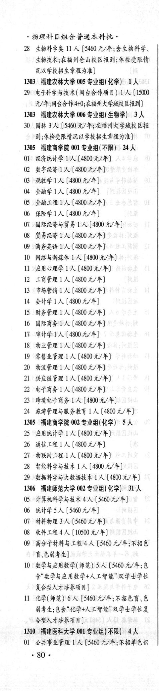
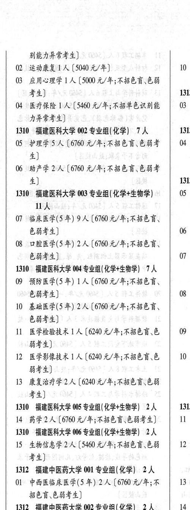

# 1310 福建医科大学

- PDF页码：31
- 书内页码：80
- 专业组：6；专业条目：14

## 001专业组

- 选科要求：不限
- 招生计划：4 人
- 校验：review

| 专业代码 | 专业名称 | 计划人数 | 学费（元/年） | 备注/完整OCR内容 |
|---|---|---:|---:|---|
| 01 | 公共事业管理 | 1 | 5460 | (5460 元/年;不招单色识 。80 . 别能力异常考生] |
| 02 | “运动康复工人 |  | 5040 | 5040元/年] 10 |
| 03 | 应用心理学 | 1 | 500 | (500 元/年;不招色盲\色能 考生] 1313 4 “医疗保险 LA (5400 元/年;不招单色识别能 03 力异常考生] |

<details><summary>本专业组OCR原文</summary>

```text
1310 福建医科大学 001 专业组(不限) 4人
Ol 公共事业管理 1 人 (5460 元/年;不招单色识
。80 .
别能力异常考生]
02 “运动康复工人【5040元/年]         10
03 应用心理学 1 人 (500 元/年;不招色盲\色能
考生]                  1313
4 “医疗保险 LA (5400 元/年;不招单色识别能   03
力异常考生]
```
</details>

## 002专业组

- 选科要求：化学
- 招生计划：7 人
- 校验：review

| 专业代码 | 专业名称 | 计划人数 | 学费（元/年） | 备注/完整OCR内容 |
|---|---|---:|---:|---|
| 05 | PEE SA (6700 4/4; FBER EBS 4 4) |  |  | 05 PEE SA (6700 4/4; FBER EBS 4 4) |
| 06 | BEE LA ( |  | 6100 | 6100 元/年;不招色育\色能考 生] 1313 |

<details><summary>本专业组OCR原文</summary>

```text
1310 福建医科大学 002 专业组( 化学) 7人    1313
05 PEE SA (6700 4/4; FBER EBS   4
4)
06 BEE LA (6100 元/年;不招色育\色能考
生]                   1313
```
</details>

## 003专业组

- 选科要求：化学+生物学
- 招生计划：OCR未稳定识别 人
- 校验：review

| 专业代码 | 专业名称 | 计划人数 | 学费（元/年） | 备注/完整OCR内容 |
|---|---|---:|---:|---|
| 07 | BREF(S#) 9A ( |  | 6700 | 6700 元/年;不招色盲、 色弱考生] 06 |
| 08 | 口腔医学(5年) | 2 |  | 【6760 t/F; KER, E44) 7 |

<details><summary>本专业组OCR原文</summary>

```text
1310 福建医科大学 003 专业组( 化学+生物学)    05 uA
07 BREF(S#) 9A (6700 元/年;不招色盲、
色弱考生]                06
08 口腔医学(5年) 2人【6760 t/F; KER,
E44)                7
```
</details>

## 004专业组

- 选科要求：化学+生物学
- 招生计划：7 人
- 校验：review

| 专业代码 | 专业名称 | 计划人数 | 学费（元/年） | 备注/完整OCR内容 |
|---|---|---:|---:|---|
| 09 | 预防医学(5 年) ] 人 |  | 6760 | 6760 元/年;不招色育、 844) 08 |
| 10 | 基础医学(5 年) | 2 | 6760 | 【6760元/年;不招色言、 EHF) |
| 11 | 医学检验技术 | 1 | 6240 | [6240 元/年;不招色盲色 \| 09 弱考生] |
| 12 | 医学影像技术 1A ( |  | 6240 | 6240 元/年;不招色盲\色 10 弱考生] |
| 13 | 康复治疗学 | 2 | 6240 | 【6240元/年;不招色盲\色弱 考生] |

<details><summary>本专业组OCR原文</summary>

```text
1310 福建医科大学 004 专业组( 化学+生物学) 7 人
09 预防医学(5 年) ] 人[6760 元/年;不招色育、
844)                08
10 基础医学(5 年) 2 人【6760元/年;不招色言、
EHF)
11 医学检验技术 1 人[6240 元/年;不招色盲色 | 09
弱考生]
12 医学影像技术 1A (6240 元/年;不招色盲\色   10
弱考生]
13 康复治疗学2 人【6240元/年;不招色盲\色弱
考生]
```
</details>

## 005专业组

- 选科要求：OCR未稳定识别
- 招生计划：2 人
- 校验：ok

| 专业代码 | 专业名称 | 计划人数 | 学费（元/年） | 备注/完整OCR内容 |
|---|---|---:|---:|---|
| 14 | 药学 | 2 | 6760 | [6760 元/年;不招色盲:色弱考生] I |

<details><summary>本专业组OCR原文</summary>

```text
1310 福建医科大学 005 专业组(化学+生物学| 2人   1313
14 药学2 人[6760 元/年;不招色盲:色弱考生]   I
```
</details>

## 006专业组

- 选科要求：化学+生物学
- 招生计划：2 人
- 校验：ok

| 专业代码 | 专业名称 | 计划人数 | 学费（元/年） | 备注/完整OCR内容 |
|---|---|---:|---:|---|
| 15 | 生物信息学 | 2 | 5460 | [5460 元/年;不招色盲.色弱 12 考生] |

<details><summary>本专业组OCR原文</summary>

```text
1310 福建医科大学 006 专业组(化学+生物学) 2 人
15 生物信息学 2人 [5460 元/年;不招色盲.色弱   12
考生]
```
</details>

## 附：院校完整OCR原文

```text
--- PDF第31页（书内第80页），第1栏 ---
1310 福建医科大学 001 专业组(不限) 4人
Ol 公共事业管理 1 人 (5460 元/年;不招单色识
。80 .

--- PDF第31页（书内第80页），第2栏 ---
别能力异常考生]
02 “运动康复工人【5040元/年]         10
03 应用心理学 1 人 (500 元/年;不招色盲\色能
考生]                  1313
4 “医疗保险 LA (5400 元/年;不招单色识别能   03
力异常考生]
1310 福建医科大学 002 专业组( 化学) 7人    1313
05 PEE SA (6700 4/4; FBER EBS   4
4)
06 BEE LA (6100 元/年;不招色育\色能考
生]                   1313
1310 福建医科大学 003 专业组( 化学+生物学)    05
uA
07 BREF(S#) 9A (6700 元/年;不招色盲、
色弱考生]                06
08 口腔医学(5年) 2人【6760 t/F; KER,
E44)                7
1310 福建医科大学 004 专业组( 化学+生物学) 7 人
09 预防医学(5 年) ] 人[6760 元/年;不招色育、
844)                08
10 基础医学(5 年) 2 人【6760元/年;不招色言、
EHF)
11 医学检验技术 1 人[6240 元/年;不招色盲色 | 09
弱考生]
12 医学影像技术 1A (6240 元/年;不招色盲\色   10
弱考生]
13 康复治疗学2 人【6240元/年;不招色盲\色弱
考生]
1310 福建医科大学 005 专业组(化学+生物学| 2人   1313
14 药学2 人[6760 元/年;不招色盲:色弱考生]   I
1310 福建医科大学 006 专业组(化学+生物学) 2 人
15 生物信息学 2人 [5460 元/年;不招色盲.色弱   12
考生]
```

## 源图


