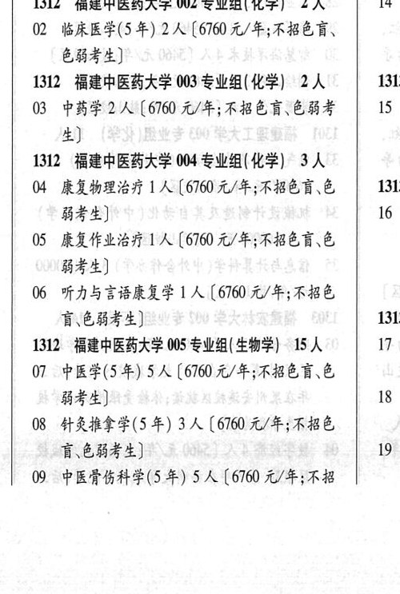
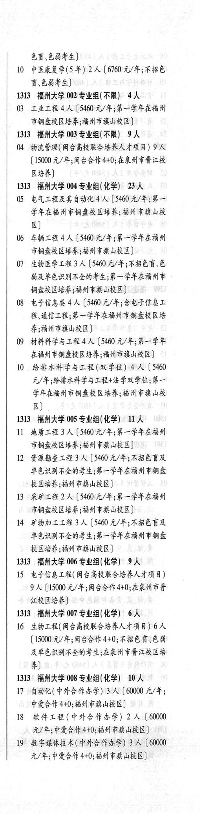

# 1312 福建中医药大学

- PDF页码：31
- 书内页码：80
- 专业组：5；专业条目：10

## 001专业组

- 选科要求：化学
- 招生计划：2 人
- 校验：sum-corrected

| 专业代码 | 专业名称 | 计划人数 | 学费（元/年） | 备注/完整OCR内容 |
|---|---|---:|---:|---|
| 01 | 中西医临床医学(5 年) | 2 | 6760 | 【6760 元/年;不 13 BED. CHF4) |

<details><summary>本专业组OCR原文</summary>

```text
1312 福建中医药大学 001 专业组( 化学) 2A BED. CHF4)
Ol 中西医临床医学(5 年) 2 人【6760 元/年;不   13
BED. CHF4)
```
</details>

## 002专业组

- 选科要求：化学
- 招生计划：OCR未稳定识别 人
- 校验：review

| 专业代码 | 专业名称 | 计划人数 | 学费（元/年） | 备注/完整OCR内容 |
|---|---|---:|---:|---|
| 02 | 临床医学(5 年) 2A ( |  | 6700 | 6700 元/年;不招色言、 色弱考生] |

<details><summary>本专业组OCR原文</summary>

```text
1312 福建中医药大学 002 专业组(化学) 2A   14 色弱考生]
02 临床医学(5 年) 2A (6700 元/年;不招色言、
色弱考生]
```
</details>

## 003专业组

- 选科要求：化学
- 招生计划：OCR未稳定识别 人
- 校验：review

| 专业代码 | 专业名称 | 计划人数 | 学费（元/年） | 备注/完整OCR内容 |
|---|---|---:|---:|---|
| 03 | PHELA (61600 A/F; ABER EHF 15 4) |  |  | 03 PHELA (61600 A/F; ABER EHF 15 4) ; |

<details><summary>本专业组OCR原文</summary>

```text
1312 福建中医药大学 003 专业组(化学) 2A   1313 4)                    ;
03 PHELA (61600 A/F; ABER EHF   15
4)                    ;
```
</details>

## 004专业组

- 选科要求：化学
- 招生计划：3 人
- 校验：sum-corrected

| 专业代码 | 专业名称 | 计划人数 | 学费（元/年） | 备注/完整OCR内容 |
|---|---|---:|---:|---|
| 04 | 康复物理治疗 | 1 | 6760 | [6760元/年;不招色盲.色 1313 B44) 16 |
| 05 | 康复作业治疗 | 1 |  | (6100 2/4; KBE HE B44) |
| 06 | 听力与言语康复学 | 1 | 6760 | 【6760 元/年;不招色 谨\色弱考生] 1313 |

<details><summary>本专业组OCR原文</summary>

```text
1312 福建中医药大学 004 专业组(化学) 3A B44)                 16
04 康复物理治疗 1 人[6760元/年;不招色盲.色   1313
B44)                 16
05 康复作业治疗1人 (6100 2/4; KBE HE
B44)
06 听力与言语康复学 1 人【6760 元/年;不招色
谨\色弱考生]               1313
```
</details>

## 005专业组

- 选科要求：生物学
- 招生计划：15 人
- 校验：review

| 专业代码 | 专业名称 | 计划人数 | 学费（元/年） | 备注/完整OCR内容 |
|---|---|---:|---:|---|
| 07 | 中医学(5年) | 5 | 6760 | 【6760 元/年;不招色盲\色 BAe) 18 |
| 08 | 针灸推拿学(5 年) 3A ( |  | 6760 | 6760 元/年;不招色 HOHF4) 19 |
| 09 | “中医骨伤科学(5年) 5A ( |  | 6700 | 6700 元/年;不招 色盲色弱考生] |
| 10 | 中医康复学(5 年) | 2 | 6760 | 【6760 元/年;不招色 盲,色弱考生] |

<details><summary>本专业组OCR原文</summary>

```text
1312 福建中医药大学 005 专业组(生物学) “15 人    17
07 中医学(5年) 5 人【6760 元/年;不招色盲\色
BAe)                 18
08 针灸推拿学(5 年) 3A (6760 元/年;不招色
HOHF4)               19
09 “中医骨伤科学(5年) 5A (6700 元/年;不招
色盲色弱考生]
10 中医康复学(5 年) 2 人【6760 元/年;不招色
盲,色弱考生]
```
</details>

## 附：院校完整OCR原文

```text
--- PDF第31页（书内第80页），第2栏 ---
1312 福建中医药大学 001 专业组( 化学) 2A
Ol 中西医临床医学(5 年) 2 人【6760 元/年;不   13
BED. CHF4)
1312 福建中医药大学 002 专业组(化学) 2A   14
02 临床医学(5 年) 2A (6700 元/年;不招色言、
色弱考生]
1312 福建中医药大学 003 专业组(化学) 2A   1313
03 PHELA (61600 A/F; ABER EHF   15
4)                    ;
1312 福建中医药大学 004 专业组(化学) 3A
04 康复物理治疗 1 人[6760元/年;不招色盲.色   1313
B44)                 16
05 康复作业治疗1人 (6100 2/4; KBE HE
B44)
06 听力与言语康复学 1 人【6760 元/年;不招色
谨\色弱考生]               1313
1312 福建中医药大学 005 专业组(生物学) “15 人    17
07 中医学(5年) 5 人【6760 元/年;不招色盲\色
BAe)                 18
08 针灸推拿学(5 年) 3A (6760 元/年;不招色
HOHF4)               19
09 “中医骨伤科学(5年) 5A (6700 元/年;不招

--- PDF第31页（书内第80页），第3栏 ---
色盲色弱考生]
10 中医康复学(5 年) 2 人【6760 元/年;不招色
盲,色弱考生]
```

## 源图


