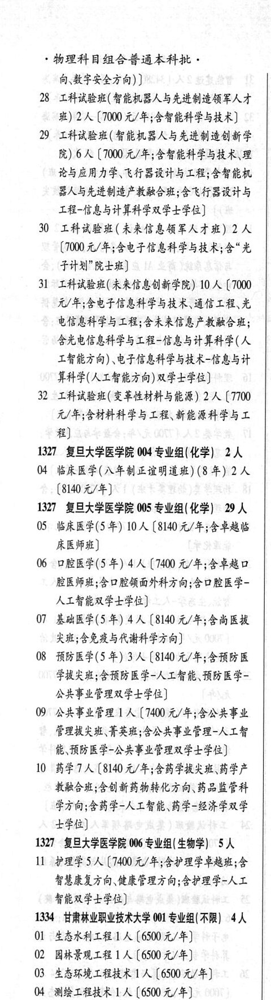

# 1327 复旦大学医学院

- PDF页码：33
- 书内页码：82
- 专业组：3；专业条目：8

## 004专业组

- 选科要求：化学
- 招生计划：2 人
- 校验：ok

| 专业代码 | 专业名称 | 计划人数 | 学费（元/年） | 备注/完整OCR内容 |
|---|---|---:|---:|---|
| 04 | 临床医学(入年制正谊明道班) (8 年) | 2 | 8140 | [8140 元/年] |

<details><summary>本专业组OCR原文</summary>

```text
1327 复旦大学医学院 004 专业组(化学) 2人
04 临床医学(入年制正谊明道班) (8 年) 2 人
[8140 元/年]
```
</details>

## 005专业组

- 选科要求：化学
- 招生计划：29 人
- 校验：review

| 专业代码 | 专业名称 | 计划人数 | 学费（元/年） | 备注/完整OCR内容 |
|---|---|---:|---:|---|
| 05 | 临床医学(5 年) | 10 |  | 【8140 A/F; SFR 床医师班] |
| 06 | 口腔医学(5 年) | 4 | 7400 | 【7400 元/年;含草越口 腔医师班;含口腔领面外科方向;含口腔医学- 人工智能双学士学位] |
| 07 | 基础医学(5 年) | 4 | 8140 | 【8140 元/年;含尚医拔 类班;含免疫与代谢科学方向] |
| 08 | 预防医学(5 年) | 3 | 8140 | 【8140 元/年;含预防医 学拔类班;含预防医学-人工知能、预防医学- 公共事业管理双学士学位] |
| 09 | 公共事业管理 ] 人 |  | 7400 | 7400 元/年;含公共事业 FLERE FRE; SORE LER-ALE 能、预防医学-公共事业管理双学十学位] |
| 10 | BETA (8140 t/F SHER se HF 教融合班;含创新药物转化方向、药品监管科 学方向;含药学-人工知能、药学-经济学双学 士学位 |  |  | 10 BETA (8140 t/F SHER se HF 教融合班;含创新药物转化方向、药品监管科 学方向;含药学-人工知能、药学-经济学双学 士学位] |

<details><summary>本专业组OCR原文</summary>

```text
1327 复旦大学医学院 005 专业组(化学) 29 人
05 临床医学(5 年) 10 人【8140 A/F; SFR
床医师班]
06 口腔医学(5 年) 4 人【7400 元/年;含草越口
腔医师班;含口腔领面外科方向;含口腔医学-
人工智能双学士学位]
07 基础医学(5 年) 4 人【8140 元/年;含尚医拔
类班;含免疫与代谢科学方向]
08 预防医学(5 年) 3 人【8140 元/年;含预防医
学拔类班;含预防医学-人工知能、预防医学-
公共事业管理双学士学位]
09 公共事业管理 ] 人【7400 元/年;含公共事业
FLERE FRE; SORE LER-ALE
能、预防医学-公共事业管理双学十学位]
10 BETA (8140 t/F SHER se HF
教融合班;含创新药物转化方向、药品监管科
学方向;含药学-人工知能、药学-经济学双学
士学位]
```
</details>

## 006专业组

- 选科要求：生物学
- 招生计划：5 人
- 校验：ok

| 专业代码 | 专业名称 | 计划人数 | 学费（元/年） | 备注/完整OCR内容 |
|---|---|---:|---:|---|
| 11 | 护理学 | 5 | 7400 | 【7400 元/年;含护理学草越班;仿 智慧康复方向、健康管理方向;含护理学-人工 智能双学士学位] |

<details><summary>本专业组OCR原文</summary>

```text
1327 复旦大学医学院 006 专业组(生物学) 5人
11 护理学5人【7400 元/年;含护理学草越班;仿
智慧康复方向、健康管理方向;含护理学-人工
智能双学士学位]
```
</details>

## 附：院校完整OCR原文

```text
--- PDF第33页（书内第82页），第1栏 ---
1327 复旦大学医学院 004 专业组(化学) 2人
04 临床医学(入年制正谊明道班) (8 年) 2 人
[8140 元/年]
1327 复旦大学医学院 005 专业组(化学) 29 人
05 临床医学(5 年) 10 人【8140 A/F; SFR
床医师班]
06 口腔医学(5 年) 4 人【7400 元/年;含草越口
腔医师班;含口腔领面外科方向;含口腔医学-
人工智能双学士学位]
07 基础医学(5 年) 4 人【8140 元/年;含尚医拔
类班;含免疫与代谢科学方向]
08 预防医学(5 年) 3 人【8140 元/年;含预防医
学拔类班;含预防医学-人工知能、预防医学-
公共事业管理双学士学位]
09 公共事业管理 ] 人【7400 元/年;含公共事业
FLERE FRE; SORE LER-ALE
能、预防医学-公共事业管理双学十学位]
10 BETA (8140 t/F SHER se HF
教融合班;含创新药物转化方向、药品监管科
学方向;含药学-人工知能、药学-经济学双学
士学位]
1327 复旦大学医学院 006 专业组(生物学) 5人
11 护理学5人【7400 元/年;含护理学草越班;仿
智慧康复方向、健康管理方向;含护理学-人工
智能双学士学位]
```

## 源图

