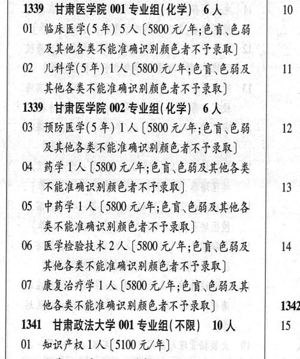

# 1339 甘肃医学院

- PDF页码：33
- 书内页码：82
- 专业组：2；专业条目：7

## 001专业组

- 选科要求：化学
- 招生计划：6 人
- 校验：review

| 专业代码 | 专业名称 | 计划人数 | 学费（元/年） | 备注/完整OCR内容 |
|---|---|---:|---:|---|
| 01 | 临床医学(5年) | 5 | 5800 | [5800元/年;色盲、色弱 及其他各类不能准确识别颜色者不予录取] |
| 02 | 儿科学(5年) 1A ( |  | 5800 | 5800 元/年;色盲、色弱及 i> 其他各类不能准确识别颜色者不也录取] |

<details><summary>本专业组OCR原文</summary>

```text
1339 甘肃医学院 001 专业组(化学) 6人     10 |
01 临床医学(5年) 5 人[5800元/年;色盲、色弱
及其他各类不能准确识别颜色者不予录取]
02 儿科学(5年) 1A (5800 元/年;色盲、色弱及   i>
其他各类不能准确识别颜色者不也录取]
```
</details>

## 002专业组

- 选科要求：化学
- 招生计划：6 人
- 校验：ok

| 专业代码 | 专业名称 | 计划人数 | 学费（元/年） | 备注/完整OCR内容 |
|---|---|---:|---:|---|
| 03 | 预防医学(5 年) | 1 | 5800 | 【5800 元/年;色盲\色弱 2 及其他各类不能准确识别颜色者不予录取] |
| 04 | 药学 | 1 | 5800 | [5800 元/年;色盲\色弱及其他各类 ; FELARMACARFRB) 13 |
| 05 | 中药学 | 1 |  | [5800 A/F; ER EBRLES 类不能准确识别颜色者不子录取] |
| 06 | 医学检验技术 | 2 |  | (5800 4/4; 68 CBR 14 ; 其他各类不能准确识别颜色者不予录取] I |
| 07 | 康复治疗学 | 1 | 5800 | [5800 元/年;色盲色弱及其 他各类不能准确识别颜色者不予录取] 1342 |

<details><summary>本专业组OCR原文</summary>

```text
1339 甘肃医学院 002 专业组(化学) 6人
03 预防医学(5 年) 1 人【5800 元/年;色盲\色弱   2
及其他各类不能准确识别颜色者不予录取]
04 药学1人[5800 元/年;色盲\色弱及其他各类     ;
FELARMACARFRB)        13
05 中药学1 人[5800 A/F; ER EBRLES
类不能准确识别颜色者不子录取]
06 医学检验技术 2 人 (5800 4/4; 68 CBR   14 ;
其他各类不能准确识别颜色者不予录取]       I
07 康复治疗学 1 人[5800 元/年;色盲色弱及其
他各类不能准确识别颜色者不予录取]      1342
```
</details>

## 附：院校完整OCR原文

```text
--- PDF第33页（书内第82页），第2栏 ---
1339 甘肃医学院 001 专业组(化学) 6人     10 |
01 临床医学(5年) 5 人[5800元/年;色盲、色弱
及其他各类不能准确识别颜色者不予录取]
02 儿科学(5年) 1A (5800 元/年;色盲、色弱及   i>
其他各类不能准确识别颜色者不也录取]
1339 甘肃医学院 002 专业组(化学) 6人
03 预防医学(5 年) 1 人【5800 元/年;色盲\色弱   2
及其他各类不能准确识别颜色者不予录取]
04 药学1人[5800 元/年;色盲\色弱及其他各类     ;
FELARMACARFRB)        13
05 中药学1 人[5800 A/F; ER EBRLES
类不能准确识别颜色者不子录取]
06 医学检验技术 2 人 (5800 4/4; 68 CBR   14 ;
其他各类不能准确识别颜色者不予录取]       I
07 康复治疗学 1 人[5800 元/年;色盲色弱及其
他各类不能准确识别颜色者不予录取]      1342
```

## 源图

