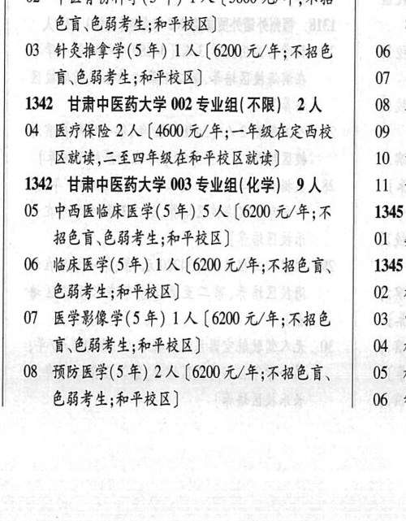
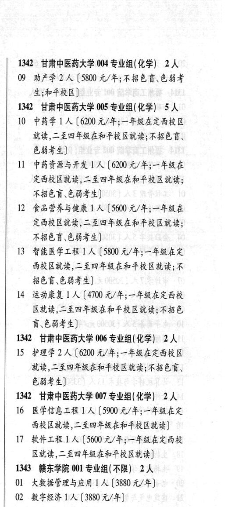

# 1342 甘肃中医药大学

- PDF页码：33
- 书内页码：82
- 专业组：7；专业条目：19

## 001专业组

- 选科要求：不限
- 招生计划：4 人
- 校验：review

| 专业代码 | 专业名称 | 计划人数 | 学费（元/年） | 备注/完整OCR内容 |
|---|---|---:|---:|---|
| 01 | 中医学(5 年) | 2 | 6200 | 【6200 元/年;不招色盲、色 } 能考生;和平校区] 05 4 |
| 02 | 中医骨伤科学(5 年) 1A ( |  | 5800 | 5800 元/年;不招 a 色盲色弱考生;和平校区] 8 |
| 03 | 针灸推拿学(5 年) | 1 | 6200 | 【6200 元/年;不招色 06 4 育、色弱考生;和平校区] 07 *&F |

<details><summary>本专业组OCR原文</summary>

```text
134. 甘肃中医药大学 001 专业组(不限) 4人     (
01 中医学(5 年) 2 人【6200 元/年;不招色盲、色    }
能考生;和平校区]            05 4
02 中医骨伤科学(5 年) 1A (5800 元/年;不招      a
色盲色弱考生;和平校区]            8
03 针灸推拿学(5 年) 1 人【6200 元/年;不招色   06 4
育、色弱考生;和平校区]          07 *&F
```
</details>

## 002专业组

- 选科要求：不限
- 招生计划：2 人
- 校验：sum-corrected

| 专业代码 | 专业名称 | 计划人数 | 学费（元/年） | 备注/完整OCR内容 |
|---|---|---:|---:|---|
| 04 | 医疗保险 | 2 | 4600 | 【4600 元/年;一年级在定西校 \| 09 2 区就读,二至四年级在和平校区就读] 10 4 |

<details><summary>本专业组OCR原文</summary>

```text
1342 甘肃中医药大学 002 专业组(不限) 2A   08 A 区就读,二至四年级在和平校区就读]      10 4
04 医疗保险 2 人【4600 元/年;一年级在定西校 | 09 2
区就读,二至四年级在和平校区就读]      10 4
```
</details>

## 003专业组

- 选科要求：化学
- 招生计划：9 人
- 校验：review

| 专业代码 | 专业名称 | 计划人数 | 学费（元/年） | 备注/完整OCR内容 |
|---|---|---:|---:|---|
| 05 | “中西医临床医学(5 年) 5A ( |  | 6200 | 6200 元/年;不 1345 招色盲、色弱考生;和平校区] Ol 才 |
| 06 | 临床医学(5 年) | 1 | 6200 | 【6200 元/年;不招色育、 1345 色弱考生;和平校区] 02 4 |
| 07 | 医学影像学(5 年) 1A ( |  | 6200 | 6200 元/年;不招色 03 电 育、色弱考生;和平校区] 04 # |
| 08 | 预防医学(5 年) | 2 | 6200 | 【6200 元/年;不招色盲、 05 4 色弱考生;和平校区] 06 4 |

<details><summary>本专业组OCR原文</summary>

```text
1342 甘肃中医药大学 003 专业组(化学) 9 人   11 -志
05 “中西医临床医学(5 年) 5A (6200 元/年;不   1345
招色盲、色弱考生;和平校区]         Ol 才
06 临床医学(5 年) 1 人【6200 元/年;不招色育、   1345
色弱考生;和平校区]             02 4
07 医学影像学(5 年) 1A (6200 元/年;不招色   03 电
育、色弱考生;和平校区]           04 #
08 预防医学(5 年) 2 人【6200 元/年;不招色盲、   05 4
色弱考生;和平校区]            06 4
```
</details>

## 004专业组

- 选科要求：化学
- 招生计划：2 人
- 校验：ok

| 专业代码 | 专业名称 | 计划人数 | 学费（元/年） | 备注/完整OCR内容 |
|---|---|---:|---:|---|
| 09 | 助产学 | 2 |  | 【5800 A/F; FRET EF 生;和平校区] |

<details><summary>本专业组OCR原文</summary>

```text
1342 甘肃中医药大学 004 专业组(化学) 2 人
09 助产学 2 人【5800 A/F; FRET EF
生;和平校区]
```
</details>

## 005专业组

- 选科要求：化学
- 招生计划：5 人
- 校验：review

| 专业代码 | 专业名称 | 计划人数 | 学费（元/年） | 备注/完整OCR内容 |
|---|---|---:|---:|---|
| 10 | 中药学 | 1 | 6200 | 【6200 元/年;一年级在定西校区 就读,二至四年级在和平校区就读;不招色盲、 色弱考生] |
| 11 | 中药资源与开发 ] 人 |  | 6200 | 6200 元/年;一年级在 定西校区就读,二至四年级在和平校区就读; RED. CBF) |
| 12 | 食品营养与健康 | 1 | 5600 | 【5600 元/年;一年级在 定西校区就读,二至四年级在和平校区就读; FBEG EHF 2) |
| 13 | 智能医学工程 ] 人 |  | 5800 | 5800 元/年;一年级在定 西校区就读,二至四年级在和平校区就读; 不 BER EHF) |
| 14 | 运动康复 | 1 | 4700 | 【4700 元/年;一年级在定西校 区就读,二至四年级在和平校区就读;不招色 育\色弱考生] |

<details><summary>本专业组OCR原文</summary>

```text
1342 甘肃中医药大学 005 专业组( 化学) 5 人
10 中药学 1 人【6200 元/年;一年级在定西校区
就读,二至四年级在和平校区就读;不招色盲、
色弱考生]
11 中药资源与开发 ] 人【6200 元/年;一年级在
定西校区就读,二至四年级在和平校区就读;
RED. CBF)
12 食品营养与健康 1 人【5600 元/年;一年级在
定西校区就读,二至四年级在和平校区就读;
FBEG EHF 2)
13 智能医学工程 ] 人【5800 元/年;一年级在定
西校区就读,二至四年级在和平校区就读; 不
BER EHF)
14 运动康复 1 人【4700 元/年;一年级在定西校
区就读,二至四年级在和平校区就读;不招色
育\色弱考生]
```
</details>

## 006专业组

- 选科要求：化学
- 招生计划：2 人
- 校验：ok

| 专业代码 | 专业名称 | 计划人数 | 学费（元/年） | 备注/完整OCR内容 |
|---|---|---:|---:|---|
| 15 | 护理学 | 2 | 6200 | 【6200 元/年;一年级在定西校区 就读,二至四年级在和平校区就读;不招色盲、 E844) |

<details><summary>本专业组OCR原文</summary>

```text
1342 甘肃中医药大学 006 专业组(化学) 2人
15 护理学 2 人【6200 元/年;一年级在定西校区
就读,二至四年级在和平校区就读;不招色盲、
E844)
```
</details>

## 007专业组

- 选科要求：化学
- 招生计划：2 人
- 校验：review

| 专业代码 | 专业名称 | 计划人数 | 学费（元/年） | 备注/完整OCR内容 |
|---|---|---:|---:|---|
| 16 | 医学信息工程 ] 人 |  | 5900 | 5900 元/年;一年级在定 西校区就读,二至四年级在和平校区就读] |
| 17 | 软件工程 1] 人[5600 元/年;一年级在定西校 区就读,二至四年级在和平校区就读] 1343 GARFH 001 SAAR) | 2 | 5600 | 17 软件工程 1] 人[5600 元/年;一年级在定西校 区就读,二至四年级在和平校区就读] 1343 GARFH 001 SAAR) 2 人 |
| 01 | 大数据管理与应用 | 1 |  | (3880 4/4) |
| 02 | 数字经济 | 1 | 3880 | [3880元/年] |

<details><summary>本专业组OCR原文</summary>

```text
1342 ”甘肃中医药大学 007 专业组(化学) 2人
16 医学信息工程 ] 人【5900 元/年;一年级在定
西校区就读,二至四年级在和平校区就读]
17 软件工程 1] 人[5600 元/年;一年级在定西校
区就读,二至四年级在和平校区就读]
1343 GARFH 001 SAAR) 2 人
01 大数据管理与应用 1 人 (3880 4/4)
02 数字经济1人 [3880元/年]
```
</details>

## 附：院校完整OCR原文

```text
--- PDF第33页（书内第82页），第2栏 ---
134. 甘肃中医药大学 001 专业组(不限) 4人     (
01 中医学(5 年) 2 人【6200 元/年;不招色盲、色    }
能考生;和平校区]            05 4
02 中医骨伤科学(5 年) 1A (5800 元/年;不招      a
色盲色弱考生;和平校区]            8
03 针灸推拿学(5 年) 1 人【6200 元/年;不招色   06 4
育、色弱考生;和平校区]          07 *&F
1342 甘肃中医药大学 002 专业组(不限) 2A   08 A
04 医疗保险 2 人【4600 元/年;一年级在定西校 | 09 2
区就读,二至四年级在和平校区就读]      10 4
1342 甘肃中医药大学 003 专业组(化学) 9 人   11 -志
05 “中西医临床医学(5 年) 5A (6200 元/年;不   1345
招色盲、色弱考生;和平校区]         Ol 才
06 临床医学(5 年) 1 人【6200 元/年;不招色育、   1345
色弱考生;和平校区]             02 4
07 医学影像学(5 年) 1A (6200 元/年;不招色   03 电
育、色弱考生;和平校区]           04 #
08 预防医学(5 年) 2 人【6200 元/年;不招色盲、   05 4
色弱考生;和平校区]            06 4

--- PDF第33页（书内第82页），第3栏 ---
1342 甘肃中医药大学 004 专业组(化学) 2 人
09 助产学 2 人【5800 A/F; FRET EF
生;和平校区]
1342 甘肃中医药大学 005 专业组( 化学) 5 人
10 中药学 1 人【6200 元/年;一年级在定西校区
就读,二至四年级在和平校区就读;不招色盲、
色弱考生]
11 中药资源与开发 ] 人【6200 元/年;一年级在
定西校区就读,二至四年级在和平校区就读;
RED. CBF)
12 食品营养与健康 1 人【5600 元/年;一年级在
定西校区就读,二至四年级在和平校区就读;
FBEG EHF 2)
13 智能医学工程 ] 人【5800 元/年;一年级在定
西校区就读,二至四年级在和平校区就读; 不
BER EHF)
14 运动康复 1 人【4700 元/年;一年级在定西校
区就读,二至四年级在和平校区就读;不招色
育\色弱考生]
1342 甘肃中医药大学 006 专业组(化学) 2人
15 护理学 2 人【6200 元/年;一年级在定西校区
就读,二至四年级在和平校区就读;不招色盲、
E844)
1342 ”甘肃中医药大学 007 专业组(化学) 2人
16 医学信息工程 ] 人【5900 元/年;一年级在定
西校区就读,二至四年级在和平校区就读]
17 软件工程 1] 人[5600 元/年;一年级在定西校
区就读,二至四年级在和平校区就读]
1343 GARFH 001 SAAR) 2 人
01 大数据管理与应用 1 人 (3880 4/4)
02 数字经济1人 [3880元/年]
```

## 源图


