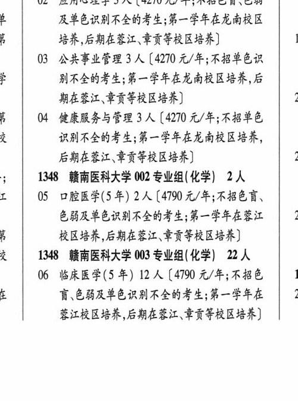
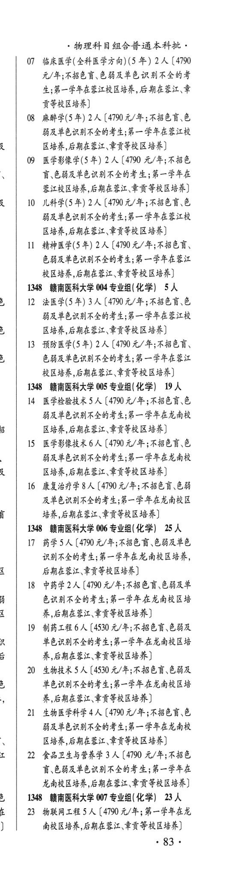
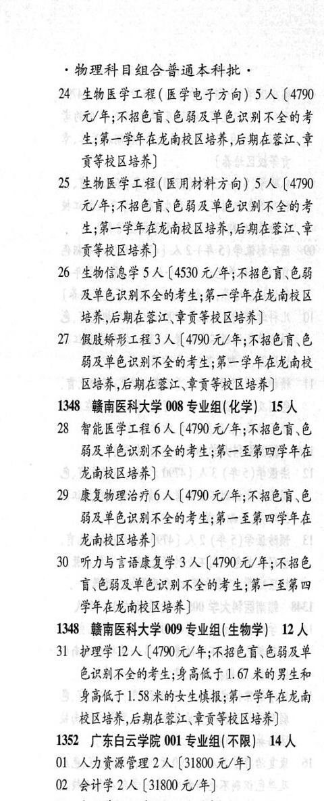

# 1348 赣南医科大学

- PDF页码：34, 35
- 书内页码：83, 84
- 专业组：9；专业条目：28

## 001专业组

- 选科要求：不限
- 招生计划：6 人
- 校验：sum-corrected

| 专业代码 | 专业名称 | 计划人数 | 学费（元/年） | 备注/完整OCR内容 |
|---|---|---:|---:|---|
| 02 | 应用心理学 | 3 | 4270 | 【4270 元/年;不招色言、色能 及单色识别不全的考生;第一学年在龙南校区 培养,后期在蕉江\章贡等校区培养 Is |
| 03 | 公共事业管理 | 3 | 4270 | 【4270 元/年;不招单色识 别不全的考生;第一学年在龙南校区培养,后 期在蓉江\章贡等校区培养 x j 04 健康服务与管理 3 人【4270 元/年;不招单色 识别不全的考生;第一学年在龙南校区培养， 后期在莹江、章贡等校区培养 21 |

<details><summary>本专业组OCR原文</summary>

```text
1348 BRBRAS 001 专业组(不限) 11 人
02 应用心理学 3 人【4270 元/年;不招色言、色能
及单色识别不全的考生;第一学年在龙南校区
培养,后期在蕉江\章贡等校区培养       Is
03 公共事业管理 3 人【4270 元/年;不招单色识
别不全的考生;第一学年在龙南校区培养,后
期在蓉江\章贡等校区培养         x
j   04 健康服务与管理 3 人【4270 元/年;不招单色
识别不全的考生;第一学年在龙南校区培养，
后期在莹江、章贡等校区培养         21
```
</details>

## 002专业组

- 选科要求：化学
- 招生计划：2 人
- 校验：review

| 专业代码 | 专业名称 | 计划人数 | 学费（元/年） | 备注/完整OCR内容 |
|---|---|---:|---:|---|
|  | 结构化OCR未稳定切分，请查看下方原文及源图 |  |  |  |

<details><summary>本专业组OCR原文</summary>

```text
5   1348 BRENAS 002 专业组(化学) 2人
T | 05 口腔医学(5年) 2 人[4790元/年;不招色育、
色有弱及单色识别不全的考生;第一学年在营江 u
A     校区培养,后期在莹江、章贡等校区培养]
```
</details>

## 003专业组

- 选科要求：化学
- 招生计划：22 人
- 校验：review

| 专业代码 | 专业名称 | 计划人数 | 学费（元/年） | 备注/完整OCR内容 |
|---|---|---:|---:|---|
| 06 | 临床医学(5 年) | 12 | 4790 | 【4790 元/年;不招色 B iq 讶色弱及单色识别不全的考生;第一学年在 23 昔江校区培养,后期在莹江\章贡等校区培养] 物理科目组合普通本科批， |
| 07 | 临床医学(全科医学方向) (5 年) | 2 | 4790 | 【4790 元/年;不招色盲、色弱及单色识别不全的考 生;第一学年在鞭江校区培养,后期在蓉江、章 贡等校区培养] |
| 08 | 麻醉学(5 年) 2A (4790 0/4; ABER 弱及单色识别不全的考生;第一学年在车江校 区培养,后期在莹江\章贡等校区培养 |  |  | 08 麻醉学(5 年) 2A (4790 0/4; ABER 弱及单色识别不全的考生;第一学年在车江校 区培养,后期在莹江\章贡等校区培养] |
| 09 | 医学影像学(5 年) | 2 | 4790 | 【4790 元/年;不招色 盲、色习及单色识别不全的考生;第一学年在 蓉江校区培养,后期在营江\章贡等校区培养] |
| 10 | 儿科学(5年) | 2 | 4790 | 【4790元/年;不招色盲\色 弱及单色识别不全的考生;第一学年在蓉江校 区培养,后期在鞭江\章贡等校区培养] |
| 11 | 精神医学(5年) | 2 | 4790 | 【4790 元/年;不招色育、 色弱及单色识别不全的考生;第一学年在著江 校区培养,后期在蓉江、章贡等校区培养] |

<details><summary>本专业组OCR原文</summary>

```text
i | ”1348 闽南医科大学 003 专业组(化学) 22 人
06 临床医学(5 年) 12 人【4790 元/年;不招色   B
iq    讶色弱及单色识别不全的考生;第一学年在   23
昔江校区培养,后期在莹江\章贡等校区培养]
物理科目组合普通本科批，
07 临床医学(全科医学方向) (5 年) 2 人【4790
元/年;不招色盲、色弱及单色识别不全的考
生;第一学年在鞭江校区培养,后期在蓉江、章
贡等校区培养]
08 麻醉学(5 年) 2A (4790 0/4; ABER
弱及单色识别不全的考生;第一学年在车江校
区培养,后期在莹江\章贡等校区培养]
09 医学影像学(5 年) 2 人【4790 元/年;不招色
盲、色习及单色识别不全的考生;第一学年在
蓉江校区培养,后期在营江\章贡等校区培养]
10 儿科学(5年) 2 人【4790元/年;不招色盲\色
弱及单色识别不全的考生;第一学年在蓉江校
区培养,后期在鞭江\章贡等校区培养]
11 精神医学(5年) 2 人【4790 元/年;不招色育、
色弱及单色识别不全的考生;第一学年在著江
校区培养,后期在蓉江、章贡等校区培养]
```
</details>

## 004专业组

- 选科要求：化学
- 招生计划：OCR未稳定识别 人
- 校验：review

| 专业代码 | 专业名称 | 计划人数 | 学费（元/年） | 备注/完整OCR内容 |
|---|---|---:|---:|---|
| 12 | 法医学(5年) | 3 | 4790 | [4790元/年;不招色盲\色 弱及单色识别不全的考生;第一学年在蓉江校 Beh, CHAE SHIRE) |
| 13 | 预防医学(5 年) 2A ( |  | 4190 | 4190 元/年;不招色育、 色弱及单色识别不全的考生;第一学年在营江 校区培养,后期在蓉江\章贡等校区培养] |

<details><summary>本专业组OCR原文</summary>

```text
1348 闽南医科大学 004 专业组(化学) SA
12 法医学(5年) 3 人[4790元/年;不招色盲\色
弱及单色识别不全的考生;第一学年在蓉江校
Beh, CHAE SHIRE)
13 预防医学(5 年) 2A (4190 元/年;不招色育、
色弱及单色识别不全的考生;第一学年在营江
校区培养,后期在蓉江\章贡等校区培养]
```
</details>

## 005专业组

- 选科要求：化学
- 招生计划：19 人
- 校验：sum-corrected

| 专业代码 | 专业名称 | 计划人数 | 学费（元/年） | 备注/完整OCR内容 |
|---|---|---:|---:|---|
| 14 | 医学检验技术 | 5 |  | 【4790 0/4; ABER LE 弱及单色识别不全的考生;第一学年在龙南校 区培养,后期在车江\章贡等校区培养] |
| 15 | 医学影像技术 | 6 | 4790 | 【4790 元/年;不扫色育\色 弱及单色识别不全的考生;第一学年在龙南校 区培养,后期在蓉江\章贡等校区培养] |
| 16 | 康复治疗学 | 8 | 4790 | [4790 元/年;不招色盲、色弱 及单色识别不全的考生;第一学年在龙南校区 BR SARL SHIRE) |

<details><summary>本专业组OCR原文</summary>

```text
1348 闽南医科大学 005 专业组(化学) 1 人
14 医学检验技术5 人【4790 0/4; ABER LE
弱及单色识别不全的考生;第一学年在龙南校
区培养,后期在车江\章贡等校区培养]
15 医学影像技术6 人【4790 元/年;不扫色育\色
弱及单色识别不全的考生;第一学年在龙南校
区培养,后期在蓉江\章贡等校区培养]
16 康复治疗学8 人[4790 元/年;不招色盲、色弱
及单色识别不全的考生;第一学年在龙南校区
BR SARL SHIRE)
```
</details>

## 006专业组

- 选科要求：化学
- 招生计划：OCR未稳定识别 人
- 校验：review

| 专业代码 | 专业名称 | 计划人数 | 学费（元/年） | 备注/完整OCR内容 |
|---|---|---:|---:|---|
| 17 | 药学 | 5 | 4790 | [4790 元/年;不招色盲色弱及单色 识别不全的考生;第一学年在龙南校区培养， 后期在莹江\章贡等校区培养 |
| 18 | 中药学 | 2 |  | 【4790 A/F; ABER CHAS 色识别不全的考生;第一学年在龙南校区培 养,后期在蕉江\章贡等校区培养] |
| 19 | 制药工程 | 6 | 4530 | [4530 元/年;不招色盲.色弱及 单色识别不全的考生;第一学年在龙南校区培 养,后期在莹江\章贡等校区培养] |
| 20 | 生物技术 | 5 | 4530 | 【4530 元/年;不招色盲色弱及 单色识别不全的考生;第一学年在龙南校区培 养,后期在莹江\章贡等校区培养] |
| 21 | 生物医学科学 | 4 | 4790 | 【4790 元/年;不招色盲、色 弱及单色识别不全的考生;第一学年在龙南校 区培养,后期在莹江\章贡等校区培养] |
| 22 | 食品卫生与营养学 3 ( |  | 4190 | 4190 元/年;不招色 盲\色习及单色识别不全的考生;第一学年在 龙南校区培养,后期在鞭江\章贡等校区培养] |

<details><summary>本专业组OCR原文</summary>

```text
1348 闽南医科大学 006 专业组(化学) A
17 药学5人[4790 元/年;不招色盲色弱及单色
识别不全的考生;第一学年在龙南校区培养，
后期在莹江\章贡等校区培养
18 中药学2人【4790 A/F; ABER CHAS
色识别不全的考生;第一学年在龙南校区培
养,后期在蕉江\章贡等校区培养]
19 制药工程6人[4530 元/年;不招色盲.色弱及
单色识别不全的考生;第一学年在龙南校区培
养,后期在莹江\章贡等校区培养]
20 生物技术5 人【4530 元/年;不招色盲色弱及
单色识别不全的考生;第一学年在龙南校区培
养,后期在莹江\章贡等校区培养]
21 生物医学科学4人【4790 元/年;不招色盲、色
弱及单色识别不全的考生;第一学年在龙南校
区培养,后期在莹江\章贡等校区培养]
22 食品卫生与营养学 3 (4190 元/年;不招色
盲\色习及单色识别不全的考生;第一学年在
龙南校区培养,后期在鞭江\章贡等校区培养]
```
</details>

## 007专业组

- 选科要求：化学
- 招生计划：23 人
- 校验：review

| 专业代码 | 专业名称 | 计划人数 | 学费（元/年） | 备注/完整OCR内容 |
|---|---|---:|---:|---|
| 23 | MRALES A ( |  | 4790 | 4790 元/年;第一学年在龙 南校区培养,后期在营江\章贡等校区培养] 83° 物理科目组合普通本科批， |
| 24 | 生物医学工程( 医学电子方向) | 5 | 4790 | 【4790 元/年;不招色盲、色弱及单色识别不全的考 生;第一学年在龙南校区培养,后期在莹江、章 贡等校区培养] |
| 25 | 生物医学工程( 医用材料方向) | 5 | 4790 | 【4790 元/年;不招色盲、色弱及单色识别不全的考 生;第一学年在龙南校区培养,后期在营江、章 贡等校区培养] |
| 26 | 生物信息学 | 5 | 4530 | 【4530 元/年;不招色盲\色弱 及单色识别不全的考生;第一学年在龙南校区 培养,后期在营江\章贡等校区培养] |
| 27 | 假肢矫形工程 | 3 | 4790 | 【4790元/年;不招色盲\色 能及单色识别不全的考生;第一学年在龙南校 区培养,后期在莹江\章贡等校区培养] |

<details><summary>本专业组OCR原文</summary>

```text
1348 ”闽南医科大学 007 专业组(化学) 23 人
23 MRALES A (4790 元/年;第一学年在龙
南校区培养,后期在营江\章贡等校区培养]
83°
物理科目组合普通本科批，
24 生物医学工程( 医学电子方向) 5 人【4790
元/年;不招色盲、色弱及单色识别不全的考
生;第一学年在龙南校区培养,后期在莹江、章
贡等校区培养]
25 生物医学工程( 医用材料方向) 5 人【4790
元/年;不招色盲、色弱及单色识别不全的考
生;第一学年在龙南校区培养,后期在营江、章
贡等校区培养]
26 生物信息学5人【4530 元/年;不招色盲\色弱
及单色识别不全的考生;第一学年在龙南校区
培养,后期在营江\章贡等校区培养]
27 假肢矫形工程 3 人【4790元/年;不招色盲\色
能及单色识别不全的考生;第一学年在龙南校
区培养,后期在莹江\章贡等校区培养]
```
</details>

## 008专业组

- 选科要求：化学
- 招生计划：15 人
- 校验：ok

| 专业代码 | 专业名称 | 计划人数 | 学费（元/年） | 备注/完整OCR内容 |
|---|---|---:|---:|---|
| 28 | 智能医学工程 | 6 | 4790 | 【4790 元/年;不招色盲\色 能及单色识别不全的考生;第一至第四学年在 龙南校区培养] |
| 29 | 康复物理治疗 | 6 | 4790 | 【4790 元/年;不招色育\色 弱及单色识别不全的考生;第一至第四学年在 龙南校区培养] |
| 30 | “听力与言语康复学 | 3 | 4790 | 【4790 元/年;不招色 盲\色弱及单色识别不全的考生;第一至第四 学年在龙南校区培养] |

<details><summary>本专业组OCR原文</summary>

```text
1348 HBRNAF 008 专业组(化学) 15 人
28 智能医学工程 6人【4790 元/年;不招色盲\色
能及单色识别不全的考生;第一至第四学年在
龙南校区培养]
29 康复物理治疗 6 人【4790 元/年;不招色育\色
弱及单色识别不全的考生;第一至第四学年在
龙南校区培养]
30 “听力与言语康复学 3 人【4790 元/年;不招色
盲\色弱及单色识别不全的考生;第一至第四
学年在龙南校区培养]
```
</details>

## 009专业组

- 选科要求：生物学
- 招生计划：12 人
- 校验：ok

| 专业代码 | 专业名称 | 计划人数 | 学费（元/年） | 备注/完整OCR内容 |
|---|---|---:|---:|---|
| 31 | 护理学 | 12 | 4790 | 【4790元/年;不招色盲、色弱及单 色识别不全的考生;身高低于1. 67 米的男生和 身高低于1.58米的女生导报;第一学年在龙南 校区培养,后期在芝江\章贡等校区培养] |

<details><summary>本专业组OCR原文</summary>

```text
1348 闽南医科大学 009 专业组( 生物学) 12 人
31 护理学 12 人【4790元/年;不招色盲、色弱及单
色识别不全的考生;身高低于1. 67 米的男生和
身高低于1.58米的女生导报;第一学年在龙南
校区培养,后期在芝江\章贡等校区培养]
```
</details>

## 附：院校完整OCR原文

```text
--- PDF第34页（书内第83页），第2栏 ---
1348 BRBRAS 001 专业组(不限) 11 人
1 Ol 法学2 人【4270 元/年;第一学年在龙南校区
培养,后期在蕉江\章贡等校区培养      18
02 应用心理学 3 人【4270 元/年;不招色言、色能
及单色识别不全的考生;第一学年在龙南校区
培养,后期在蕉江\章贡等校区培养       Is
03 公共事业管理 3 人【4270 元/年;不招单色识
别不全的考生;第一学年在龙南校区培养,后
期在蓉江\章贡等校区培养         x
j   04 健康服务与管理 3 人【4270 元/年;不招单色
识别不全的考生;第一学年在龙南校区培养，
后期在莹江、章贡等校区培养         21
5   1348 BRENAS 002 专业组(化学) 2人
T | 05 口腔医学(5年) 2 人[4790元/年;不招色育、
色有弱及单色识别不全的考生;第一学年在营江 u
A     校区培养,后期在莹江、章贡等校区培养]
i | ”1348 闽南医科大学 003 专业组(化学) 22 人
06 临床医学(5 年) 12 人【4790 元/年;不招色   B
iq    讶色弱及单色识别不全的考生;第一学年在   23
昔江校区培养,后期在莹江\章贡等校区培养]

--- PDF第34页（书内第83页），第3栏 ---
物理科目组合普通本科批，
07 临床医学(全科医学方向) (5 年) 2 人【4790
元/年;不招色盲、色弱及单色识别不全的考
生;第一学年在鞭江校区培养,后期在蓉江、章
贡等校区培养]
08 麻醉学(5 年) 2A (4790 0/4; ABER
弱及单色识别不全的考生;第一学年在车江校
区培养,后期在莹江\章贡等校区培养]
09 医学影像学(5 年) 2 人【4790 元/年;不招色
盲、色习及单色识别不全的考生;第一学年在
蓉江校区培养,后期在营江\章贡等校区培养]
10 儿科学(5年) 2 人【4790元/年;不招色盲\色
弱及单色识别不全的考生;第一学年在蓉江校
区培养,后期在鞭江\章贡等校区培养]
11 精神医学(5年) 2 人【4790 元/年;不招色育、
色弱及单色识别不全的考生;第一学年在著江
校区培养,后期在蓉江、章贡等校区培养]
1348 闽南医科大学 004 专业组(化学) SA
12 法医学(5年) 3 人[4790元/年;不招色盲\色
弱及单色识别不全的考生;第一学年在蓉江校
Beh, CHAE SHIRE)
13 预防医学(5 年) 2A (4190 元/年;不招色育、
色弱及单色识别不全的考生;第一学年在营江
校区培养,后期在蓉江\章贡等校区培养]
1348 闽南医科大学 005 专业组(化学) 1 人
14 医学检验技术5 人【4790 0/4; ABER LE
弱及单色识别不全的考生;第一学年在龙南校
区培养,后期在车江\章贡等校区培养]
15 医学影像技术6 人【4790 元/年;不扫色育\色
弱及单色识别不全的考生;第一学年在龙南校
区培养,后期在蓉江\章贡等校区培养]
16 康复治疗学8 人[4790 元/年;不招色盲、色弱
及单色识别不全的考生;第一学年在龙南校区
BR SARL SHIRE)
1348 闽南医科大学 006 专业组(化学) A
17 药学5人[4790 元/年;不招色盲色弱及单色
识别不全的考生;第一学年在龙南校区培养，
后期在莹江\章贡等校区培养
18 中药学2人【4790 A/F; ABER CHAS
色识别不全的考生;第一学年在龙南校区培
养,后期在蕉江\章贡等校区培养]
19 制药工程6人[4530 元/年;不招色盲.色弱及
单色识别不全的考生;第一学年在龙南校区培
养,后期在莹江\章贡等校区培养]
20 生物技术5 人【4530 元/年;不招色盲色弱及
单色识别不全的考生;第一学年在龙南校区培
养,后期在莹江\章贡等校区培养]
21 生物医学科学4人【4790 元/年;不招色盲、色
弱及单色识别不全的考生;第一学年在龙南校
区培养,后期在莹江\章贡等校区培养]
22 食品卫生与营养学 3 (4190 元/年;不招色
盲\色习及单色识别不全的考生;第一学年在
龙南校区培养,后期在鞭江\章贡等校区培养]
1348 ”闽南医科大学 007 专业组(化学) 23 人
23 MRALES A (4790 元/年;第一学年在龙
南校区培养,后期在营江\章贡等校区培养]
83°

--- PDF第35页（书内第84页），第1栏 ---
物理科目组合普通本科批，
24 生物医学工程( 医学电子方向) 5 人【4790
元/年;不招色盲、色弱及单色识别不全的考
生;第一学年在龙南校区培养,后期在莹江、章
贡等校区培养]
25 生物医学工程( 医用材料方向) 5 人【4790
元/年;不招色盲、色弱及单色识别不全的考
生;第一学年在龙南校区培养,后期在营江、章
贡等校区培养]
26 生物信息学5人【4530 元/年;不招色盲\色弱
及单色识别不全的考生;第一学年在龙南校区
培养,后期在营江\章贡等校区培养]
27 假肢矫形工程 3 人【4790元/年;不招色盲\色
能及单色识别不全的考生;第一学年在龙南校
区培养,后期在莹江\章贡等校区培养]
1348 HBRNAF 008 专业组(化学) 15 人
28 智能医学工程 6人【4790 元/年;不招色盲\色
能及单色识别不全的考生;第一至第四学年在
龙南校区培养]
29 康复物理治疗 6 人【4790 元/年;不招色育\色
弱及单色识别不全的考生;第一至第四学年在
龙南校区培养]
30 “听力与言语康复学 3 人【4790 元/年;不招色
盲\色弱及单色识别不全的考生;第一至第四
学年在龙南校区培养]
1348 闽南医科大学 009 专业组( 生物学) 12 人
31 护理学 12 人【4790元/年;不招色盲、色弱及单
色识别不全的考生;身高低于1. 67 米的男生和
身高低于1.58米的女生导报;第一学年在龙南
校区培养,后期在芝江\章贡等校区培养]
```

## 源图



