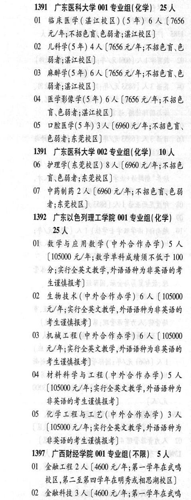

# 1391 广东医科大学

- PDF页码：37
- 书内页码：86
- 专业组：2；专业条目：7

## 001专业组

- 选科要求：化学
- 招生计划：25 人
- 校验：ok

| 专业代码 | 专业名称 | 计划人数 | 学费（元/年） | 备注/完整OCR内容 |
|---|---|---:|---:|---|
| 01 | BREF (HARB) (5 年) | 6 | 7656 | 【7656 元/年;不招色盲色弱者;洪江校区] |
| 02 | 儿科学(5年) | 4 | 7656 | [7656元/年;不招色盲、色 弱者;湛江校区] |
| 03 | 麻醉学(5 年) | 6 | 7656 | 【7656 元/年;不招色盲、色 弱者;湛江校区] |
| 04 | 医学影像学(5 年) | 6 | 7656 | 【7656 元/年;不招色 盲\色弱者;湛江校区] |
| 05 | 口腔医学(5 年) | 3 | 6960 | 【6960元/年;不招色盲、 684; ERE) |

<details><summary>本专业组OCR原文</summary>

```text
1391 广东医科大学 001 专业组(化学) 25 人
Ol BREF (HARB) (5 年) 6 人【7656
元/年;不招色盲色弱者;洪江校区]
02 儿科学(5年) 4人[7656元/年;不招色盲、色
弱者;湛江校区]
03 麻醉学(5 年) 6 人【7656 元/年;不招色盲、色
弱者;湛江校区]
04 医学影像学(5 年) 6 人【7656 元/年;不招色
盲\色弱者;湛江校区]
05 口腔医学(5 年) 3人【6960元/年;不招色盲、
684; ERE)
```
</details>

## 002专业组

- 选科要求：化学
- 招生计划：10 人
- 校验：review

| 专业代码 | 专业名称 | 计划人数 | 学费（元/年） | 备注/完整OCR内容 |
|---|---|---:|---:|---|
| 06 | 护理学(东莞校区) 8A ( |  | 6960 | 6960 元/年;不招色 F684; ERB) |
| 07 | 中药制药 2A (6900 VF; FREER EH 者;东莞校区 |  |  | 07 中药制药 2A (6900 VF; FREER EH 者;东莞校区] |

<details><summary>本专业组OCR原文</summary>

```text
1391 广东医科大学 002 专业组(化学) 10 人
06 护理学(东莞校区) 8A (6960 元/年;不招色
F684; ERB)
07 中药制药 2A (6900 VF; FREER EH
者;东莞校区]
```
</details>

## 附：院校完整OCR原文

```text
--- PDF第37页（书内第86页），第1栏 ---
1391 广东医科大学 001 专业组(化学) 25 人
Ol BREF (HARB) (5 年) 6 人【7656
元/年;不招色盲色弱者;洪江校区]
02 儿科学(5年) 4人[7656元/年;不招色盲、色
弱者;湛江校区]
03 麻醉学(5 年) 6 人【7656 元/年;不招色盲、色
弱者;湛江校区]
04 医学影像学(5 年) 6 人【7656 元/年;不招色
盲\色弱者;湛江校区]
05 口腔医学(5 年) 3人【6960元/年;不招色盲、
684; ERE)
1391 广东医科大学 002 专业组(化学) 10 人
06 护理学(东莞校区) 8A (6960 元/年;不招色
F684; ERB)
07 中药制药 2A (6900 VF; FREER EH
者;东莞校区]
```

## 源图

