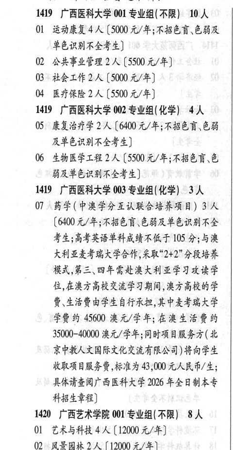

# 1419 广西医科大学

- PDF页码：39
- 书内页码：88
- 专业组：3；专业条目：7

## 001专业组

- 选科要求：不限
- 招生计划：10 人
- 校验：ok

| 专业代码 | 专业名称 | 计划人数 | 学费（元/年） | 备注/完整OCR内容 |
|---|---|---:|---:|---|
| 01 | 运动康复 | 4 | 5000 | 【5000 元/年;不招色言、色弱及 单色识别不全考生] |
| 02 | 公共事业管理 | 2 | 5500 | 【5500 元/年] |
| 03 | 社会工作 | 2 | 5000 | [5000 元/年] |
| 04 | 医疗保险 | 2 | 5500 | 【5500元/年] |

<details><summary>本专业组OCR原文</summary>

```text
1419 广西医科大学 001 专业组(不限) 10 人
01 运动康复4 人【5000 元/年;不招色言、色弱及
单色识别不全考生]
02 公共事业管理 2 人【5500 元/年]
03 社会工作2 人[5000 元/年]
04 医疗保险2人 【5500元/年]
```
</details>

## 002专业组

- 选科要求：化学
- 招生计划：4 人
- 校验：ok

| 专业代码 | 专业名称 | 计划人数 | 学费（元/年） | 备注/完整OCR内容 |
|---|---|---:|---:|---|
| 05 | 康复治疗学 | 2 | 6400 | 【6400元/年;不招色盲、色能 及单色识别不全考生] |
| 06 | 生物医学工程 | 2 | 5500 | 【5500 元/年;不招色盲\色 弱及单色识别不全考生] |

<details><summary>本专业组OCR原文</summary>

```text
1419 广西医科大学 002 专业组(化学) 4人
05 康复治疗学2人【6400元/年;不招色盲、色能
及单色识别不全考生]
06 生物医学工程 2人【5500 元/年;不招色盲\色
弱及单色识别不全考生]
```
</details>

## 003专业组

- 选科要求：化学
- 招生计划：3 人
- 校验：review

| 专业代码 | 专业名称 | 计划人数 | 学费（元/年） | 备注/完整OCR内容 |
|---|---|---:|---:|---|
| 07 | “药学(中澳学分互认联合培养项目) BA |  | 6400 | 6400 元/年;不招色育\色能及单色识别不全 考生;高考英语单科成绩不低于 105 分;与澳 KAILA RA POM, RIDA" PE 模式,第三、四年需赴澳大利亚学习攻读学 位,在澳方高校交流学习期间，澳方高校的学 RAER OFLA TRE LPEE RAF 学费约 45600 澳元/学年; AREER A 35000-40000 澳元/学年;同时项目服务方(北 京中教人文国际文化交流有限公司) 将向学生 收取项目服务费,标准为 3;000 元大民币/生; 具体请查阅广西医科大学 2026 年全日制本专 科招生章程] |

<details><summary>本专业组OCR原文</summary>

```text
1419 广西医科大学 003 专业组(化学) 3人
07 “药学(中澳学分互认联合培养项目) BA
[6400 元/年;不招色育\色能及单色识别不全
考生;高考英语单科成绩不低于 105 分;与澳
KAILA RA POM, RIDA" PE
模式,第三、四年需赴澳大利亚学习攻读学
位,在澳方高校交流学习期间，澳方高校的学
RAER OFLA TRE LPEE RAF
学费约 45600 澳元/学年; AREER A
35000-40000 澳元/学年;同时项目服务方(北
京中教人文国际文化交流有限公司) 将向学生
收取项目服务费,标准为 3;000 元大民币/生;
具体请查阅广西医科大学 2026 年全日制本专
科招生章程]
```
</details>

## 附：院校完整OCR原文

```text
--- PDF第39页（书内第88页），第1栏 ---
1419 广西医科大学 001 专业组(不限) 10 人
01 运动康复4 人【5000 元/年;不招色言、色弱及
单色识别不全考生]
02 公共事业管理 2 人【5500 元/年]
03 社会工作2 人[5000 元/年]
04 医疗保险2人 【5500元/年]
1419 广西医科大学 002 专业组(化学) 4人
05 康复治疗学2人【6400元/年;不招色盲、色能
及单色识别不全考生]
06 生物医学工程 2人【5500 元/年;不招色盲\色
弱及单色识别不全考生]
1419 广西医科大学 003 专业组(化学) 3人
07 “药学(中澳学分互认联合培养项目) BA
[6400 元/年;不招色育\色能及单色识别不全
考生;高考英语单科成绩不低于 105 分;与澳
KAILA RA POM, RIDA" PE
模式,第三、四年需赴澳大利亚学习攻读学
位,在澳方高校交流学习期间，澳方高校的学
RAER OFLA TRE LPEE RAF
学费约 45600 澳元/学年; AREER A
35000-40000 澳元/学年;同时项目服务方(北
京中教人文国际文化交流有限公司) 将向学生
收取项目服务费,标准为 3;000 元大民币/生;
具体请查阅广西医科大学 2026 年全日制本专
科招生章程]
```

## 源图

