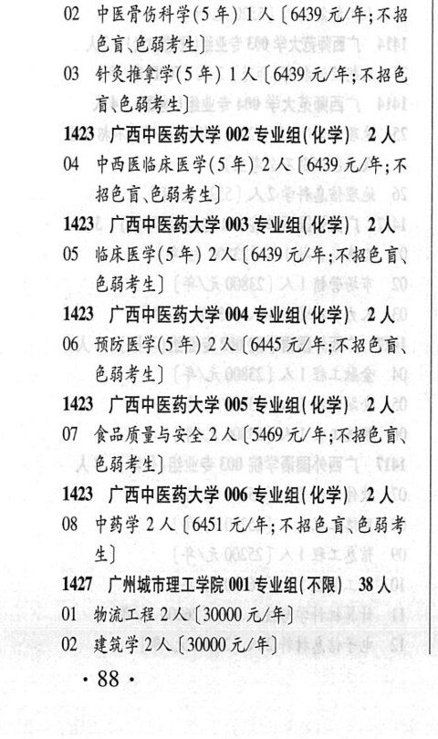

# 1423 广西中医药大学

- PDF页码：39
- 书内页码：88
- 专业组：6；专业条目：8

## 001专业组

- 选科要求：不限
- 招生计划：3 人
- 校验：review

| 专业代码 | 专业名称 | 计划人数 | 学费（元/年） | 备注/完整OCR内容 |
|---|---|---:|---:|---|
| 01 | 中医学(5年) | 1 | 6439 | 【6439元/年;不招色盲、色 BAL) |
| 02 | 中医骨伤科学(5 #) LA ( |  | 6439 | 6439 元/年;不招 色盲色弱考生] |
| 03 | 针灸推拿学(5 年) 1A ( |  | 6439 | 6439 元/年;不招色 裔色弱考生] |

<details><summary>本专业组OCR原文</summary>

```text
1423 广西中医药大学 001 专业组(不限) 3 人
Ol 中医学(5年) 1人【6439元/年;不招色盲、色
BAL)
02 中医骨伤科学(5 #) LA (6439 元/年;不招
色盲色弱考生]
03 针灸推拿学(5 年) 1A (6439 元/年;不招色
裔色弱考生]
```
</details>

## 002专业组

- 选科要求：化学
- 招生计划：2 人
- 校验：ok

| 专业代码 | 专业名称 | 计划人数 | 学费（元/年） | 备注/完整OCR内容 |
|---|---|---:|---:|---|
| 04 | 中西医临床医学(5 年) | 2 | 6439 | 【6439 元/年;不 招色育、色弱考生] |

<details><summary>本专业组OCR原文</summary>

```text
1423 广西中医药大学 002 专业组( 化学) 2 人
04 中西医临床医学(5 年) 2 人【6439 元/年;不
招色育、色弱考生]
```
</details>

## 003专业组

- 选科要求：化学
- 招生计划：2 人
- 校验：review

| 专业代码 | 专业名称 | 计划人数 | 学费（元/年） | 备注/完整OCR内容 |
|---|---|---:|---:|---|
| 05 | 临床医学(5年) 2A ( |  | 6439 | 6439 元/年;不招色盲、 8844) |

<details><summary>本专业组OCR原文</summary>

```text
1423 广西中医药大学 003 专业组( 化学) 2人
05 临床医学(5年) 2A (6439 元/年;不招色盲、
8844)
```
</details>

## 004专业组

- 选科要求：化学
- 招生计划：OCR未稳定识别 人
- 校验：review

| 专业代码 | 专业名称 | 计划人数 | 学费（元/年） | 备注/完整OCR内容 |
|---|---|---:|---:|---|
| 06 | 预防医学(5 年) 2A |  | 6445 | 6445元/年;不招名言、 色弱考生] |

<details><summary>本专业组OCR原文</summary>

```text
1423 广西中医药大学 004 专业组(化学) 2A 色弱考生]
06 预防医学(5 年) 2A [6445元/年;不招名言、
色弱考生]
```
</details>

## 005专业组

- 选科要求：化学
- 招生计划：2 人
- 校验：ok

| 专业代码 | 专业名称 | 计划人数 | 学费（元/年） | 备注/完整OCR内容 |
|---|---|---:|---:|---|
| 07 | 食品质量与安全 | 2 | 5469 | 【5469 元/年;不招色言\ 色磁考生] |

<details><summary>本专业组OCR原文</summary>

```text
1423 广西中医药大学 005 专业组(化学) 2人
07 食品质量与安全 2 人【5469 元/年;不招色言\
色磁考生]
```
</details>

## 006专业组

- 选科要求：化学
- 招生计划：2 人
- 校验：sum-corrected

| 专业代码 | 专业名称 | 计划人数 | 学费（元/年） | 备注/完整OCR内容 |
|---|---|---:|---:|---|
| 08 | 中药学 | 2 |  | 【6451 A/F; BEA CBF 生] |

<details><summary>本专业组OCR原文</summary>

```text
1423 广西中医药大学 006 专业组( 化学) 2A 生]
08 中药学 2 人【6451 A/F; BEA CBF
生]
```
</details>

## 附：院校完整OCR原文

```text
--- PDF第39页（书内第88页），第1栏 ---
1423 广西中医药大学 001 专业组(不限) 3 人
Ol 中医学(5年) 1人【6439元/年;不招色盲、色
BAL)
02 中医骨伤科学(5 #) LA (6439 元/年;不招
色盲色弱考生]
03 针灸推拿学(5 年) 1A (6439 元/年;不招色
裔色弱考生]
1423 广西中医药大学 002 专业组( 化学) 2 人
04 中西医临床医学(5 年) 2 人【6439 元/年;不
招色育、色弱考生]
1423 广西中医药大学 003 专业组( 化学) 2人
05 临床医学(5年) 2A (6439 元/年;不招色盲、
8844)
1423 广西中医药大学 004 专业组(化学) 2A
06 预防医学(5 年) 2A [6445元/年;不招名言、
色弱考生]
1423 广西中医药大学 005 专业组(化学) 2人
07 食品质量与安全 2 人【5469 元/年;不招色言\
色磁考生]
1423 广西中医药大学 006 专业组( 化学) 2A
08 中药学 2 人【6451 A/F; BEA CBF
生]
```

## 源图

