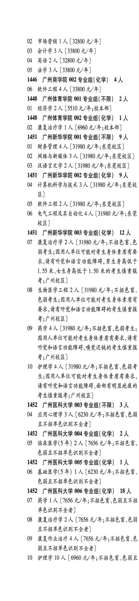
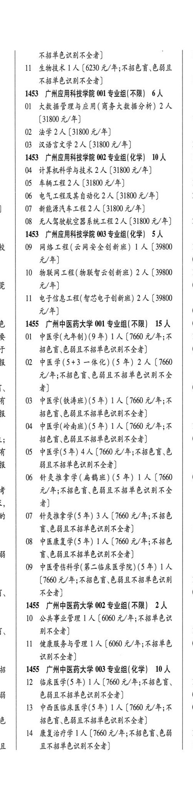

# 1452 广州医科大学

- PDF页码：40
- 书内页码：89
- 专业组：4；专业条目：8

## 003专业组

- 选科要求：不限
- 招生计划：3 人
- 校验：ok

| 专业代码 | 专业名称 | 计划人数 | 学费（元/年） | 备注/完整OCR内容 |
|---|---|---:|---:|---|
| 04 | 应用心理学 | 3 | 6230 | 【6230 元/年;不招色盲色弱 且不招音色识别不全者] |

<details><summary>本专业组OCR原文</summary>

```text
1452 广州医科大学 003 专业组(不限) 3 人
04 应用心理学3 人【6230 元/年;不招色盲色弱
且不招音色识别不全者]
```
</details>

## 004专业组

- 选科要求：化学
- 招生计划：2 人
- 校验：review

| 专业代码 | 专业名称 | 计划人数 | 学费（元/年） | 备注/完整OCR内容 |
|---|---|---:|---:|---|
| 05 | 临床医学(5 年) 2A ( |  | 1656 | 1656 元/年;不招色言、 色弱且不招单色识别不全者] |

<details><summary>本专业组OCR原文</summary>

```text
1452 广州医科大学 004 专业组(化学) 2人
05 临床医学(5 年) 2A (1656 元/年;不招色言、
色弱且不招单色识别不全者]
```
</details>

## 005专业组

- 选科要求：化学
- 招生计划：1 人
- 校验：review

| 专业代码 | 专业名称 | 计划人数 | 学费（元/年） | 备注/完整OCR内容 |
|---|---|---:|---:|---|
| 06 | 基础医学(5年) LA ( |  | 6230 | 6230 元/年;不招色言、 色弱且不招单色识别不全者] |

<details><summary>本专业组OCR原文</summary>

```text
1452 广州医科大学 005 专业组(化学) 1人
06 基础医学(5年) LA (6230 元/年;不招色言、
色弱且不招单色识别不全者]
```
</details>

## 006专业组

- 选科要求：化学
- 招生计划：18 人
- 校验：review

| 专业代码 | 专业名称 | 计划人数 | 学费（元/年） | 备注/完整OCR内容 |
|---|---|---:|---:|---|
| 07 | 药学 | 1 | 7656 | 【7656 元/年;不招色盲色弱且不招 单色识别不全者] |
| 08 | 康复治疗学 | 2 | 7656 | 【7656元/年;不招色育\色弱 且不招音色识别不全者] |
| 09 | 康复作业治疗 | 4 | 7656 | 【7656 元/年;不招色言,色 弱且不招单色识别不全者] |
| 10 | 护理学 | 10 | 6960 | 【6960 元/年;不招色盲、色弱且 不招单色识别不全者] 1 |
| 11 | 生物技术1] 人【6230 4/4; RBER CBE 不招单色识别不全者] 1 |  |  | 11 生物技术1] 人【6230 4/4; RBER CBE 不招单色识别不全者] 1 |

<details><summary>本专业组OCR原文</summary>

```text
1452 广州医科大学 006 专业组(化学) 18 人
07 药学1 人【7656 元/年;不招色盲色弱且不招
单色识别不全者]
08 康复治疗学 2 人【7656元/年;不招色育\色弱
且不招音色识别不全者]
09 康复作业治疗 4 人【7656 元/年;不招色言,色
弱且不招单色识别不全者]
10 护理学 10 人【6960 元/年;不招色盲、色弱且
不招单色识别不全者]    1
11 生物技术1] 人【6230 4/4; RBER CBE
不招单色识别不全者]            1
```
</details>

## 附：院校完整OCR原文

```text
--- PDF第40页（书内第89页），第1栏 ---
1452 广州医科大学 003 专业组(不限) 3 人
04 应用心理学3 人【6230 元/年;不招色盲色弱
且不招音色识别不全者]
1452 广州医科大学 004 专业组(化学) 2人
05 临床医学(5 年) 2A (1656 元/年;不招色言、
色弱且不招单色识别不全者]
1452 广州医科大学 005 专业组(化学) 1人
06 基础医学(5年) LA (6230 元/年;不招色言、
色弱且不招单色识别不全者]
1452 广州医科大学 006 专业组(化学) 18 人
07 药学1 人【7656 元/年;不招色盲色弱且不招
单色识别不全者]
08 康复治疗学 2 人【7656元/年;不招色育\色弱
且不招音色识别不全者]
09 康复作业治疗 4 人【7656 元/年;不招色言,色
弱且不招单色识别不全者]
10 护理学 10 人【6960 元/年;不招色盲、色弱且

--- PDF第40页（书内第89页），第2栏 ---
不招单色识别不全者]    1
11 生物技术1] 人【6230 4/4; RBER CBE
不招单色识别不全者]            1
```

## 源图


