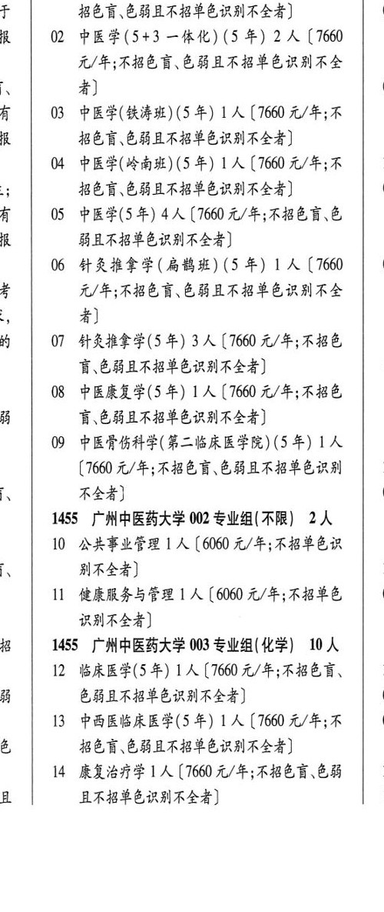
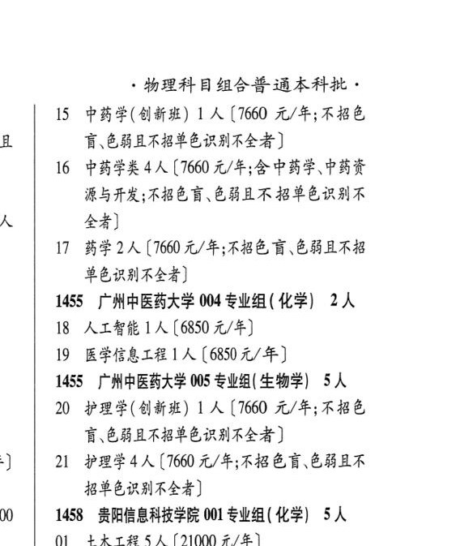

# 1455 广州中医药大学

- PDF页码：40
- 书内页码：89
- 专业组：5；专业条目：12

## 001专业组

- 选科要求：不限
- 招生计划：15 人
- 校验：review

| 专业代码 | 专业名称 | 计划人数 | 学费（元/年） | 备注/完整OCR内容 |
|---|---|---:|---:|---|
|  | 结构化OCR未稳定切分，请查看下方原文及源图 |  |  |  |

<details><summary>本专业组OCR原文</summary>

```text
1455广州中医药大学001专业组（不限）15人
```
</details>

## 002专业组

- 选科要求：不限
- 招生计划：2 人
- 校验：review

| 专业代码 | 专业名称 | 计划人数 | 学费（元/年） | 备注/完整OCR内容 |
|---|---|---:|---:|---|
| 10 | 公共事业管理 \| 人 |  | 6060 | 6060 元/年;不招单色识 别不全者] 1 |
| 11 | 健康服务与管理 | 1 | 6060 | 【6060 元/年;不招单色 0 识别不全者] |

<details><summary>本专业组OCR原文</summary>

```text
1455 广州中医药大学 002 专业组(不限】 2 人
10 公共事业管理 | 人【6060 元/年;不招单色识
别不全者]                 1
11 健康服务与管理 1 人【6060 元/年;不招单色   0
识别不全者]
```
</details>

## 003专业组

- 选科要求：化学
- 招生计划：10 人
- 校验：review

| 专业代码 | 专业名称 | 计划人数 | 学费（元/年） | 备注/完整OCR内容 |
|---|---|---:|---:|---|
| 12 | 临床医学(5年) 1A ( |  | 1660 | 1660 元/年;不招色育、 1 ij EHAABSERAASS) 0 |
| 13 | 中西医临床医学(5年) | 1 | 7660 | 【7660 元/年;不 \| 0 名 招色育、色弱且不招单色识别不全者] |
| 14 | 康复治疗学 | 1 | 7660 | 【7660 元/年;不招色盲色弱 1 且 且不招单色识别不全者] 1 物理科目组合普通本科批。 |
| 15 | 中药学(创新班) | 1 | 7660 | 【7660 元/年;不招色 盲\色能且不招单色识别不全者 ] |
| 16 | 中药学类 | 4 | 7660 | 【7660 元/年;含中药学中药次 源与开发;不招色盲、色能且不 招单色识别不 全者] |
| 17 | 药学 | 2 | 7660 | [7660 元/年;不招色盲、色弱且不招 单色识别不全者] |

<details><summary>本专业组OCR原文</summary>

```text
18  1455 广州中医药大学 003 专业组(化学) 10 人
12 临床医学(5年) 1A (1660 元/年;不招色育、   1
ij     EHAABSERAASS)         0
13 中西医临床医学(5年) 1 人【7660 元/年;不 | 0
名     招色育、色弱且不招单色识别不全者]
14 康复治疗学 1人【7660 元/年;不招色盲色弱   1
且     且不招单色识别不全者]           1
物理科目组合普通本科批。
15 中药学(创新班) 1 人【7660 元/年;不招色
盲\色能且不招单色识别不全者 ]
16 中药学类4人【7660 元/年;含中药学中药次
源与开发;不招色盲、色能且不 招单色识别不
全者]
17 药学2人[7660 元/年;不招色盲、色弱且不招
单色识别不全者]
```
</details>

## 004专业组

- 选科要求：化学
- 招生计划：2 人
- 校验：review

| 专业代码 | 专业名称 | 计划人数 | 学费（元/年） | 备注/完整OCR内容 |
|---|---|---:|---:|---|
| 18 | 人工智能 | 1 | 6850 | [6850 元/年] |
| 19 | 医学信息工程] 人 |  | 6850 | 6850元/年] |

<details><summary>本专业组OCR原文</summary>

```text
1455 广州中医药大学 004 专业组 ( 化学) 2人
18 人工智能1人[6850 元/年]
19 医学信息工程] 人【6850元/年]
```
</details>

## 005专业组

- 选科要求：生物学
- 招生计划：5 人
- 校验：review

| 专业代码 | 专业名称 | 计划人数 | 学费（元/年） | 备注/完整OCR内容 |
|---|---|---:|---:|---|
| 20 | 护理学(创新班) 1A (1660 A/F; KBE 讶色弱且不招单色识别不全者 |  |  | 20 护理学(创新班) 1A (1660 A/F; KBE 讶色弱且不招单色识别不全者 ] |
| 21 | 护理学 | 4 |  | [7660 A/F; ABER EBAR 招单色识别不全者] |

<details><summary>本专业组OCR原文</summary>

```text
1455 广州中医药大学 005 专业组( 生物学) 5人
20 护理学(创新班) 1A (1660 A/F; KBE
讶色弱且不招单色识别不全者 ]
21 护理学4人[7660 A/F; ABER EBAR
招单色识别不全者]
```
</details>

## 附：院校完整OCR原文

```text
--- PDF第40页（书内第89页），第2栏 ---
多   1455 广州中医药大学 001 SW AR) 15 人   0
本   Ol 中医学(九年制) (9 年) 1 人【7660 元/年;不   1
于     BED CHARBSERMALS)      0
02 中医学(5+3 一体化) (5 年) 2 人【7660
元/年;不招色盲色弱且不招单色识别不全
is     4)                    0.
有   03 中医学(铁涛班)(5 年) 1 人【7660 元/年;不
R     招色盲色弱且不招单色识别不全者]
04 中医学(岭南班)(5 年) 1A (1660 元/年;不   1
a     BED CHARBSERMASSE)      0
有  05 中医学(5年) 4 人[7660 元/年;不招色盲色
R     能且不招单色识别不全者]
06 HRS F( HBH) (5 年) LA (7660    0
者     WH FRED CBARBSER MAS
i,     4)
的   07 针灸推拿学(5 年) 3 人【7660 元/年;不招色
盲\色弱且不招单色识别不全者]        1
08 中医康复学(5 年) 1 人【7660 元/年;不招色
i     FERAABEERASS)
09 中医骨伤科学(第二临床医学院) (5 年) 1 人
(1660 元/年;不招色盲色弱且不招单色识别   1
、     不全者                  0
1455 广州中医药大学 002 专业组(不限】 2 人
10 公共事业管理 | 人【6060 元/年;不招单色识
别不全者]                 1
11 健康服务与管理 1 人【6060 元/年;不招单色   0
识别不全者]
18  1455 广州中医药大学 003 专业组(化学) 10 人
12 临床医学(5年) 1A (1660 元/年;不招色育、   1
ij     EHAABSERAASS)         0
13 中西医临床医学(5年) 1 人【7660 元/年;不 | 0
名     招色育、色弱且不招单色识别不全者]
14 康复治疗学 1人【7660 元/年;不招色盲色弱   1
且     且不招单色识别不全者]           1

--- PDF第40页（书内第89页），第3栏 ---
物理科目组合普通本科批。
15 中药学(创新班) 1 人【7660 元/年;不招色
盲\色能且不招单色识别不全者 ]
16 中药学类4人【7660 元/年;含中药学中药次
源与开发;不招色盲、色能且不 招单色识别不
全者]
17 药学2人[7660 元/年;不招色盲、色弱且不招
单色识别不全者]
1455 广州中医药大学 004 专业组 ( 化学) 2人
18 人工智能1人[6850 元/年]
19 医学信息工程] 人【6850元/年]
1455 广州中医药大学 005 专业组( 生物学) 5人
20 护理学(创新班) 1A (1660 A/F; KBE
讶色弱且不招单色识别不全者 ]
21 护理学4人[7660 A/F; ABER EBAR
招单色识别不全者]
```

## 源图


