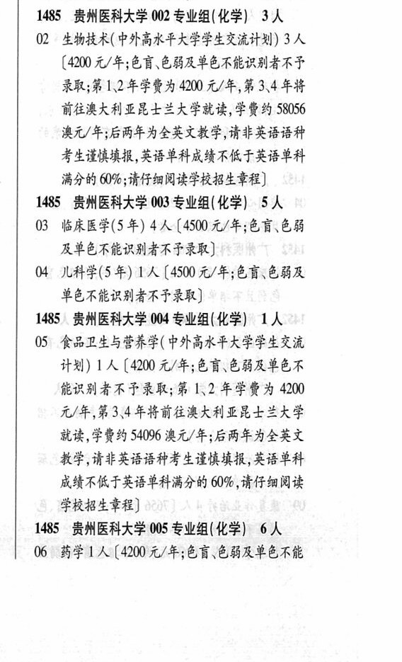
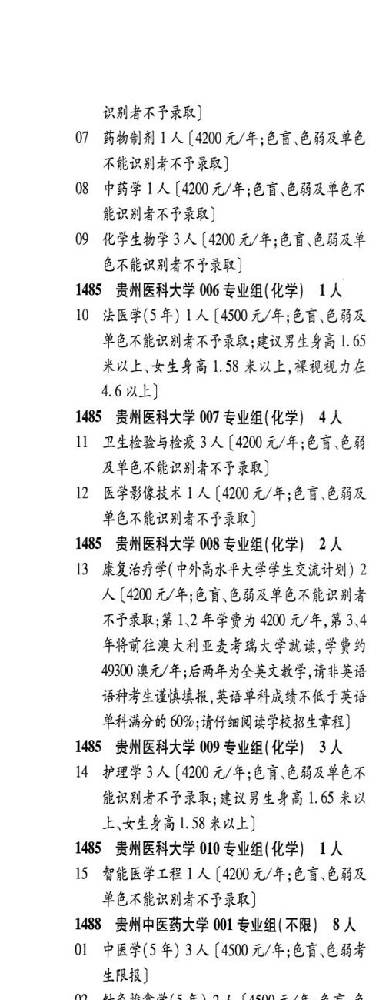

# 1485 贵州医科大学

- PDF页码：41, 42
- 书内页码：90, 91
- 专业组：10；专业条目：15

## 001专业组

- 选科要求：不限
- 招生计划：1 人
- 校验：ok

| 专业代码 | 专业名称 | 计划人数 | 学费（元/年） | 备注/完整OCR内容 |
|---|---|---:|---:|---|
| 01 | 应用心理学 | 1 | 4100 | 【4100 元/年;色盲色弱及单 色不能识别者不予录取] |

<details><summary>本专业组OCR原文</summary>

```text
1485 贵州医科大学 001 专业组(不限) 1人
Ol 应用心理学 1 人【4100 元/年;色盲色弱及单
色不能识别者不予录取]
```
</details>

## 002专业组

- 选科要求：化学
- 招生计划：3 人
- 校验：ok

| 专业代码 | 专业名称 | 计划人数 | 学费（元/年） | 备注/完整OCR内容 |
|---|---|---:|---:|---|
| 02 | “生物技术( 中外高水平大学学生交流计划) | 3 | 4200 | (4200 元/年;色盲色弱及单色不能识别者不予 录取;第 DEER A 400 元/年,第 3\4 年将 前往澳大利亚昆士兰大学就读,学费约 58056 澳元/年;后两年为全英文教学,请非英语语种 考生亲情填报,英语单科成绩不低于英语单科 满分的 60%9;请仔细阅读学校招生章程] |

<details><summary>本专业组OCR原文</summary>

```text
1485 贵州医科大学 002 专业组( 化学) 3人
02 “生物技术( 中外高水平大学学生交流计划) 3 人
(4200 元/年;色盲色弱及单色不能识别者不予
录取;第 DEER A 400 元/年,第 3\4 年将
前往澳大利亚昆士兰大学就读,学费约 58056
澳元/年;后两年为全英文教学,请非英语语种
考生亲情填报,英语单科成绩不低于英语单科
满分的 60%9;请仔细阅读学校招生章程]
```
</details>

## 003专业组

- 选科要求：化学
- 招生计划：5 人
- 校验：review

| 专业代码 | 专业名称 | 计划人数 | 学费（元/年） | 备注/完整OCR内容 |
|---|---|---:|---:|---|
| 03 | 临床医学(5 年) 4A (450 4/4; 68, 68 及单色不能识别者不予录取 |  |  | 03 临床医学(5 年) 4A (450 4/4; 68, 68 及单色不能识别者不予录取] |
| 04 | 几科学(5年) 1A (4500 4/4; OR CBR 单色不能识别者不也录取 |  |  | 04 几科学(5年) 1A (4500 4/4; OR CBR 单色不能识别者不也录取] |

<details><summary>本专业组OCR原文</summary>

```text
1485 贵州医科大学 003 专业组(化学) 5人
03 临床医学(5 年) 4A (450 4/4; 68, 68
及单色不能识别者不予录取]
04 几科学(5年) 1A (4500 4/4; OR CBR
单色不能识别者不也录取]
```
</details>

## 004专业组

- 选科要求：化学
- 招生计划：OCR未稳定识别 人
- 校验：review

| 专业代码 | 专业名称 | 计划人数 | 学费（元/年） | 备注/完整OCR内容 |
|---|---|---:|---:|---|
| 05 | 食品卫生与营养学( 中外高水平大学学生交流 计划) LA ( |  | 4200 | 4200 元/年;色盲、色弱及音色不 能识别者不予录取; 第 上2 年学费为 4200 元/年,第3\4 年将前往澳大利亚昆士兰大学 就读,学费约 54096 澳元/年;后两年为全英文 教学,请非英语语种考生说愤填报;英语单科 成绩不低于英语单科满分的 60% ,请仔细阅读 学校招生章程] |

<details><summary>本专业组OCR原文</summary>

```text
1485 ”贵州医科大学 004 专业组(化学) 工人
05 食品卫生与营养学( 中外高水平大学学生交流
计划) LA (4200 元/年;色盲、色弱及音色不
能识别者不予录取; 第 上2 年学费为 4200
元/年,第3\4 年将前往澳大利亚昆士兰大学
就读,学费约 54096 澳元/年;后两年为全英文
教学,请非英语语种考生说愤填报;英语单科
成绩不低于英语单科满分的 60% ,请仔细阅读
学校招生章程]
```
</details>

## 005专业组

- 选科要求：化学
- 招生计划：6 人
- 校验：review

| 专业代码 | 专业名称 | 计划人数 | 学费（元/年） | 备注/完整OCR内容 |
|---|---|---:|---:|---|
| 06 | 药学 | 1 | 4200 | [4200元/年;色盲色弱及单色不能 识别者不予录取] |
| 07 | 药物制剂 1] 人 |  | 4200 | 4200 元/年;色盲色弱及单色 不能识别者不予录取] |
| 08 | 中药学 | 1 | 4200 | [4200 元/年;色盲、色弱及单色不 能识别者不予录取] |
| 09 | 化学生物学 | 3 | 4200 | 【4200 元/年;色盲.色弱及单 色不能识别者不予录取] |

<details><summary>本专业组OCR原文</summary>

```text
1485 贵州医科大学 005 专业组(化学) 6人
06 药学1 人[4200元/年;色盲色弱及单色不能
识别者不予录取]
07 药物制剂 1] 人【4200 元/年;色盲色弱及单色
不能识别者不予录取]
08 中药学 1 人[4200 元/年;色盲、色弱及单色不
能识别者不予录取]
09 化学生物学3 人【4200 元/年;色盲.色弱及单
色不能识别者不予录取]
```
</details>

## 006专业组

- 选科要求：化学
- 招生计划：1 人
- 校验：ok

| 专业代码 | 专业名称 | 计划人数 | 学费（元/年） | 备注/完整OCR内容 |
|---|---|---:|---:|---|
| 10 | 法医学(5年) | 1 | 4500 | [4500 元/年;色育、色弱及 单色不能识别者不予录取;建议男生身高 1. 65 米以上、女生身高 1. 58 米以上,裸视视力在 4.6以上] |

<details><summary>本专业组OCR原文</summary>

```text
1485 贵州医科大学 006 专业组(化学) 1人
10 法医学(5年) 1 人[4500 元/年;色育、色弱及
单色不能识别者不予录取;建议男生身高 1. 65
米以上、女生身高 1. 58 米以上,裸视视力在
4.6以上]
```
</details>

## 007专业组

- 选科要求：化学
- 招生计划：4 人
- 校验：ok

| 专业代码 | 专业名称 | 计划人数 | 学费（元/年） | 备注/完整OCR内容 |
|---|---|---:|---:|---|
| 11 | 卫生检验与检疫 | 3 | 4200 | 【4200 元/年;色育、色能 及单色不能识别者不了予录取] |
| 12 | 医学影像技术 | 1 | 4200 | 【4200 元/年;色盲色弱及 单色不能识别者不予录取] |

<details><summary>本专业组OCR原文</summary>

```text
1485 贵州医科大学 007 专业组(化学) 4人
11 卫生检验与检疫 3 人【4200 元/年;色育、色能
及单色不能识别者不了予录取]
12 医学影像技术 1 人【4200 元/年;色盲色弱及
单色不能识别者不予录取]
```
</details>

## 008专业组

- 选科要求：化学
- 招生计划：2 人
- 校验：review

| 专业代码 | 专业名称 | 计划人数 | 学费（元/年） | 备注/完整OCR内容 |
|---|---|---:|---:|---|
| 13 | 康复治疗学(中外高水平大学学生交流计划) 2 K ( |  | 400 | 400 元/年;色盲色弱及单色不能识别者 不子录取;第 12 $F HA 4200 元/年,第3.4 FHHERAAM LAA RARE, FRA 49300 澳元/年;后两年为全英文教学,请非英语 语种考生谱愤填报,英语单科成绩不低于英语 单科满分的 6096 ;请仔细阅读学校招生章程] |

<details><summary>本专业组OCR原文</summary>

```text
1485 贵州医科大学 008 专业组(化学) 2人
13 康复治疗学(中外高水平大学学生交流计划) 2
K (400 元/年;色盲色弱及单色不能识别者
不子录取;第 12 $F HA 4200 元/年,第3.4
FHHERAAM LAA RARE, FRA
49300 澳元/年;后两年为全英文教学,请非英语
语种考生谱愤填报,英语单科成绩不低于英语
单科满分的 6096 ;请仔细阅读学校招生章程]
```
</details>

## 009专业组

- 选科要求：化学
- 招生计划：3 人
- 校验：ok

| 专业代码 | 专业名称 | 计划人数 | 学费（元/年） | 备注/完整OCR内容 |
|---|---|---:|---:|---|
| 14 | 护理学 | 3 | 4200 | 【4200 元/年;色盲、色弱及单色不 能识别者不予录取; 建议男生身高 1.65 米以 上、女生身高1.58 米以上] |

<details><summary>本专业组OCR原文</summary>

```text
1485 贵州医科大学 009 专业组(化学) 3 人
14 护理学3人【4200 元/年;色盲、色弱及单色不
能识别者不予录取; 建议男生身高 1.65 米以
上、女生身高1.58 米以上]
```
</details>

## 010专业组

- 选科要求：化学
- 招生计划：OCR未稳定识别 人
- 校验：review

| 专业代码 | 专业名称 | 计划人数 | 学费（元/年） | 备注/完整OCR内容 |
|---|---|---:|---:|---|
| 15 | 智能医学工程 ] 人 |  | 4200 | 4200 元/年;色盲色弱及 单色不能识别者不予录取] |

<details><summary>本专业组OCR原文</summary>

```text
1485 贵州医科大学 010 专业组( 化学) 1A
15 智能医学工程 ] 人【4200 元/年;色盲色弱及
单色不能识别者不予录取]
```
</details>

## 附：院校完整OCR原文

```text
--- PDF第41页（书内第90页），第3栏 ---
1485 贵州医科大学 001 专业组(不限) 1人
Ol 应用心理学 1 人【4100 元/年;色盲色弱及单
色不能识别者不予录取]
1485 贵州医科大学 002 专业组( 化学) 3人
02 “生物技术( 中外高水平大学学生交流计划) 3 人
(4200 元/年;色盲色弱及单色不能识别者不予
录取;第 DEER A 400 元/年,第 3\4 年将
前往澳大利亚昆士兰大学就读,学费约 58056
澳元/年;后两年为全英文教学,请非英语语种
考生亲情填报,英语单科成绩不低于英语单科
满分的 60%9;请仔细阅读学校招生章程]
1485 贵州医科大学 003 专业组(化学) 5人
03 临床医学(5 年) 4A (450 4/4; 68, 68
及单色不能识别者不予录取]
04 几科学(5年) 1A (4500 4/4; OR CBR
单色不能识别者不也录取]
1485 ”贵州医科大学 004 专业组(化学) 工人
05 食品卫生与营养学( 中外高水平大学学生交流
计划) LA (4200 元/年;色盲、色弱及音色不
能识别者不予录取; 第 上2 年学费为 4200
元/年,第3\4 年将前往澳大利亚昆士兰大学
就读,学费约 54096 澳元/年;后两年为全英文
教学,请非英语语种考生说愤填报;英语单科
成绩不低于英语单科满分的 60% ,请仔细阅读
学校招生章程]
1485 贵州医科大学 005 专业组(化学) 6人
06 药学1 人[4200元/年;色盲色弱及单色不能

--- PDF第42页（书内第91页），第1栏 ---
识别者不予录取]
07 药物制剂 1] 人【4200 元/年;色盲色弱及单色
不能识别者不予录取]
08 中药学 1 人[4200 元/年;色盲、色弱及单色不
能识别者不予录取]
09 化学生物学3 人【4200 元/年;色盲.色弱及单
色不能识别者不予录取]
1485 贵州医科大学 006 专业组(化学) 1人
10 法医学(5年) 1 人[4500 元/年;色育、色弱及
单色不能识别者不予录取;建议男生身高 1. 65
米以上、女生身高 1. 58 米以上,裸视视力在
4.6以上]
1485 贵州医科大学 007 专业组(化学) 4人
11 卫生检验与检疫 3 人【4200 元/年;色育、色能
及单色不能识别者不了予录取]
12 医学影像技术 1 人【4200 元/年;色盲色弱及
单色不能识别者不予录取]
1485 贵州医科大学 008 专业组(化学) 2人
13 康复治疗学(中外高水平大学学生交流计划) 2
K (400 元/年;色盲色弱及单色不能识别者
不子录取;第 12 $F HA 4200 元/年,第3.4
FHHERAAM LAA RARE, FRA
49300 澳元/年;后两年为全英文教学,请非英语
语种考生谱愤填报,英语单科成绩不低于英语
单科满分的 6096 ;请仔细阅读学校招生章程]
1485 贵州医科大学 009 专业组(化学) 3 人
14 护理学3人【4200 元/年;色盲、色弱及单色不
能识别者不予录取; 建议男生身高 1.65 米以
上、女生身高1.58 米以上]
1485 贵州医科大学 010 专业组( 化学) 1A
15 智能医学工程 ] 人【4200 元/年;色盲色弱及
单色不能识别者不予录取]
```

## 源图


