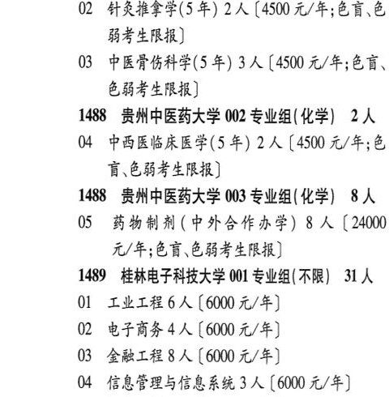

# 1488 贵州中医药大学

- PDF页码：42
- 书内页码：91
- 专业组：3；专业条目：5

## 001专业组

- 选科要求：不限
- 招生计划：8 人
- 校验：review

| 专业代码 | 专业名称 | 计划人数 | 学费（元/年） | 备注/完整OCR内容 |
|---|---|---:|---:|---|
| 01 | 中医学(5年) | 3 | 4500 | 【4500 元/年;色盲、色弱考 生限报] |
| 02 | 针灸推拿学(5 年) 2A ( |  | 4500 | 4500 元/年;色盲、色 BA LRU) |
| 03 | 中医骨伤科学(5 #) 3A (4500 4/4568, EHF ERR) |  |  | 03 中医骨伤科学(5 #) 3A (4500 4/4568, EHF ERR) |

<details><summary>本专业组OCR原文</summary>

```text
1488 贵州中医药大学 001 专业组(不限】 8 人
Ol 中医学(5年) 3 人【4500 元/年;色盲、色弱考
生限报]
02 针灸推拿学(5 年) 2A (4500 元/年;色盲、色
BA LRU)
03 中医骨伤科学(5 #) 3A (4500 4/4568,
EHF ERR)
```
</details>

## 002专业组

- 选科要求：化学
- 招生计划：2 人
- 校验：ok

| 专业代码 | 专业名称 | 计划人数 | 学费（元/年） | 备注/完整OCR内容 |
|---|---|---:|---:|---|
| 04 | 中西医临床医学(5 年) | 2 | 4500 | 【4500 元/年;色 讶色弱考生限报] |

<details><summary>本专业组OCR原文</summary>

```text
1488 贵州中医药大学 002 专业组( 化学) 2人
04 中西医临床医学(5 年) 2 人【4500 元/年;色
讶色弱考生限报]
```
</details>

## 003专业组

- 选科要求：化学
- 招生计划：8 人
- 校验：review

| 专业代码 | 专业名称 | 计划人数 | 学费（元/年） | 备注/完整OCR内容 |
|---|---|---:|---:|---|
| 05 | 药物制剂(中外合作办学) 8 A (24000 S/H; EW CBF LNB) |  |  | 05 药物制剂(中外合作办学) 8 A (24000 S/H; EW CBF LNB) |

<details><summary>本专业组OCR原文</summary>

```text
1488 贵州中医药大学 003 专业组(化学) 8 人
05 药物制剂(中外合作办学) 8 A (24000
S/H; EW CBF LNB)
```
</details>

## 附：院校完整OCR原文

```text
--- PDF第42页（书内第91页），第1栏 ---
1488 贵州中医药大学 001 专业组(不限】 8 人
Ol 中医学(5年) 3 人【4500 元/年;色盲、色弱考
生限报]
02 针灸推拿学(5 年) 2A (4500 元/年;色盲、色
BA LRU)
03 中医骨伤科学(5 #) 3A (4500 4/4568,
EHF ERR)
1488 贵州中医药大学 002 专业组( 化学) 2人
04 中西医临床医学(5 年) 2 人【4500 元/年;色
讶色弱考生限报]
1488 贵州中医药大学 003 专业组(化学) 8 人
05 药物制剂(中外合作办学) 8 A (24000
S/H; EW CBF LNB)
```

## 源图

