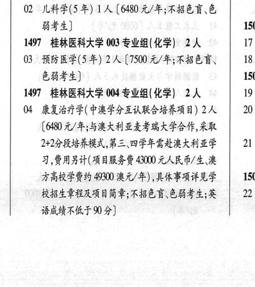
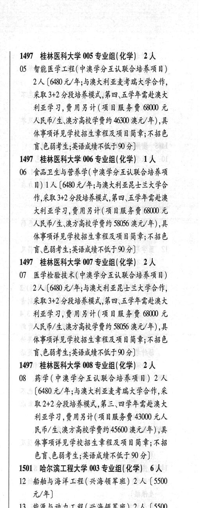

# 1497 桂林医科大学

- PDF页码：43
- 书内页码：92
- 专业组：8；专业条目：7

## 001专业组

- 选科要求：化学
- 招生计划：4 人
- 校验：review

| 专业代码 | 专业名称 | 计划人数 | 学费（元/年） | 备注/完整OCR内容 |
|---|---|---:|---:|---|
|  | 结构化OCR未稳定切分，请查看下方原文及源图 |  |  |  |

<details><summary>本专业组OCR原文</summary>

```text
1497 ”桂林医科大学 001 专业组( 化学) 4人
OL 临床医学(5 年) 4A (7500 元/年;不招色育、   1501
色弱考生]                 15
```
</details>

## 002专业组

- 选科要求：化学
- 招生计划：1 人
- 校验：sum-corrected

| 专业代码 | 专业名称 | 计划人数 | 学费（元/年） | 备注/完整OCR内容 |
|---|---|---:|---:|---|
| 02 | 儿科学(5年) | 1 | 6480 | 【6480 元/年;不招色盲\色 弱考生] 1501 |

<details><summary>本专业组OCR原文</summary>

```text
1497 ”桂林医科大学 002 专业组(化学) 1A    16 弱考生]                  1501
02 儿科学(5年) 1人【6480 元/年;不招色盲\色
弱考生]                  1501
```
</details>

## 003专业组

- 选科要求：化学
- 招生计划：2 人
- 校验：ok

| 专业代码 | 专业名称 | 计划人数 | 学费（元/年） | 备注/完整OCR内容 |
|---|---|---:|---:|---|
| 03 | “预防医学(5年) | 2 | 7500 | 【7500 元/年;不招色盲、 18 EHF) 1501 |

<details><summary>本专业组OCR原文</summary>

```text
1497 ”桂林医科大学 003 专业组(化学) 2人    17
03 “预防医学(5年) 2 人【7500 元/年;不招色盲、   18
EHF)                 1501
```
</details>

## 004专业组

- 选科要求：OCR未稳定识别
- 招生计划：2 人
- 校验：ok

| 专业代码 | 专业名称 | 计划人数 | 学费（元/年） | 备注/完整OCR内容 |
|---|---|---:|---:|---|
| 04 | 康复治疗学(中澳学分互认联合培养项目) | 2 | 6480 | \| 20 [6480 元/年;与澳大利亚才考瑞大学合作,采取 2+2分段培养模式,第三\四学年需赴澳大利亚学 21 习,费用另计(项目服务沈43000 元人民币/生、澳 方高校学费约 49300 澳元/年) ,具体事项详见学 1501 校招生章程及项目简章;不招色育\色弱考生;英 22 BRAT 0) |

<details><summary>本专业组OCR原文</summary>

```text
1497 桂林医科大学 004 专业组(化学| 2人    19
04 康复治疗学(中澳学分互认联合培养项目) 2人| 20
[6480 元/年;与澳大利亚才考瑞大学合作,采取
2+2分段培养模式,第三\四学年需赴澳大利亚学   21
习,费用另计(项目服务沈43000 元人民币/生、澳
方高校学费约 49300 澳元/年) ,具体事项详见学 1501
校招生章程及项目简章;不招色育\色弱考生;英   22
BRAT 0)
```
</details>

## 005专业组

- 选科要求：化学
- 招生计划：2 人
- 校验：ok

| 专业代码 | 专业名称 | 计划人数 | 学费（元/年） | 备注/完整OCR内容 |
|---|---|---:|---:|---|
| 05 | 智能医学工程(中澳学分互认联合培养项目) | 2 | 6480 | [6480 元/年;与澳大利亚去考瑞大学合作， 采取3+2 分段培养模式,第四、五学年需赴澳大 利亚学习,费用另计(项目服务费 68000 元 人民币/生、澳方高校学费约 46300 澳元/年) ,具 体事项详见学校招生章程及项目简章;不招色 育\色弱考生;英语成绩不佐于9分] |

<details><summary>本专业组OCR原文</summary>

```text
1497 桂林医科大学 005 专业组(化学) 2 人
05 智能医学工程(中澳学分互认联合培养项目)
2人 [6480 元/年;与澳大利亚去考瑞大学合作，
采取3+2 分段培养模式,第四、五学年需赴澳大
利亚学习,费用另计(项目服务费 68000 元
人民币/生、澳方高校学费约 46300 澳元/年) ,具
体事项详见学校招生章程及项目简章;不招色
育\色弱考生;英语成绩不佐于9分]
```
</details>

## 006专业组

- 选科要求：化学
- 招生计划：1 人
- 校验：sum-corrected

| 专业代码 | 专业名称 | 计划人数 | 学费（元/年） | 备注/完整OCR内容 |
|---|---|---:|---:|---|
| 06 | 食品卫生与营养学(中澳学分互认联合培养项 目) | 1 | 6480 | [6480 元/年;与澳大利亚昆士兰大学合 作,采取3+2 分段培养模式,第四、五学年需赴澳 KALE, MAK H(A ARF K 6800 元 人民币/生、澳方高校学费约 58056 澳元/年) ,具 体事项详见学校招生章程及项目简章;不招色 讶色弱考生;英语成绩不低于90分] |

<details><summary>本专业组OCR原文</summary>

```text
1497 “桂林医科大学 006 专业组(化学) 1A
06 食品卫生与营养学(中澳学分互认联合培养项
目) 1人[6480 元/年;与澳大利亚昆士兰大学合
作,采取3+2 分段培养模式,第四、五学年需赴澳
KALE, MAK H(A ARF K 6800 元
人民币/生、澳方高校学费约 58056 澳元/年) ,具
体事项详见学校招生章程及项目简章;不招色
讶色弱考生;英语成绩不低于90分]
```
</details>

## 007专业组

- 选科要求：化学
- 招生计划：2 人
- 校验：ok

| 专业代码 | 专业名称 | 计划人数 | 学费（元/年） | 备注/完整OCR内容 |
|---|---|---:|---:|---|
| 07 | 医学检验技术(中澳学分互认联合培养项目) | 2 | 6480 | [6480 元/年;与澳大利亚昆士兰大学合作， 采取3+2 分段培养模式,第四、五学年需赴澳大 利亚学习,费用另计(项目服务费 68000 元 人民币/生、澳方高校学费约 58056 澳元/年),具 体事项详见学校招生章程及项目简章;不招色 言\色弱考生;英语成绩不低于90 分] |

<details><summary>本专业组OCR原文</summary>

```text
1497 桂林医科大学 007 专业组(化学) 2 人
07 医学检验技术(中澳学分互认联合培养项目)
2人 [6480 元/年;与澳大利亚昆士兰大学合作，
采取3+2 分段培养模式,第四、五学年需赴澳大
利亚学习,费用另计(项目服务费 68000 元
人民币/生、澳方高校学费约 58056 澳元/年),具
体事项详见学校招生章程及项目简章;不招色
言\色弱考生;英语成绩不低于90 分]
```
</details>

## 008专业组

- 选科要求：化学
- 招生计划：2 人
- 校验：ok

| 专业代码 | 专业名称 | 计划人数 | 学费（元/年） | 备注/完整OCR内容 |
|---|---|---:|---:|---|
| 08 | 药学(中澳学分互认联合培养项目) | 2 |  | (480 A/F; 5RAAMLRE RAMEE, RK 取2+2 分段培养模式,第三、四学年需赴澳大 利亚学习,费用另计(项目服务费 43000 元人 民币/生、澳方高校学费约45600 澳元/年) ;具 体事项详见学校招生章程及项目简章;不招 色盲、色弱考生;英语成绩不低于90 分] |

<details><summary>本专业组OCR原文</summary>

```text
1497 桂林医科大学 008 专业组(化学) 2人
08 药学(中澳学分互认联合培养项目) 2 人
(480 A/F; 5RAAMLRE RAMEE, RK
取2+2 分段培养模式,第三、四学年需赴澳大
利亚学习,费用另计(项目服务费 43000 元人
民币/生、澳方高校学费约45600 澳元/年) ;具
体事项详见学校招生章程及项目简章;不招
色盲、色弱考生;英语成绩不低于90 分]
```
</details>

## 附：院校完整OCR原文

```text
--- PDF第43页（书内第92页），第2栏 ---
1497 ”桂林医科大学 001 专业组( 化学) 4人
OL 临床医学(5 年) 4A (7500 元/年;不招色育、   1501
色弱考生]                 15
1497 ”桂林医科大学 002 专业组(化学) 1A    16
02 儿科学(5年) 1人【6480 元/年;不招色盲\色
弱考生]                  1501
1497 ”桂林医科大学 003 专业组(化学) 2人    17
03 “预防医学(5年) 2 人【7500 元/年;不招色盲、   18
EHF)                 1501
1497 桂林医科大学 004 专业组(化学| 2人    19
04 康复治疗学(中澳学分互认联合培养项目) 2人| 20
[6480 元/年;与澳大利亚才考瑞大学合作,采取
2+2分段培养模式,第三\四学年需赴澳大利亚学   21
习,费用另计(项目服务沈43000 元人民币/生、澳
方高校学费约 49300 澳元/年) ,具体事项详见学 1501
校招生章程及项目简章;不招色育\色弱考生;英   22
BRAT 0)

--- PDF第43页（书内第92页），第3栏 ---
1497 桂林医科大学 005 专业组(化学) 2 人
05 智能医学工程(中澳学分互认联合培养项目)
2人 [6480 元/年;与澳大利亚去考瑞大学合作，
采取3+2 分段培养模式,第四、五学年需赴澳大
利亚学习,费用另计(项目服务费 68000 元
人民币/生、澳方高校学费约 46300 澳元/年) ,具
体事项详见学校招生章程及项目简章;不招色
育\色弱考生;英语成绩不佐于9分]
1497 “桂林医科大学 006 专业组(化学) 1A
06 食品卫生与营养学(中澳学分互认联合培养项
目) 1人[6480 元/年;与澳大利亚昆士兰大学合
作,采取3+2 分段培养模式,第四、五学年需赴澳
KALE, MAK H(A ARF K 6800 元
人民币/生、澳方高校学费约 58056 澳元/年) ,具
体事项详见学校招生章程及项目简章;不招色
讶色弱考生;英语成绩不低于90分]
1497 桂林医科大学 007 专业组(化学) 2 人
07 医学检验技术(中澳学分互认联合培养项目)
2人 [6480 元/年;与澳大利亚昆士兰大学合作，
采取3+2 分段培养模式,第四、五学年需赴澳大
利亚学习,费用另计(项目服务费 68000 元
人民币/生、澳方高校学费约 58056 澳元/年),具
体事项详见学校招生章程及项目简章;不招色
言\色弱考生;英语成绩不低于90 分]
1497 桂林医科大学 008 专业组(化学) 2人
08 药学(中澳学分互认联合培养项目) 2 人
(480 A/F; 5RAAMLRE RAMEE, RK
取2+2 分段培养模式,第三、四学年需赴澳大
利亚学习,费用另计(项目服务费 43000 元人
民币/生、澳方高校学费约45600 澳元/年) ;具
体事项详见学校招生章程及项目简章;不招
色盲、色弱考生;英语成绩不低于90 分]
```

## 源图


