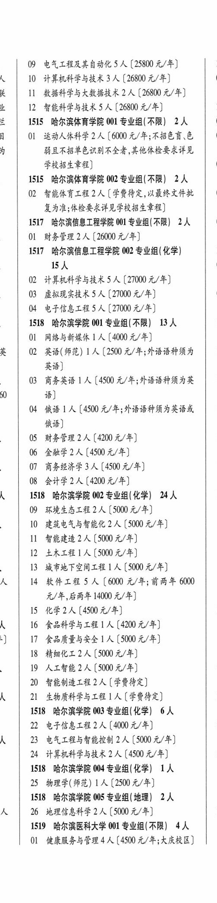
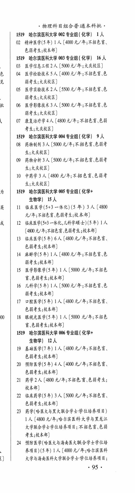
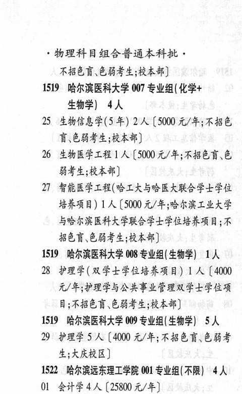

# 1519 哈尔滨医科大学

- PDF页码：46, 47
- 书内页码：95, 96
- 专业组：9；专业条目：29

## 001专业组

- 选科要求：不限
- 招生计划：4 人
- 校验：ok

| 专业代码 | 专业名称 | 计划人数 | 学费（元/年） | 备注/完整OCR内容 |
|---|---|---:|---:|---|
| 01 | 健康服务与管理 | 4 | 4500 | 【4500 元/年;大庆校区] 物理科目组合普通本科批， |

<details><summary>本专业组OCR原文</summary>

```text
1519 哈尔滨医科大学 001 专业组(不限) 4 人
01 健康服务与管理4 人【4500 元/年;大庆校区]
物理科目组合普通本科批，
```
</details>

## 002专业组

- 选科要求：化学
- 招生计划：1 人
- 校验：review

| 专业代码 | 专业名称 | 计划人数 | 学费（元/年） | 备注/完整OCR内容 |
|---|---|---:|---:|---|
| 02 | 精神医学(5年) ] 人 |  | 4000 | 4000 元/年;不招色盲、 EBL RAN) |

<details><summary>本专业组OCR原文</summary>

```text
1519 ”哈尔滨医科大学 002 专业组 ( 化学) 1人
02 精神医学(5年) ] 人【4000 元/年;不招色盲、
EBL RAN)
```
</details>

## 003专业组

- 选科要求：化学
- 招生计划：16 人
- 校验：ok

| 专业代码 | 专业名称 | 计划人数 | 学费（元/年） | 备注/完整OCR内容 |
|---|---|---:|---:|---|
| 03 | 医学信息工程 | 2 | 5000 | [5000 元/年;大庆校区] |
| 04 | 医学检验技术 | 5 | 4000 | 【4000元/年;不招色育.色 BAL; KRKB) |
| 05 | ”医学实验技术 | 2 |  | 【5500 0/4; KBE BAL; KRRB) |
| 06 | 医学影像技术 | 3 | 5000 | 【5000 元/年;不招色言\色 弱考生;大庆校区] |
| 07 | 康复治疗学 | 4 |  | 【4800 4/4; RBER EB 考生;大庆校区] |

<details><summary>本专业组OCR原文</summary>

```text
1519 哈尔滨医科大学 003 专业组 ( 化学) 16 人
03 医学信息工程 2 人[5000 元/年;大庆校区]
04 医学检验技术5人【4000元/年;不招色育.色
BAL; KRKB)
05 ”医学实验技术 2 人【5500 0/4; KBE
BAL; KRRB)
06 医学影像技术3 人【5000 元/年;不招色言\色
弱考生;大庆校区]
07 康复治疗学4人【4800 4/4; RBER EB
考生;大庆校区]
```
</details>

## 004专业组

- 选科要求：化学
- 招生计划：9 人
- 校验：sum-corrected

| 专业代码 | 专业名称 | 计划人数 | 学费（元/年） | 备注/完整OCR内容 |
|---|---|---:|---:|---|
| 08 | 药物制剂 | 3 |  | [5000 4/4; KIER CBF 生;大庆校区] |
| 09 | 药物分析 | 3 | 5000 | [5000 元/年;不招色盲、色弱者 生;大庆校区] |
| 10 | 中药学 | 3 | 4800 | 【4800 元/年;不招色盲.色弱考 生;大庆校区] |

<details><summary>本专业组OCR原文</summary>

```text
1519 哈尔滨医科大学 004 专业组 ( 化学) 9A
08 药物制剂 3 人[5000 4/4; KIER CBF
生;大庆校区]
09 药物分析 3 人[5000 元/年;不招色盲、色弱者
生;大庆校区]
10 中药学 3 人【4800 元/年;不招色盲.色弱考
生;大庆校区]
```
</details>

## 005专业组

- 选科要求：化学+生物学
- 招生计划：15 人
- 校验：review

| 专业代码 | 专业名称 | 计划人数 | 学费（元/年） | 备注/完整OCR内容 |
|---|---|---:|---:|---|
| 11 | 临床医学(5+3 一体化) (5 年) | 3 | 4800 | 【4800 元/年;不招色盲.色弱考生;校本部] |
| 12 | ”临床医学(5+3 一体化,儿科学硕士) (5年) LA (4800 4/4; ABER EBS HAH) |  |  | 12 ”临床医学(5+3 一体化,儿科学硕士) (5年) LA (4800 4/4; ABER EBS HAH) |
| 13 | 临床医学(5 年) 6A ( |  | 4800 | 4800 元/年;不招色盲、 色弱考生;校本部] |
| 14 | 麻醉学(5 年) LA ( |  | 4800 | 4800 元/年;不招色盲、色 BAL RAR) |
| 15 | 医学影像学(5 年) 1A ( |  | 5000 | 5000 元/年;不招色 Hi CHFS RAH) |
| 16 | 儿科学(5年) LA (5000 A/F; ABER E BFL BAR) |  |  | 16 儿科学(5年) LA (5000 A/F; ABER E BFL BAR) |
| 17 | 口腔医学(5年) 1A ( |  | 480 | 480 元/年;不招色盲、 色弱考生;校本部] |
| 18 | 眼视光医学(5 年) 1A ( |  | 5000 | 5000 元/年;不招色 BEHFE RAR) |

<details><summary>本专业组OCR原文</summary>

```text
1519 哈尔滨医科大学 005 专业组 ( 化学+ 生物学) 15人
11 临床医学(5+3 一体化) (5 年) 3 人【4800
元/年;不招色盲.色弱考生;校本部]
12 ”临床医学(5+3 一体化,儿科学硕士) (5年) LA
(4800 4/4; ABER EBS HAH)
13 临床医学(5 年) 6A (4800 元/年;不招色盲、
色弱考生;校本部]
14 麻醉学(5 年) LA (4800 元/年;不招色盲、色
BAL RAR)
15 医学影像学(5 年) 1A (5000 元/年;不招色
Hi CHFS RAH)
16 儿科学(5年) LA (5000 A/F; ABER E
BFL BAR)
17 口腔医学(5年) 1A (480 元/年;不招色盲、
色弱考生;校本部]
18 眼视光医学(5 年) 1A (5000 元/年;不招色
BEHFE RAR)
```
</details>

## 006专业组

- 选科要求：化学+生物学
- 招生计划：12 人
- 校验：review

| 专业代码 | 专业名称 | 计划人数 | 学费（元/年） | 备注/完整OCR内容 |
|---|---|---:|---:|---|
| 19 | 基础医学(7年) ] 人 |  | 4800 | 4800 元/年;不招色盲、 色弱考生;校本部] |
| 20 | 预防医学(5年) | 4 | 4000 | 【4000 元/年;不招色言、 色弱考生;校本部] |
| 21 | 药学 | 2 | 4800 | 【4800 元/年;不招色讶色弱考生; 校本部] |
| 22 | 临床药学(5 年) | 3 | 5000 | 【5000 元/年;不招色言、 色弱考生;校本部] |
| 23 | 药学(哈医大与黑大联合学士学位培养项目) | 1 | 4800 | 【4800 元/年;哈尔滨医科大学与黑龙江 大学联合学士学位培养项目;不招色盲、色能 考生;校本部] |
| 24 | 预防医学(哈医大与海南医大联合学士学位培 HHA) (SE) 1A ( |  | 4000 | 4000 元/年;哈尔滨医科 大学与海南医科大学联合学士学位培养项目; 955 物理科目组合普通本科批， 不招色盲、色弱考生;校本部] |

<details><summary>本专业组OCR原文</summary>

```text
1519 哈尔滨医科大学 006 专业组 ( 化学+ 生物学) 12 人
19 基础医学(7年) ] 人【4800 元/年;不招色盲、
色弱考生;校本部]
20 预防医学(5年) 4 人【4000 元/年;不招色言、
色弱考生;校本部]
21 药学2人【4800 元/年;不招色讶色弱考生;
校本部]
22 临床药学(5 年) 3 人【5000 元/年;不招色言、
色弱考生;校本部]
23 药学(哈医大与黑大联合学士学位培养项目)
1 人【4800 元/年;哈尔滨医科大学与黑龙江
大学联合学士学位培养项目;不招色盲、色能
考生;校本部]
24 预防医学(哈医大与海南医大联合学士学位培
HHA) (SE) 1A (4000 元/年;哈尔滨医科
大学与海南医科大学联合学士学位培养项目;
955
物理科目组合普通本科批，
不招色盲、色弱考生;校本部]
```
</details>

## 007专业组

- 选科要求：化学+生物学
- 招生计划：4 人
- 校验：review

| 专业代码 | 专业名称 | 计划人数 | 学费（元/年） | 备注/完整OCR内容 |
|---|---|---:|---:|---|
| 25 | 生物信息学(5 年) | 2 | 5000 | 【5000 元/年;不招色 育\色弱考生;校本部] |
| 26 | 生物医学工程 \| 人 |  | 5000 | 5000 元/年;不招色育、色 BFE BAR) |
| 27 | 智能医学工程(哈工大与哈医大联合学士学位 培养项目) 1A ( |  | 5000 | 5000 元/年;哈尔滨工业大学 与哈尔滨医科大学联合学士学位培养项目;不 招色盲、色弱考生;校本部] |

<details><summary>本专业组OCR原文</summary>

```text
1519 哈尔滨医科大学 007 专业组(化学+ 生物学) 4人
25 生物信息学(5 年) 2 人【5000 元/年;不招色
育\色弱考生;校本部]
26 生物医学工程 | 人【5000 元/年;不招色育、色
BFE BAR)
27 智能医学工程(哈工大与哈医大联合学士学位
培养项目) 1A (5000 元/年;哈尔滨工业大学
与哈尔滨医科大学联合学士学位培养项目;不
招色盲、色弱考生;校本部]
```
</details>

## 008专业组

- 选科要求：OCR未稳定识别
- 招生计划：OCR未稳定识别 人
- 校验：review

| 专业代码 | 专业名称 | 计划人数 | 学费（元/年） | 备注/完整OCR内容 |
|---|---|---:|---:|---|
| 28 | 护理学(双学士学位培养项目) 1A ( |  | 4000 | 4000 元/年;护理学与公共事业管理双学士学位项 目;不招色言\色弱考生;校本部] |

<details><summary>本专业组OCR原文</summary>

```text
1519 哈尔滨医科大学 008 专业组(生物学| 工人
28 护理学(双学士学位培养项目) 1A (4000
元/年;护理学与公共事业管理双学士学位项
目;不招色言\色弱考生;校本部]
```
</details>

## 009专业组

- 选科要求：OCR未稳定识别
- 招生计划：5 人
- 校验：ok

| 专业代码 | 专业名称 | 计划人数 | 学费（元/年） | 备注/完整OCR内容 |
|---|---|---:|---:|---|
| 29 | 护理学 | 5 | 4000 | 【4000 元/年;不招色盲、色弱考 生;大庆校区] |

<details><summary>本专业组OCR原文</summary>

```text
1519 哈尔滨医科大学 009 专业组生物学) 5 人
29 护理学5 人【4000 元/年;不招色盲、色弱考
生;大庆校区]
```
</details>

## 附：院校完整OCR原文

```text
--- PDF第46页（书内第95页），第2栏 ---
1519 哈尔滨医科大学 001 专业组(不限) 4 人
01 健康服务与管理4 人【4500 元/年;大庆校区]

--- PDF第46页（书内第95页），第3栏 ---
物理科目组合普通本科批，
1519 ”哈尔滨医科大学 002 专业组 ( 化学) 1人
02 精神医学(5年) ] 人【4000 元/年;不招色盲、
EBL RAN)
1519 哈尔滨医科大学 003 专业组 ( 化学) 16 人
03 医学信息工程 2 人[5000 元/年;大庆校区]
04 医学检验技术5人【4000元/年;不招色育.色
BAL; KRKB)
05 ”医学实验技术 2 人【5500 0/4; KBE
BAL; KRRB)
06 医学影像技术3 人【5000 元/年;不招色言\色
弱考生;大庆校区]
07 康复治疗学4人【4800 4/4; RBER EB
考生;大庆校区]
1519 哈尔滨医科大学 004 专业组 ( 化学) 9A
08 药物制剂 3 人[5000 4/4; KIER CBF
生;大庆校区]
09 药物分析 3 人[5000 元/年;不招色盲、色弱者
生;大庆校区]
10 中药学 3 人【4800 元/年;不招色盲.色弱考
生;大庆校区]
1519 哈尔滨医科大学 005 专业组 ( 化学+
生物学) 15人
11 临床医学(5+3 一体化) (5 年) 3 人【4800
元/年;不招色盲.色弱考生;校本部]
12 ”临床医学(5+3 一体化,儿科学硕士) (5年) LA
(4800 4/4; ABER EBS HAH)
13 临床医学(5 年) 6A (4800 元/年;不招色盲、
色弱考生;校本部]
14 麻醉学(5 年) LA (4800 元/年;不招色盲、色
BAL RAR)
15 医学影像学(5 年) 1A (5000 元/年;不招色
Hi CHFS RAH)
16 儿科学(5年) LA (5000 A/F; ABER E
BFL BAR)
17 口腔医学(5年) 1A (480 元/年;不招色盲、
色弱考生;校本部]
18 眼视光医学(5 年) 1A (5000 元/年;不招色
BEHFE RAR)
1519 哈尔滨医科大学 006 专业组 ( 化学+
生物学) 12 人
19 基础医学(7年) ] 人【4800 元/年;不招色盲、
色弱考生;校本部]
20 预防医学(5年) 4 人【4000 元/年;不招色言、
色弱考生;校本部]
21 药学2人【4800 元/年;不招色讶色弱考生;
校本部]
22 临床药学(5 年) 3 人【5000 元/年;不招色言、
色弱考生;校本部]
23 药学(哈医大与黑大联合学士学位培养项目)
1 人【4800 元/年;哈尔滨医科大学与黑龙江
大学联合学士学位培养项目;不招色盲、色能
考生;校本部]
24 预防医学(哈医大与海南医大联合学士学位培
HHA) (SE) 1A (4000 元/年;哈尔滨医科
大学与海南医科大学联合学士学位培养项目;
955

--- PDF第47页（书内第96页），第1栏 ---
物理科目组合普通本科批，
不招色盲、色弱考生;校本部]
1519 哈尔滨医科大学 007 专业组(化学+
生物学) 4人
25 生物信息学(5 年) 2 人【5000 元/年;不招色
育\色弱考生;校本部]
26 生物医学工程 | 人【5000 元/年;不招色育、色
BFE BAR)
27 智能医学工程(哈工大与哈医大联合学士学位
培养项目) 1A (5000 元/年;哈尔滨工业大学
与哈尔滨医科大学联合学士学位培养项目;不
招色盲、色弱考生;校本部]
1519 哈尔滨医科大学 008 专业组(生物学| 工人
28 护理学(双学士学位培养项目) 1A (4000
元/年;护理学与公共事业管理双学士学位项
目;不招色言\色弱考生;校本部]
1519 哈尔滨医科大学 009 专业组生物学) 5 人
29 护理学5 人【4000 元/年;不招色盲、色弱考
生;大庆校区]
```

## 源图



