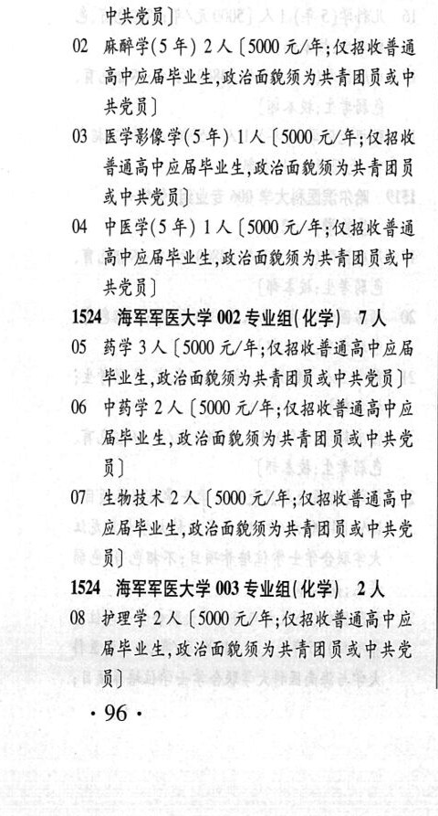

# 1524 海军军医大学

- PDF页码：47
- 书内页码：96
- 专业组：3；专业条目：8

## 001专业组

- 选科要求：化学
- 招生计划：17 人
- 校验：review

| 专业代码 | 专业名称 | 计划人数 | 学费（元/年） | 备注/完整OCR内容 |
|---|---|---:|---:|---|
| 01 | 临床医学(5 年) | 13 | 5000 | 【5000 元/年;仅招收普 HHEPHRELE AEGRMALAH RK 中共党员] |
| 02 | 麻醉学(5 年) 2A ( |  | 5000 | 5000 元/年;仅招收普通 高中应届毕业生,政治面狐须为共青团员或中 共党员] |
| 03 | 医学影像学(5年) LA ( |  | 500 | 500 元/年;仅招收 普通高中应届毕业生,政治面狐须为共青团员 或中共党员] |
| 04 | 中医学(5 年) 1A ( |  | 500 | 500 元/年;仅招收善通 高中应局毕业生,政治面通须为共青团员或中 共党员] |

<details><summary>本专业组OCR原文</summary>

```text
1524 海军军医大学 001 专业组(化学) 17 人
Ol 临床医学(5 年) 13 人【5000 元/年;仅招收普
HHEPHRELE AEGRMALAH RK
中共党员]
02 麻醉学(5 年) 2A (5000 元/年;仅招收普通
高中应届毕业生,政治面狐须为共青团员或中
共党员]
03 医学影像学(5年) LA (500 元/年;仅招收
普通高中应届毕业生,政治面狐须为共青团员
或中共党员]
04 中医学(5 年) 1A (500 元/年;仅招收善通
高中应局毕业生,政治面通须为共青团员或中
共党员]
```
</details>

## 002专业组

- 选科要求：化学
- 招生计划：7 人
- 校验：ok

| 专业代码 | 专业名称 | 计划人数 | 学费（元/年） | 备注/完整OCR内容 |
|---|---|---:|---:|---|
| 05 | 药学 | 3 | 5000 | 【5000 元/年;仅招收普通高中应局 毕业生,政治面貌须为共青团员或中共党员] |
| 06 | 中药学 | 2 | 5000 | 【5000 元/年;仅招收善通高中应 BELA, KG GRADE AAA PRE i) |
| 07 | 生物技术 | 2 | 5000 | 【5000元/年;仅招收善通高中 应局毕业生,政治面犁须为共青团员或中共党 i) |

<details><summary>本专业组OCR原文</summary>

```text
1524 海军军医大学 002 专业组(化学) 7人
05 药学 3 人【5000 元/年;仅招收普通高中应局
毕业生,政治面貌须为共青团员或中共党员]
06 中药学 2 人【5000 元/年;仅招收善通高中应
BELA, KG GRADE AAA PRE
i)
07 生物技术 2 人【5000元/年;仅招收善通高中
应局毕业生,政治面犁须为共青团员或中共党
i)
```
</details>

## 003专业组

- 选科要求：化学
- 招生计划：2 人
- 校验：ok

| 专业代码 | 专业名称 | 计划人数 | 学费（元/年） | 备注/完整OCR内容 |
|---|---|---:|---:|---|
| 08 | 护理学 | 2 | 5000 | 【5000 元/年;仅招收善通高中应 届毕业生,政治面貌须为共青团员或中共党 i) .96 . |

<details><summary>本专业组OCR原文</summary>

```text
1524 海军军医大学 003 专业组( 化学) 2人
08 护理学2 人【5000 元/年;仅招收善通高中应
届毕业生,政治面貌须为共青团员或中共党
i)
.96 .
```
</details>

## 附：院校完整OCR原文

```text
--- PDF第47页（书内第96页），第1栏 ---
1524 海军军医大学 001 专业组(化学) 17 人
Ol 临床医学(5 年) 13 人【5000 元/年;仅招收普
HHEPHRELE AEGRMALAH RK
中共党员]
02 麻醉学(5 年) 2A (5000 元/年;仅招收普通
高中应届毕业生,政治面狐须为共青团员或中
共党员]
03 医学影像学(5年) LA (500 元/年;仅招收
普通高中应届毕业生,政治面狐须为共青团员
或中共党员]
04 中医学(5 年) 1A (500 元/年;仅招收善通
高中应局毕业生,政治面通须为共青团员或中
共党员]
1524 海军军医大学 002 专业组(化学) 7人
05 药学 3 人【5000 元/年;仅招收普通高中应局
毕业生,政治面貌须为共青团员或中共党员]
06 中药学 2 人【5000 元/年;仅招收善通高中应
BELA, KG GRADE AAA PRE
i)
07 生物技术 2 人【5000元/年;仅招收善通高中
应局毕业生,政治面犁须为共青团员或中共党
i)
1524 海军军医大学 003 专业组( 化学) 2人
08 护理学2 人【5000 元/年;仅招收善通高中应
届毕业生,政治面貌须为共青团员或中共党
i)
.96 .
```

## 源图

