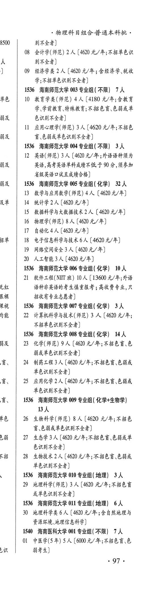
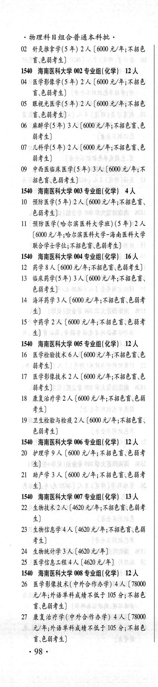
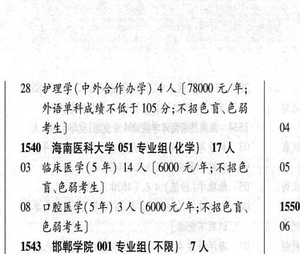

# 1540 海南医科大学

- PDF页码：48, 49
- 书内页码：97, 98
- 专业组：9；专业条目：28

## 001专业组

- 选科要求：不限
- 招生计划：7 人
- 校验：ok

| 专业代码 | 专业名称 | 计划人数 | 学费（元/年） | 备注/完整OCR内容 |
|---|---|---:|---:|---|
| 01 | 中医学(5年) | 5 | 6000 | [6000 元/年;不招色言,色 BF) -97- 物理科目组合普通本科批。 |
| 02 | 针灸推拿学(5 年) | 2 | 6000 | 【6000 元/年;不招色 HeHF 4) |

<details><summary>本专业组OCR原文</summary>

```text
1540 海南医科大学 001 专业组( 不限】 7人
01 中医学(5年) 5人[6000 元/年;不招色言,色
BF)
-97-
物理科目组合普通本科批。
02 针灸推拿学(5 年) 2 人【6000 元/年;不招色
HeHF 4)
```
</details>

## 002专业组

- 选科要求：化学
- 招生计划：12 人
- 校验：review

| 专业代码 | 专业名称 | 计划人数 | 学费（元/年） | 备注/完整OCR内容 |
|---|---|---:|---:|---|
| 04 | 医学影像学(5 年) | 2 | 6000 | 【6000 元/年;不招色 Fess) |
| 05 | RMLEF(S#) 2A ( |  | 600 | 600 元/年;不招色 FEHF4) |
| 06 | 麻醉学(5 年) | 3 | 6000 | [6000元/年;不招色育、色 能考生] |
| 07 | 儿科学(5年) | 2 | 6000 | 【6000 元/年;不招色育、色 BFL) |
| 09 | 中西医临床医学(5 年) 3A ( |  | 6000 | 6000 元/年;不 招色言\色弱考生] |

<details><summary>本专业组OCR原文</summary>

```text
1540 海南医科大学 002 专业组(化学) 12 人
04 医学影像学(5 年) 2 人【6000 元/年;不招色
Fess)
05 RMLEF(S#) 2A (600 元/年;不招色
FEHF4)
06 麻醉学(5 年) 3 人[6000元/年;不招色育、色
能考生]
07 儿科学(5年) 2 人【6000 元/年;不招色育、色
BFL)
09 中西医临床医学(5 年) 3A (6000 元/年;不
招色言\色弱考生]
```
</details>

## 003专业组

- 选科要求：化学
- 招生计划：4 人
- 校验：ok

| 专业代码 | 专业名称 | 计划人数 | 学费（元/年） | 备注/完整OCR内容 |
|---|---|---:|---:|---|
| 10 | 预防医学(5 年) | 2 | 6000 | 【6000 元/年;不招色育、 色弱考生] |
| 11 | 预防医学(哈尔滨医科大学班) (5 年) | 2 | 6000 | (6000 元/年;哈尔滨医科大学-海南医科大学 联合学士学位;不招色育\色弱考生] |

<details><summary>本专业组OCR原文</summary>

```text
1540 海南医科大学 003 专业组(化学) 4人
10 预防医学(5 年) 2 人【6000 元/年;不招色育、
色弱考生]
11 预防医学(哈尔滨医科大学班) (5 年) 2 人
(6000 元/年;哈尔滨医科大学-海南医科大学
联合学士学位;不招色育\色弱考生]
```
</details>

## 004专业组

- 选科要求：化学
- 招生计划：16 人
- 校验：review

| 专业代码 | 专业名称 | 计划人数 | 学费（元/年） | 备注/完整OCR内容 |
|---|---|---:|---:|---|
| 12 | 药学 | 8 |  | 【6000 A/F; FER EHF 4) |
| 13 | 临床药学(5年) 3A ( |  | 6000 | 6000 元/年;不招色盲、 色弱考生] |
| 14 | 海洋药学 | 3 |  | 【6000 A/F; FBO CBS 4) |
| 15 | PHF 2A ( |  | 600 | 600 元/年;不招色盲色弱考 生] |

<details><summary>本专业组OCR原文</summary>

```text
1540 海南医科大学 004 专业组(化学) 16 人
12 药学8 人【6000 A/F; FER EHF 4)
13 临床药学(5年) 3A (6000 元/年;不招色盲、
色弱考生]
14 海洋药学 3 人【6000 A/F; FBO CBS
4)
15 PHF 2A (600 元/年;不招色盲色弱考
生]
```
</details>

## 005专业组

- 选科要求：化学
- 招生计划：12 人
- 校验：ok

| 专业代码 | 专业名称 | 计划人数 | 学费（元/年） | 备注/完整OCR内容 |
|---|---|---:|---:|---|
| 16 | 医学检验技术 | 6 | 6000 | 【6000元/年;不招色盲\色 BF) |
| 17 | 医学影像技术 | 2 | 6000 | 【6000 元/年;不招色盲\色 弱考生] |
| 18 | 康复治疗学 | 2 |  | [6000 t/#; FABER EB 考生] |
| 19 | “卫生检验与检疫 | 2 | 6000 | 【6000 元/年;不招色谨、 色弱考生] |

<details><summary>本专业组OCR原文</summary>

```text
1540 海南医科大学 005 专业组( 化学) 12 人
16 医学检验技术 6 人【6000元/年;不招色盲\色
BF)
17 医学影像技术 2 人【6000 元/年;不招色盲\色
弱考生]
18 康复治疗学2 人[6000 t/#; FABER EB
考生]
19 “卫生检验与检疫 2 人【6000 元/年;不招色谨、
色弱考生]
```
</details>

## 006专业组

- 选科要求：化学
- 招生计划：12 人
- 校验：review

| 专业代码 | 专业名称 | 计划人数 | 学费（元/年） | 备注/完整OCR内容 |
|---|---|---:|---:|---|
| 20 | 护理学 | 9 | 6000 | 【6000 元/年;不招色讶色弱考 4) |
| 21 | 助产学 A (6000 4/4; FBER EHF 4) |  |  | 21 助产学 A (6000 4/4; FBER EHF 4) |

<details><summary>本专业组OCR原文</summary>

```text
1540 海南医科大学 006 专业组(化学) 12 人
20 护理学 9 人【6000 元/年;不招色讶色弱考
4)
21 助产学 A (6000 4/4; FBER EHF
4)
```
</details>

## 007专业组

- 选科要求：化学
- 招生计划：OCR未稳定识别 人
- 校验：review

| 专业代码 | 专业名称 | 计划人数 | 学费（元/年） | 备注/完整OCR内容 |
|---|---|---:|---:|---|
| 22 | EMBRDA (4620 t/F$ ABER BF 4) |  |  | 22 EMBRDA (4620 t/F$ ABER BF 4) |
| 23 | 生物信息学 | 4 | 4620 | 【4620元/年;不招色盲\色能 考生] |
| 24 | 生物统计学 | 3 | 4620 | 【4620 元/年] |
| 25 | 医学信息工程 | 4 | 4620 | 【4620元/年] |

<details><summary>本专业组OCR原文</summary>

```text
1540 海南医科大学 007 专业组(化学) BA
22 EMBRDA (4620 t/F$ ABER BF
4)
23 生物信息学4人【4620元/年;不招色盲\色能
考生]
24 生物统计学 3人【4620 元/年]
25 医学信息工程4人【4620元/年]
```
</details>

## 008专业组

- 选科要求：化学
- 招生计划：12 人
- 校验：review

| 专业代码 | 专业名称 | 计划人数 | 学费（元/年） | 备注/完整OCR内容 |
|---|---|---:|---:|---|
| 26 | 医学影像技术(中外合作办学) | 4 | 78000 | 【78000 元/年;外语单科成绩不低于 105 分;不招色 Fees 4) |
| 27 | 康复治疗学(中外合作办学) 4 A ( |  | 78000 | 78000 元/年;外语单科成绩不佐于 105 分;不招色 育、色弱考生] .98 . |
| 28 | “护理学(中外合作办学) | 4 | 78000 | 【78000 元/年; ( 外语单科成绩不低于 105 分;不招色盲、色弱 考生] 4 3 |

<details><summary>本专业组OCR原文</summary>

```text
1540 海南医科大学 008 专业组(化学) 12 人
26 医学影像技术(中外合作办学) 4 人【78000
元/年;外语单科成绩不低于 105 分;不招色
Fees 4)
27 康复治疗学(中外合作办学) 4 A (78000
元/年;外语单科成绩不佐于 105 分;不招色
育、色弱考生]
.98 .
28 “护理学(中外合作办学) 4 人【78000 元/年;     (
外语单科成绩不低于 105 分;不招色盲、色弱
考生]                   4 3
```
</details>

## 051专业组

- 选科要求：化学
- 招生计划：17 人
- 校验：review

| 专业代码 | 专业名称 | 计划人数 | 学费（元/年） | 备注/完整OCR内容 |
|---|---|---:|---:|---|
| 03 | 临床医学(5 年) | 14 | 6000 | (6000 元/年;不招色 05 4 讶色弱考生] |
| 08 | 口腔医学(5年) 3A ( |  | 6000 | 6000 元/年;不招色盲、 1550 色弱考生] 06 4 |

<details><summary>本专业组OCR原文</summary>

```text
1540 海南医科大学 051 专业组(化学) 17 人     和
03 临床医学(5 年) 14 人 (6000 元/年;不招色  05 4
讶色弱考生]
08 口腔医学(5年) 3A (6000 元/年;不招色盲、   1550
色弱考生]                06 4
```
</details>

## 附：院校完整OCR原文

```text
--- PDF第48页（书内第97页），第3栏 ---
1540 海南医科大学 001 专业组( 不限】 7人
01 中医学(5年) 5人[6000 元/年;不招色言,色
BF)
-97-

--- PDF第49页（书内第98页），第1栏 ---
物理科目组合普通本科批。
02 针灸推拿学(5 年) 2 人【6000 元/年;不招色
HeHF 4)
1540 海南医科大学 002 专业组(化学) 12 人
04 医学影像学(5 年) 2 人【6000 元/年;不招色
Fess)
05 RMLEF(S#) 2A (600 元/年;不招色
FEHF4)
06 麻醉学(5 年) 3 人[6000元/年;不招色育、色
能考生]
07 儿科学(5年) 2 人【6000 元/年;不招色育、色
BFL)
09 中西医临床医学(5 年) 3A (6000 元/年;不
招色言\色弱考生]
1540 海南医科大学 003 专业组(化学) 4人
10 预防医学(5 年) 2 人【6000 元/年;不招色育、
色弱考生]
11 预防医学(哈尔滨医科大学班) (5 年) 2 人
(6000 元/年;哈尔滨医科大学-海南医科大学
联合学士学位;不招色育\色弱考生]
1540 海南医科大学 004 专业组(化学) 16 人
12 药学8 人【6000 A/F; FER EHF 4)
13 临床药学(5年) 3A (6000 元/年;不招色盲、
色弱考生]
14 海洋药学 3 人【6000 A/F; FBO CBS
4)
15 PHF 2A (600 元/年;不招色盲色弱考
生]
1540 海南医科大学 005 专业组( 化学) 12 人
16 医学检验技术 6 人【6000元/年;不招色盲\色
BF)
17 医学影像技术 2 人【6000 元/年;不招色盲\色
弱考生]
18 康复治疗学2 人[6000 t/#; FABER EB
考生]
19 “卫生检验与检疫 2 人【6000 元/年;不招色谨、
色弱考生]
1540 海南医科大学 006 专业组(化学) 12 人
20 护理学 9 人【6000 元/年;不招色讶色弱考
4)
21 助产学 A (6000 4/4; FBER EHF
4)
1540 海南医科大学 007 专业组(化学) BA
22 EMBRDA (4620 t/F$ ABER BF
4)
23 生物信息学4人【4620元/年;不招色盲\色能
考生]
24 生物统计学 3人【4620 元/年]
25 医学信息工程4人【4620元/年]
1540 海南医科大学 008 专业组(化学) 12 人
26 医学影像技术(中外合作办学) 4 人【78000
元/年;外语单科成绩不低于 105 分;不招色
Fees 4)
27 康复治疗学(中外合作办学) 4 A (78000
元/年;外语单科成绩不佐于 105 分;不招色
育、色弱考生]
.98 .

--- PDF第49页（书内第98页），第2栏 ---
28 “护理学(中外合作办学) 4 人【78000 元/年;     (
外语单科成绩不低于 105 分;不招色盲、色弱
考生]                   4 3
1540 海南医科大学 051 专业组(化学) 17 人     和
03 临床医学(5 年) 14 人 (6000 元/年;不招色  05 4
讶色弱考生]
08 口腔医学(5年) 3A (6000 元/年;不招色盲、   1550
色弱考生]                06 4
```

## 源图



