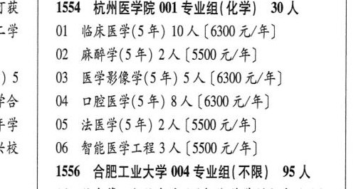

# 1554 杭州医学院

- PDF页码：50
- 书内页码：99
- 专业组：1；专业条目：1

## 001专业组

- 选科要求：化学
- 招生计划：2 人
- 校验：sum-corrected

| 专业代码 | 专业名称 | 计划人数 | 学费（元/年） | 备注/完整OCR内容 |
|---|---|---:|---:|---|
| 02 | 麻醉学(5年) | 2 | 5500 | 【5500 元/年] ) 5 03 医学影像学(5年) 5A (6300 4/4) Pe \| 04 口腔医学(5年) 8人[6300元/年] 学 \| 05 法医学(5年) 2人[5500元/年] cH \| 06 智能医学工程3人[5500 元/年] |

<details><summary>本专业组OCR原文</summary>

```text
T获   1554 杭州医学院 001 专业组(化学) 30 人
02 麻醉学(5年) 2人【5500 元/年]
) 5   03 医学影像学(5年) 5A (6300 4/4)
Pe | 04 口腔医学(5年) 8人[6300元/年]
学 | 05 法医学(5年) 2人[5500元/年]
cH | 06 智能医学工程3人[5500 元/年]
```
</details>

## 附：院校完整OCR原文

```text
--- PDF第50页（书内第99页），第2栏 ---
T获   1554 杭州医学院 001 专业组(化学) 30 人
-学  01 临床医学(5 年) 10 人【6300 元/年]
02 麻醉学(5年) 2人【5500 元/年]
) 5   03 医学影像学(5年) 5A (6300 4/4)
Pe | 04 口腔医学(5年) 8人[6300元/年]
学 | 05 法医学(5年) 2人[5500元/年]
cH | 06 智能医学工程3人[5500 元/年]
```

## 源图

