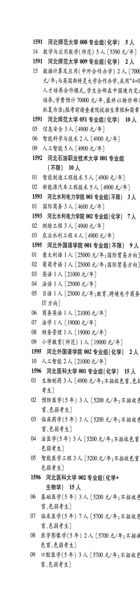
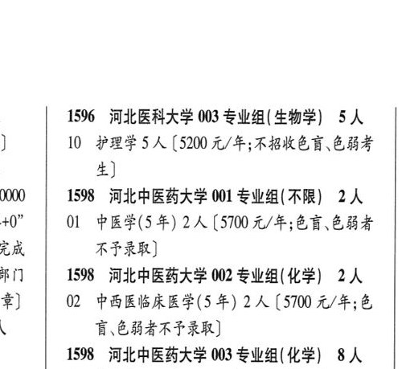

# 1596 河北医科大学

- PDF页码：54
- 书内页码：103
- 专业组：3；专业条目：10

## 001专业组

- 选科要求：化学
- 招生计划：4 人
- 校验：review

| 专业代码 | 专业名称 | 计划人数 | 学费（元/年） | 备注/完整OCR内容 |
|---|---|---:|---:|---|
| 01 | 生物制药 | 3 | 4900 | 【4900 元/年;不招收色盲.色素 考生] |
| 02 | 预防医学(5 年) 3A ( |  | 5200 | 5200 元/年;不招收 盲\色弱考生] |
| 03 | 临床药学(5 年) | 3 | 5200 | 【5200 元/年;不招收人 B 6844) |
| 04 | 法医学(5年) | 3 |  | [5200 4/4; FBKED 色弱考生] |
| 05 | 智能医学工程 | 3 | 5200 | 【5200 元/年;不招收色育 色弱考生] |

<details><summary>本专业组OCR原文</summary>

```text
1596 河北医科大学 001 专业组(化学) 4人
01 生物制药 3 人【4900 元/年;不招收色盲.色素
考生]
02 预防医学(5 年) 3A (5200 元/年;不招收
盲\色弱考生]
03 临床药学(5 年) 3 人【5200 元/年;不招收人
B 6844)
04 法医学(5年) 3 人[5200 4/4; FBKED
色弱考生]
05 智能医学工程 3 人【5200 元/年;不招收色育
色弱考生]
```
</details>

## 002专业组

- 选科要求：化学+生物学
- 招生计划：15 人
- 校验：review

| 专业代码 | 专业名称 | 计划人数 | 学费（元/年） | 备注/完整OCR内容 |
|---|---|---:|---:|---|
| 06 | 基础医学(5 年) | 3 | 5200 | 【5200 元/年;不招收多 盲.色弱考生] |
| 07 | 临床医学(5 年) | 7 | 5700 | 【5700 元/年;不招收多 F844) |
| 08 | 医学影像学(5 年) 2A (5700 4/4; FB |  |  | 08 医学影像学(5 年) 2A (5700 4/4; FB |
| 65 | 6844) |  |  | 65.6844) |
| 09 | 口腔医学(5 年) 3A ( |  | 5100 | 5100 元/年;不招收多 讶.色弱考生] |

<details><summary>本专业组OCR原文</summary>

```text
1596 河北医科大学 002 专业组( 化学+ 生物学) 15 人
06 基础医学(5 年) 3 人【5200 元/年;不招收多
盲.色弱考生]
07 临床医学(5 年) 7 人【5700 元/年;不招收多
F844)
08 医学影像学(5 年) 2A (5700 4/4; FB
65.6844)
09 口腔医学(5 年) 3A (5100 元/年;不招收多
讶.色弱考生]
```
</details>

## 003专业组

- 选科要求：生物学
- 招生计划：5 人
- 校验：review

| 专业代码 | 专业名称 | 计划人数 | 学费（元/年） | 备注/完整OCR内容 |
|---|---|---:|---:|---|
|  | 结构化OCR未稳定切分，请查看下方原文及源图 |  |  |  |

<details><summary>本专业组OCR原文</summary>

```text
159%6 河北医科大学 003 专业组(生物学) 5人
}    10 护理学5人 (520 元/年;不招收色盲色弱考
生]
```
</details>

## 附：院校完整OCR原文

```text
--- PDF第54页（书内第103页），第1栏 ---
1596 河北医科大学 001 专业组(化学) 4人
01 生物制药 3 人【4900 元/年;不招收色盲.色素
考生]
02 预防医学(5 年) 3A (5200 元/年;不招收
盲\色弱考生]
03 临床药学(5 年) 3 人【5200 元/年;不招收人
B 6844)
04 法医学(5年) 3 人[5200 4/4; FBKED
色弱考生]
05 智能医学工程 3 人【5200 元/年;不招收色育
色弱考生]
1596 河北医科大学 002 专业组( 化学+
生物学) 15 人
06 基础医学(5 年) 3 人【5200 元/年;不招收多
盲.色弱考生]
07 临床医学(5 年) 7 人【5700 元/年;不招收多
F844)
08 医学影像学(5 年) 2A (5700 4/4; FB
65.6844)
09 口腔医学(5 年) 3A (5100 元/年;不招收多
讶.色弱考生]

--- PDF第54页（书内第103页），第2栏 ---
159%6 河北医科大学 003 专业组(生物学) 5人
}    10 护理学5人 (520 元/年;不招收色盲色弱考
生]
```

## 源图


