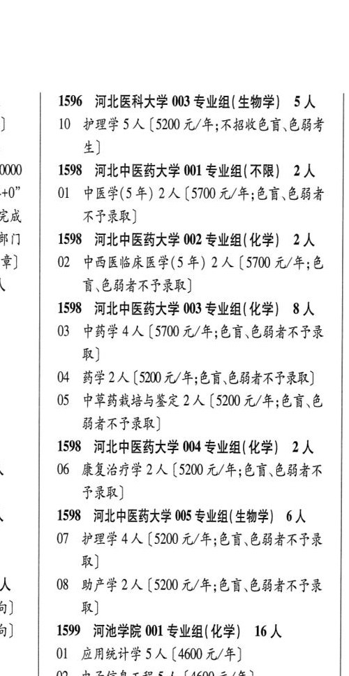

# 1598 河北中医药大学

- PDF页码：54
- 书内页码：103
- 专业组：5；专业条目：7

## 001专业组

- 选科要求：不限
- 招生计划：OCR未稳定识别 人
- 校验：review

| 专业代码 | 专业名称 | 计划人数 | 学费（元/年） | 备注/完整OCR内容 |
|---|---|---:|---:|---|
|  | 结构化OCR未稳定切分，请查看下方原文及源图 |  |  |  |

<details><summary>本专业组OCR原文</summary>

```text
1000   1598 河北中医药大学 001 专业组(不限】 2A 0” 01 中医学(5 年) 2A (570 4/4; 88 CBF 守成     不予录取]
0” 01 中医学(5 年) 2A (570 4/4; 88 CBF
守成     不予录取]
```
</details>

## 002专业组

- 选科要求：化学
- 招生计划：OCR未稳定识别 人
- 校验：review

| 专业代码 | 专业名称 | 计划人数 | 学费（元/年） | 备注/完整OCR内容 |
|---|---|---:|---:|---|
|  | 结构化OCR未稳定切分，请查看下方原文及源图 |  |  |  |

<details><summary>本专业组OCR原文</summary>

```text
RTT   1598 河北中医药大学 002 专业组(化学) 2A #)   02 中西医临床医学(5 年) 2A (5100 元/年;色 \      盲\色弱者不予录取]
#)   02 中西医临床医学(5 年) 2A (5100 元/年;色
\      盲\色弱者不予录取]
```
</details>

## 003专业组

- 选科要求：化学
- 招生计划：8 人
- 校验：ok

| 专业代码 | 专业名称 | 计划人数 | 学费（元/年） | 备注/完整OCR内容 |
|---|---|---:|---:|---|
| 03 | 中药学 | 4 | 5700 | 【5700 元/年;色盲、色弱者不巴录 取] |
| 04 | 药学 | 2 | 5200 | [5200 元/年;色盲\色弱者不予录取] |
| 05 | 中草药栽培与鉴定 | 2 | 5200 | 【5200 元/年;色盲.色 弱者不子录取] |

<details><summary>本专业组OCR原文</summary>

```text
1598 河北中医药大学 003 专业组(化学) 8人
03 中药学4人【5700 元/年;色盲、色弱者不巴录
取]
04 药学2人 [5200 元/年;色盲\色弱者不予录取]
05 中草药栽培与鉴定 2 人【5200 元/年;色盲.色
弱者不子录取]
```
</details>

## 004专业组

- 选科要求：化学
- 招生计划：2 人
- 校验：ok

| 专业代码 | 专业名称 | 计划人数 | 学费（元/年） | 备注/完整OCR内容 |
|---|---|---:|---:|---|
| 06 | 康复治疗学 | 2 | 5200 | [5200 元/年;色盲色弱者不 FRR) |

<details><summary>本专业组OCR原文</summary>

```text
1598 河北中医药大学 004 专业组(化学) 2人
06 康复治疗学 2 人[5200 元/年;色盲色弱者不
FRR)
```
</details>

## 005专业组

- 选科要求：OCR未稳定识别
- 招生计划：14 人
- 校验：sum-corrected

| 专业代码 | 专业名称 | 计划人数 | 学费（元/年） | 备注/完整OCR内容 |
|---|---|---:|---:|---|
| 07 | 护理学 | 4 | 5200 | 【5200 元/年;色盲色弱者不予录 取] 人 08 助产学2 人【5200 元/年;色盲、色弱者不予录 1) 取] 1) 1599 河池学院 001 专业组(化学) 16人 |
| 01 | 应用统计学 | 5 |  | (4600 4/4) |
| 02 | 电子信息工程 | 5 | 4600 | 【4600 元/年] 务、 \| 03 款件工程6人[4600 元/年;不招色言者] |

<details><summary>本专业组OCR原文</summary>

```text
4    1598 河北中医药大学 005 专业组( 生物学| 6人
07 护理学4人【5200 元/年;色盲色弱者不予录
取]
人    08 助产学2 人【5200 元/年;色盲、色弱者不予录
1)     取]
1)   1599 河池学院 001 专业组(化学) 16人
Ol 应用统计学5人 (4600 4/4)
02 电子信息工程5人【4600 元/年]
务、 | 03 款件工程6人[4600 元/年;不招色言者]
```
</details>

## 附：院校完整OCR原文

```text
--- PDF第54页（书内第103页），第2栏 ---
1000   1598 河北中医药大学 001 专业组(不限】 2A
0” 01 中医学(5 年) 2A (570 4/4; 88 CBF
守成     不予录取]
RTT   1598 河北中医药大学 002 专业组(化学) 2A
#)   02 中西医临床医学(5 年) 2A (5100 元/年;色
\      盲\色弱者不予录取]
1598 河北中医药大学 003 专业组(化学) 8人
03 中药学4人【5700 元/年;色盲、色弱者不巴录
取]
04 药学2人 [5200 元/年;色盲\色弱者不予录取]
05 中草药栽培与鉴定 2 人【5200 元/年;色盲.色
弱者不子录取]
1598 河北中医药大学 004 专业组(化学) 2人
06 康复治疗学 2 人[5200 元/年;色盲色弱者不
FRR)
4    1598 河北中医药大学 005 专业组( 生物学| 6人
07 护理学4人【5200 元/年;色盲色弱者不予录
取]
人    08 助产学2 人【5200 元/年;色盲、色弱者不予录
1)     取]
1)   1599 河池学院 001 专业组(化学) 16人
Ol 应用统计学5人 (4600 4/4)
02 电子信息工程5人【4600 元/年]
务、 | 03 款件工程6人[4600 元/年;不招色言者]
```

## 源图

