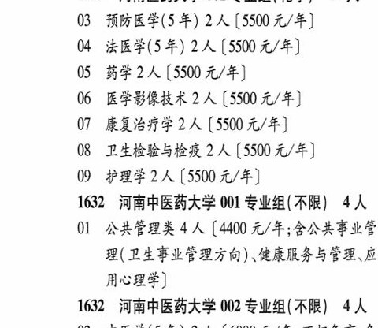

# 1629 河南医药大学

- PDF页码：58
- 书内页码：107
- 专业组：2；专业条目：9

## 001专业组

- 选科要求：化学
- 招生计划：6 人
- 校验：ok

| 专业代码 | 专业名称 | 计划人数 | 学费（元/年） | 备注/完整OCR内容 |
|---|---|---:|---:|---|
| 01 | 精神医学(5 年) | 3 | 5500 | 【5500 元/年] |
| 02 | 儿科学(5年) | 3 | 6050 | [6050元/年] |

<details><summary>本专业组OCR原文</summary>

```text
1629 河南医药大学 001 专业组(化学) 6人
Ol 精神医学(5 年) 3 人【5500 元/年]
02 儿科学(5年) 3人[6050元/年]
```
</details>

## 002专业组

- 选科要求：化学
- 招生计划：14 人
- 校验：ok

| 专业代码 | 专业名称 | 计划人数 | 学费（元/年） | 备注/完整OCR内容 |
|---|---|---:|---:|---|
| 03 | 预防医学(5 年) | 2 | 5500 | 【5500 元/年] |
| 04 | 法医学(5年) | 2 | 5500 | 【5500 元/年] |
| 05 | 药学 | 2 | 5500 | [5500 元/年] |
| 06 | 医学影像技术 | 2 | 5500 | 【5500 元/年] |
| 07 | 康复治疗学 | 2 | 5500 | 【5500元/年] |
| 08 | ”卫生检验与检疫 | 2 | 5500 | 【5500 元/年] |
| 09 | 护理学 | 2 | 5500 | [5500元/年] |

<details><summary>本专业组OCR原文</summary>

```text
1629 河南医药大学 002 专业组(化学) 14 人
03 预防医学(5 年) 2 人【5500 元/年]
04 法医学(5年) 2 人【5500 元/年]
05 药学2人[5500 元/年]
06 医学影像技术 2 人【5500 元/年]
07 康复治疗学2 人【5500元/年]
08 ”卫生检验与检疫 2 人【5500 元/年]
09 护理学2人[5500元/年]
```
</details>

## 附：院校完整OCR原文

```text
--- PDF第58页（书内第107页），第1栏 ---
1629 河南医药大学 001 专业组(化学) 6人
Ol 精神医学(5 年) 3 人【5500 元/年]
02 儿科学(5年) 3人[6050元/年]
1629 河南医药大学 002 专业组(化学) 14 人
03 预防医学(5 年) 2 人【5500 元/年]
04 法医学(5年) 2 人【5500 元/年]
05 药学2人[5500 元/年]
06 医学影像技术 2 人【5500 元/年]
07 康复治疗学2 人【5500元/年]
08 ”卫生检验与检疫 2 人【5500 元/年]
09 护理学2人[5500元/年]
```

## 源图

