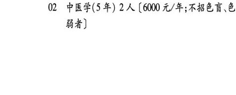
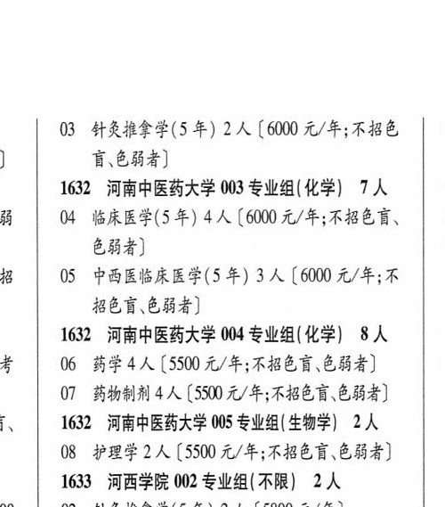

# 1632 河南中医药大学

- PDF页码：58
- 书内页码：107
- 专业组：7；专业条目：14

## 001专业组

- 选科要求：化学
- 招生计划：6 人
- 校验：ok

| 专业代码 | 专业名称 | 计划人数 | 学费（元/年） | 备注/完整OCR内容 |
|---|---|---:|---:|---|
| 01 | 精神医学(5 年) | 3 | 5500 | 【5500 元/年] |
| 02 | 儿科学(5年) | 3 | 6050 | [6050元/年] |

<details><summary>本专业组OCR原文</summary>

```text
1629 河南医药大学 001 专业组(化学) 6人
Ol 精神医学(5 年) 3 人【5500 元/年]
02 儿科学(5年) 3人[6050元/年]
```
</details>

## 001专业组

- 选科要求：不限
- 招生计划：4 人
- 校验：sum-corrected

| 专业代码 | 专业名称 | 计划人数 | 学费（元/年） | 备注/完整OCR内容 |
|---|---|---:|---:|---|
| 01 | 公共管理类 | 4 | 4400 | [4400 元/年;含公共事业管 理(卫生事业管理方向)、健康服务与管理应 用心理学] |

<details><summary>本专业组OCR原文</summary>

```text
1632 河南中医药大学 001 专业组(不限) 4A
Ol 公共管理类 4 人[4400 元/年;含公共事业管
理(卫生事业管理方向)、健康服务与管理应
用心理学]
```
</details>

## 002专业组

- 选科要求：化学
- 招生计划：14 人
- 校验：ok

| 专业代码 | 专业名称 | 计划人数 | 学费（元/年） | 备注/完整OCR内容 |
|---|---|---:|---:|---|
| 03 | 预防医学(5 年) | 2 | 5500 | 【5500 元/年] |
| 04 | 法医学(5年) | 2 | 5500 | 【5500 元/年] |
| 05 | 药学 | 2 | 5500 | [5500 元/年] |
| 06 | 医学影像技术 | 2 | 5500 | 【5500 元/年] |
| 07 | 康复治疗学 | 2 | 5500 | 【5500元/年] |
| 08 | ”卫生检验与检疫 | 2 | 5500 | 【5500 元/年] |
| 09 | 护理学 | 2 | 5500 | [5500元/年] |

<details><summary>本专业组OCR原文</summary>

```text
1629 河南医药大学 002 专业组(化学) 14 人
03 预防医学(5 年) 2 人【5500 元/年]
04 法医学(5年) 2 人【5500 元/年]
05 药学2人[5500 元/年]
06 医学影像技术 2 人【5500 元/年]
07 康复治疗学2 人【5500元/年]
08 ”卫生检验与检疫 2 人【5500 元/年]
09 护理学2人[5500元/年]
```
</details>

## 002专业组

- 选科要求：不限
- 招生计划：4 人
- 校验：ok

| 专业代码 | 专业名称 | 计划人数 | 学费（元/年） | 备注/完整OCR内容 |
|---|---|---:|---:|---|
| 02 | 中医学(5年) | 2 | 6000 | 【6000 元/年;不招色盲、色 84) |
| 03 | 针灸推拿学(5 年) | 2 | 6000 | 【6000 元/年;不招色 0 } E684) 1 |

<details><summary>本专业组OCR原文</summary>

```text
1632 河南中医药大学 002 专业组(不限】 4人
02 中医学(5年) 2 人【6000 元/年;不招色盲、色
84)
03 针灸推拿学(5 年) 2 人【6000 元/年;不招色   0
}     E684)                1
```
</details>

## 003专业组

- 选科要求：化学
- 招生计划：7 人
- 校验：review

| 专业代码 | 专业名称 | 计划人数 | 学费（元/年） | 备注/完整OCR内容 |
|---|---|---:|---:|---|
|  | 结构化OCR未稳定切分，请查看下方原文及源图 |  |  |  |

<details><summary>本专业组OCR原文</summary>

```text
1632 河南中医药大学 003 专业组(化学) 7 人   0
B | 04 BRER(S4) 4A (0000 元/年;不招色言、 | 0
684)                 0
招   05 中西医临床医学(5 年) 3 人【6000 元/年;不   1
BER ERS)
```
</details>

## 004专业组

- 选科要求：化学
- 招生计划：4 人
- 校验：sum-corrected

| 专业代码 | 专业名称 | 计划人数 | 学费（元/年） | 备注/完整OCR内容 |
|---|---|---:|---:|---|
| 07 | 药物制剂 | 4 | 5500 | 【5500 元/年;不招色盲\色弱者] 0 |

<details><summary>本专业组OCR原文</summary>

```text
1632 ”河南中医药大学 004 专业组(化学) 8 人   0
07 药物制剂 4人【5500 元/年;不招色盲\色弱者]   0
```
</details>

## 005专业组

- 选科要求：OCR未稳定识别
- 招生计划：2 人
- 校验：ok

| 专业代码 | 专业名称 | 计划人数 | 学费（元/年） | 备注/完整OCR内容 |
|---|---|---:|---:|---|
| 08 | 护理学 | 2 | 5500 | 【5500 元/年;不招色盲.色弱者] 0 |

<details><summary>本专业组OCR原文</summary>

```text
i   1632 河南中医药大学 005 专业组| 生物学| 2人    0
08 护理学2 人【5500 元/年;不招色盲.色弱者]   0
```
</details>

## 附：院校完整OCR原文

```text
--- PDF第58页（书内第107页），第1栏 ---
1629 河南医药大学 001 专业组(化学) 6人
Ol 精神医学(5 年) 3 人【5500 元/年]
02 儿科学(5年) 3人[6050元/年]
1629 河南医药大学 002 专业组(化学) 14 人
03 预防医学(5 年) 2 人【5500 元/年]
04 法医学(5年) 2 人【5500 元/年]
05 药学2人[5500 元/年]
06 医学影像技术 2 人【5500 元/年]
07 康复治疗学2 人【5500元/年]
08 ”卫生检验与检疫 2 人【5500 元/年]
09 护理学2人[5500元/年]
1632 河南中医药大学 001 专业组(不限) 4A
Ol 公共管理类 4 人[4400 元/年;含公共事业管
理(卫生事业管理方向)、健康服务与管理应
用心理学]
1632 河南中医药大学 002 专业组(不限】 4人
02 中医学(5年) 2 人【6000 元/年;不招色盲、色
84)

--- PDF第58页（书内第107页），第2栏 ---
03 针灸推拿学(5 年) 2 人【6000 元/年;不招色   0
}     E684)                1
1632 河南中医药大学 003 专业组(化学) 7 人   0
B | 04 BRER(S4) 4A (0000 元/年;不招色言、 | 0
684)                 0
招   05 中西医临床医学(5 年) 3 人【6000 元/年;不   1
BER ERS)
1632 ”河南中医药大学 004 专业组(化学) 8 人   0
者   06 药学4人[5500 元/年;不招色盲、色弱者]    0
07 药物制剂 4人【5500 元/年;不招色盲\色弱者]   0
i   1632 河南中医药大学 005 专业组| 生物学| 2人    0
08 护理学2 人【5500 元/年;不招色盲.色弱者]   0
```

## 源图


