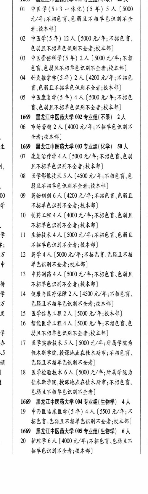
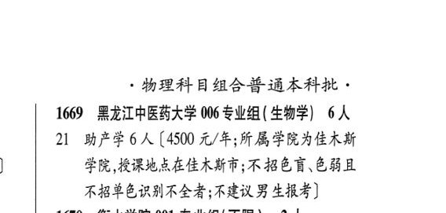

# 1669 黑龙江中医药大学

- PDF页码：60
- 书内页码：109
- 专业组：6；专业条目：15

## 001专业组

- 选科要求：不限
- 招生计划：25 人
- 校验：review

| 专业代码 | 专业名称 | 计划人数 | 学费（元/年） | 备注/完整OCR内容 |
|---|---|---:|---:|---|
| 02 | 中医学(5年) | 12 | 5000 | [5000 元/年;不招色育、 色弱且不招单色识别不全者;校本部] 1 |
| 03 | 中医骨伤科学(5 年) 2A ( |  | 5000 | 5000 元/年;不招 0 色盲色弱且不招单色识别不全者;校本部] |
| 04 | 针灸推拿学(5 年) | 2 | 4200 | 【4200 元/年;不招色 育\色磁且不招单色识别不全者;校本部] 1 |
| 05 | 中医康复学(5 年) | 4 | 5000 | 【5000 元/年;不招色 0 盲.色丧且不招单色识别不全者;校本部] 0 |

<details><summary>本专业组OCR原文</summary>

```text
1669 黑龙江中医药大学 001 专业组(不限】 25 人    0
OL 中医学(5+3 一体化) (5 #) 5A (5000   0
元/年;不招色育色弱且不招单色识别不全 | 1
者;校本部]                0
02 中医学(5年) 12 人[5000 元/年;不招色育、
色弱且不招单色识别不全者;校本部]      1
03 中医骨伤科学(5 年) 2A (5000 元/年;不招   0
色盲色弱且不招单色识别不全者;校本部]
04 针灸推拿学(5 年) 2 人【4200 元/年;不招色
育\色磁且不招单色识别不全者;校本部]     1
05 中医康复学(5 年) 4 人【5000 元/年;不招色  0
盲.色丧且不招单色识别不全者;校本部]     0
```
</details>

## 002专业组

- 选科要求：不限
- 招生计划：2 人
- 校验：ok

| 专业代码 | 专业名称 | 计划人数 | 学费（元/年） | 备注/完整OCR内容 |
|---|---|---:|---:|---|
| 06 | 市场营销 | 2 | 4000 | 【4000 元/年;不招单色识别不“\| 0 全者;校本部] 0 |

<details><summary>本专业组OCR原文</summary>

```text
1669 黑龙江中医药大学 002 专业组(不限】 2 人    1
06 市场营销 2 人【4000 元/年;不招单色识别不“| 0
全者;校本部]               0
```
</details>

## 003专业组

- 选科要求：OCR未稳定识别
- 招生计划：33 人
- 校验：sum-corrected

| 专业代码 | 专业名称 | 计划人数 | 学费（元/年） | 备注/完整OCR内容 |
|---|---|---:|---:|---|
| 07 | 康复治疗学 | 4 |  | 【5000 A/F; ABER ER \| 0 i, 且不招单色识别不全者;校本部] 0 |
| 08 | 医学影像技术 | 5 | 4500 | 【4500 元/年;不招色育\色 \| 1 弱且不招单色识别不全者;校本部] 0 |
| 00 | \| 09 药物制剂 | 6 | 4200 | [4200 元/年;不招色盲.色弱且 \| 0 学 不招单色识别不全者;校本部] 1 |
| 10 | 制药工程 | 4 | 4000 | 【4000 元/年;不招色盲、色弱且 0 不招单色识别不全者;校本部] 1 学 11 生物技术4 人【5000 元/年;不招色盲、色弱且 0 Es 不招单色识别不全者;校本部] 0 万 12 药学4人[5000 元/年;不招色盲色弱且不招 1 中 单色识别不全者;校本部] 0 |
| 13 | 中药制药 | 4 | 4500 | 【5000 A/F; ABER EBL 0 if 不招单色识别不全者;校本部] 1 学 14 健康与医疗保障 2 人【4500 元/年;不招色盲、 \| 0 万 色丧且不招单色识别不全者;校本部] 1 发 \| 15 医学信息工程2 (5000 元/年;校本部] 0 |
| 16 | 智能医学工程 | 4 | 5000 | 【5000 元/年;不招色育.色 1 学 弱且不招单色识别不全者;校本部] 0 办 17 医学实验技术5 人【5000 元/年;所属学院为 \| 0 iS 佳木斯学院 ,授课地点在佳木斯市;不招色言、 1 aR 色弱且不招单色识别不全者] 0 |
| 18 | 医学检验技术 | 6 | 5000 | 【5000 元/年;所属学院为 佳木斯学院 ,授课地点在佳木斯市;不招色育、 0 色弱且不招单色识别不全者] |

<details><summary>本专业组OCR原文</summary>

```text
La   1669 黑龙江中医药大学 003 专业组(化学| 50 人    1
07 康复治疗学4 人【5000 A/F; ABER ER | 0
i,     且不招单色识别不全者;校本部]        0
08 医学影像技术5 人【4500 元/年;不招色育\色 | 1
弱且不招单色识别不全者;校本部]       0
00 | 09 药物制剂6人[4200 元/年;不招色盲.色弱且 | 0
学     不招单色识别不全者;校本部]         1
10 制药工程4人【4000 元/年;不招色盲、色弱且   0
不招单色识别不全者;校本部]         1
学   11 生物技术4 人【5000 元/年;不招色盲、色弱且  0
Es     不招单色识别不全者;校本部]         0
万   12 药学4人[5000 元/年;不招色盲色弱且不招   1
中     单色识别不全者;校本部]           0
13 中药制药4 人【5000 A/F; ABER EBL  0
if     不招单色识别不全者;校本部]         1
学   14 健康与医疗保障 2 人【4500 元/年;不招色盲、 | 0
万     色丧且不招单色识别不全者;校本部]      1
发 | 15 医学信息工程2 (5000 元/年;校本部]     0
16 智能医学工程4 人【5000 元/年;不招色育.色   1
学     弱且不招单色识别不全者;校本部]       0
办   17 医学实验技术5 人【5000 元/年;所属学院为 | 0
iS     佳木斯学院 ,授课地点在佳木斯市;不招色言、   1
aR     色弱且不招单色识别不全者]         0
18 医学检验技术6 人【5000 元/年;所属学院为
佳木斯学院 ,授课地点在佳木斯市;不招色育、   0
色弱且不招单色识别不全者]
```
</details>

## 004专业组

- 选科要求：生物学
- 招生计划：4 人
- 校验：ok

| 专业代码 | 专业名称 | 计划人数 | 学费（元/年） | 备注/完整OCR内容 |
|---|---|---:|---:|---|
| 19 | 中西医临床医学(5 年) | 4 | 5500 | 【5500 元/年;不 招色盲、色幸且不招单色识别不全者;校本部] 0 |

<details><summary>本专业组OCR原文</summary>

```text
1669 黑龙江中医药大学 004 专业组(生物学) 4人   0
19 中西医临床医学(5 年) 4 人【5500 元/年;不
招色盲、色幸且不招单色识别不全者;校本部]   0
```
</details>

## 005专业组

- 选科要求：生物学
- 招生计划：6 人
- 校验：ok

| 专业代码 | 专业名称 | 计划人数 | 学费（元/年） | 备注/完整OCR内容 |
|---|---|---:|---:|---|
| 20 | 护理学 | 6 |  | 【4000 A/F; BER CHAR 0 招音色识别不全者;校本部] \| 物理科目组合普通本科批 ， |

<details><summary>本专业组OCR原文</summary>

```text
1669 黑龙江中医药大学 005 专业组(生物学) 6人
20 护理学6 人【4000 A/F; BER CHAR   0
招音色识别不全者;校本部]
| 物理科目组合普通本科批 ，
```
</details>

## 006专业组

- 选科要求：OCR未稳定识别
- 招生计划：6 人
- 校验：ok

| 专业代码 | 专业名称 | 计划人数 | 学费（元/年） | 备注/完整OCR内容 |
|---|---|---:|---:|---|
| 21 | 助产学 | 6 | 4500 | 【4500 元/年;所属学院为佳木斯 学院,授课地点在佳木斯市;不 招色盲,色弱且 不招单色识别不全者;不建议男生报考] |

<details><summary>本专业组OCR原文</summary>

```text
1669 黑龙江中医药大学 006 专业组 ( 生物学| 6 人
21 助产学6 人【4500 元/年;所属学院为佳木斯
学院,授课地点在佳木斯市;不 招色盲,色弱且
不招单色识别不全者;不建议男生报考]
```
</details>

## 附：院校完整OCR原文

```text
--- PDF第60页（书内第109页），第2栏 ---
1669 黑龙江中医药大学 001 专业组(不限】 25 人    0
OL 中医学(5+3 一体化) (5 #) 5A (5000   0
元/年;不招色育色弱且不招单色识别不全 | 1
者;校本部]                0
02 中医学(5年) 12 人[5000 元/年;不招色育、
色弱且不招单色识别不全者;校本部]      1
03 中医骨伤科学(5 年) 2A (5000 元/年;不招   0
色盲色弱且不招单色识别不全者;校本部]
04 针灸推拿学(5 年) 2 人【4200 元/年;不招色
育\色磁且不招单色识别不全者;校本部]     1
05 中医康复学(5 年) 4 人【5000 元/年;不招色  0
盲.色丧且不招单色识别不全者;校本部]     0
1669 黑龙江中医药大学 002 专业组(不限】 2 人    1
06 市场营销 2 人【4000 元/年;不招单色识别不“| 0
全者;校本部]               0
La   1669 黑龙江中医药大学 003 专业组(化学| 50 人    1
07 康复治疗学4 人【5000 A/F; ABER ER | 0
i,     且不招单色识别不全者;校本部]        0
08 医学影像技术5 人【4500 元/年;不招色育\色 | 1
弱且不招单色识别不全者;校本部]       0
00 | 09 药物制剂6人[4200 元/年;不招色盲.色弱且 | 0
学     不招单色识别不全者;校本部]         1
10 制药工程4人【4000 元/年;不招色盲、色弱且   0
不招单色识别不全者;校本部]         1
学   11 生物技术4 人【5000 元/年;不招色盲、色弱且  0
Es     不招单色识别不全者;校本部]         0
万   12 药学4人[5000 元/年;不招色盲色弱且不招   1
中     单色识别不全者;校本部]           0
13 中药制药4 人【5000 A/F; ABER EBL  0
if     不招单色识别不全者;校本部]         1
学   14 健康与医疗保障 2 人【4500 元/年;不招色盲、 | 0
万     色丧且不招单色识别不全者;校本部]      1
发 | 15 医学信息工程2 (5000 元/年;校本部]     0
16 智能医学工程4 人【5000 元/年;不招色育.色   1
学     弱且不招单色识别不全者;校本部]       0
办   17 医学实验技术5 人【5000 元/年;所属学院为 | 0
iS     佳木斯学院 ,授课地点在佳木斯市;不招色言、   1
aR     色弱且不招单色识别不全者]         0
18 医学检验技术6 人【5000 元/年;所属学院为
佳木斯学院 ,授课地点在佳木斯市;不招色育、   0
色弱且不招单色识别不全者]
1669 黑龙江中医药大学 004 专业组(生物学) 4人   0
19 中西医临床医学(5 年) 4 人【5500 元/年;不
招色盲、色幸且不招单色识别不全者;校本部]   0
1669 黑龙江中医药大学 005 专业组(生物学) 6人
20 护理学6 人【4000 A/F; BER CHAR   0
招音色识别不全者;校本部]

--- PDF第60页（书内第109页），第3栏 ---
| 物理科目组合普通本科批 ，
1669 黑龙江中医药大学 006 专业组 ( 生物学| 6 人
21 助产学6 人【4500 元/年;所属学院为佳木斯
学院,授课地点在佳木斯市;不 招色盲,色弱且
不招单色识别不全者;不建议男生报考]
```

## 源图


