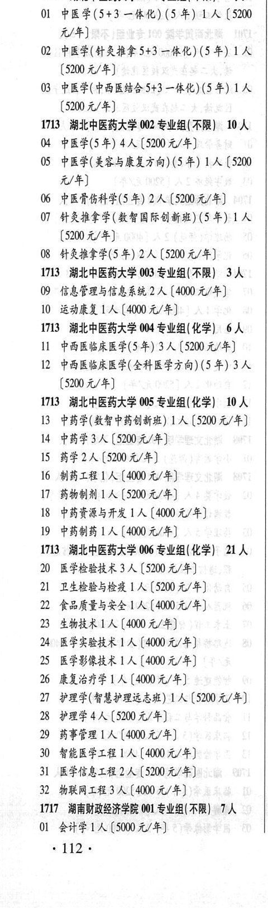

# 1713 湖北中医药大学

- PDF页码：63
- 书内页码：112
- 专业组：6；专业条目：32

## 001专业组

- 选科要求：不限
- 招生计划：3 人
- 校验：review

| 专业代码 | 专业名称 | 计划人数 | 学费（元/年） | 备注/完整OCR内容 |
|---|---|---:|---:|---|
| 01 | 中医学(5+3 一体化) (5 年) LA ( |  | 5200 | 5200 元/年] |
| 02 | 中医学(针灸推拿5f3 一体化) (5 年) LA |  | 5200 | 5200元/年] |
| 03 | 中医学(中西医结合 $+3 一体化) (5 年) 1A ( |  | 5200 | 5200 元/年] |

<details><summary>本专业组OCR原文</summary>

```text
173 湖北中医药大学 001 专业组(不限) 3 人
Ol 中医学(5+3 一体化) (5 年) LA (5200
元/年]
02 中医学(针灸推拿5f3 一体化) (5 年) LA
[5200元/年]
03 中医学(中西医结合 $+3 一体化) (5 年) 1A
(5200 元/年]
```
</details>

## 002专业组

- 选科要求：不限
- 招生计划：10 人
- 校验：review

| 专业代码 | 专业名称 | 计划人数 | 学费（元/年） | 备注/完整OCR内容 |
|---|---|---:|---:|---|
| 04 | 中医学(5年) | 4 | 5200 | 【5200元/年] |
| 05 | 中医学(美容与康复方向) (5 #) 1A ( |  | 5200 | 5200 元/年] |
| 06 | 中医骨伤科学(5 年) | 2 | 5200 | 【5200元/年] |
| 07 | 针灸推拿学(教智国际创新班) (5 年) LA ( |  | 5200 | 5200 元/年] |
| 08 | 针灸推拿学(5 年) 2A ( |  | 5200 | 5200 元/年] |

<details><summary>本专业组OCR原文</summary>

```text
1713 湖北中医药大学 002 专业组(不限) 10 人
04 中医学(5年) 4人【5200元/年]
05 中医学(美容与康复方向) (5 #) 1A (5200
元/年]
06 中医骨伤科学(5 年) 2 人【5200元/年]
07 针灸推拿学(教智国际创新班) (5 年) LA
(5200 元/年]
08 针灸推拿学(5 年) 2A (5200 元/年]
```
</details>

## 003专业组

- 选科要求：不限
- 招生计划：3 人
- 校验：ok

| 专业代码 | 专业名称 | 计划人数 | 学费（元/年） | 备注/完整OCR内容 |
|---|---|---:|---:|---|
| 09 | 信息管理与信息系统 | 2 | 4000 | 【4000元/年] |
| 10 | 运动康复 | 1 | 4000 | 【4000元/年] |

<details><summary>本专业组OCR原文</summary>

```text
1713 湖北中医药大学 003 专业组(不限) 3人
09 信息管理与信息系统 2 人【4000元/年]
10 运动康复 1 人【4000元/年]
```
</details>

## 004专业组

- 选科要求：化学
- 招生计划：6 人
- 校验：ok

| 专业代码 | 专业名称 | 计划人数 | 学费（元/年） | 备注/完整OCR内容 |
|---|---|---:|---:|---|
| 11 | 中西医临床医学(5 年) | 3 | 5200 | [5200元/年] |
| 12 | 中西医临床医学(全科医学方向) (5 年) | 3 | 5200 | (5200 元/年] |

<details><summary>本专业组OCR原文</summary>

```text
1713 湖北中医药大学 004 专业组(化学) 6人
11 中西医临床医学(5 年) 3 人[5200元/年]
12 中西医临床医学(全科医学方向) (5 年) 3 人
(5200 元/年]
```
</details>

## 005专业组

- 选科要求：化学
- 招生计划：10 人
- 校验：review

| 专业代码 | 专业名称 | 计划人数 | 学费（元/年） | 备注/完整OCR内容 |
|---|---|---:|---:|---|
| 13 | 中药学(数智中药创新班) ] 人 |  | 5200 | 5200 元/年] |
| 14 | 中药学 | 3 | 5200 | [5200元/年] |
| 15 | 药学 | 2 | 5200 | [5200元/年] |
| 16 | 制药工程 | 1 | 4000 | [4000 元/年] |
| 17 | 药物制剂 | 1 | 5200 | 【5200元/年] |
| 18 | 中药资源与开发 ] 人 |  | 4000 | 4000元/年] |
| 19 | 中药制药 ] 人 |  | 4000 | 4000元/年] |

<details><summary>本专业组OCR原文</summary>

```text
1713 湖北中医药大学 005 专业组(化学) 10 人
13 中药学(数智中药创新班) ] 人【5200 元/年]
14 中药学3人[5200元/年]
15 药学2人 [5200元/年]
16 制药工程1人[4000 元/年]
17 药物制剂1人 【5200元/年]
18 中药资源与开发 ] 人【4000元/年]
19 中药制药 ] 人【4000元/年]
```
</details>

## 006专业组

- 选科要求：化学
- 招生计划：21 人
- 校验：review

| 专业代码 | 专业名称 | 计划人数 | 学费（元/年） | 备注/完整OCR内容 |
|---|---|---:|---:|---|
| 20 | 医学检验技术 | 3 | 5200 | 【5200 元/年] |
| 21 | 卫生检验与检疫 | 1 | 5200 | [5200元/年] |
| 22 | 食品质量与安全 | 1 | 4000 | 【4000元/年] |
| 23 | 生物技术 | 1 | 4000 | 【4000 元/年] |
| 24 | 医学实验技术 | 1 | 4000 | 【4000元/年] |
| 25 | 医学影像技术 | 1 | 4000 | 【4000 元/年] |
| 26 | 康复治疗学 | 1 | 4000 | [4000元/年] |
| 27 | PRE PEPRLAK) 1A ( |  | 5200 | 5200 元/年] |
| 28 | 护理学 | 4 | 5200 | [5200元/年] |
| 29 | 药事管理 | 1 |  | 【4000 4/4) |
| 30 | 智能医学工程 \|]人 |  | 4000 | 4000元/年] |
| 31 | 医学信息工程 | 2 | 5200 | :[5200元/年] |
| 32 | 物联网工程 | 3 | 4000 | 【4000元/年] |

<details><summary>本专业组OCR原文</summary>

```text
1713 湖北中医药大学 006 专业组(化学) 21人
20 医学检验技术 3 人【5200 元/年]
21 卫生检验与检疫 1 人[5200元/年]
22 食品质量与安全1 人【4000元/年]
23 生物技术1人【4000 元/年]
24 医学实验技术1 人【4000元/年]
25 医学影像技术 1 人【4000 元/年]
26 康复治疗学1 人[4000元/年]
27 PRE PEPRLAK) 1A (5200 元/年]
28 护理学4人[5200元/年]
29 药事管理 1 人【4000 4/4)
30 智能医学工程 |]人【4000元/年]
31 医学信息工程 2 人:[5200元/年]
32 物联网工程3 人【4000元/年]
```
</details>

## 附：院校完整OCR原文

```text
--- PDF第63页（书内第112页），第1栏 ---
173 湖北中医药大学 001 专业组(不限) 3 人
Ol 中医学(5+3 一体化) (5 年) LA (5200
元/年]
02 中医学(针灸推拿5f3 一体化) (5 年) LA
[5200元/年]
03 中医学(中西医结合 $+3 一体化) (5 年) 1A
(5200 元/年]
1713 湖北中医药大学 002 专业组(不限) 10 人
04 中医学(5年) 4人【5200元/年]
05 中医学(美容与康复方向) (5 #) 1A (5200
元/年]
06 中医骨伤科学(5 年) 2 人【5200元/年]
07 针灸推拿学(教智国际创新班) (5 年) LA
(5200 元/年]
08 针灸推拿学(5 年) 2A (5200 元/年]
1713 湖北中医药大学 003 专业组(不限) 3人
09 信息管理与信息系统 2 人【4000元/年]
10 运动康复 1 人【4000元/年]
1713 湖北中医药大学 004 专业组(化学) 6人
11 中西医临床医学(5 年) 3 人[5200元/年]
12 中西医临床医学(全科医学方向) (5 年) 3 人
(5200 元/年]
1713 湖北中医药大学 005 专业组(化学) 10 人
13 中药学(数智中药创新班) ] 人【5200 元/年]
14 中药学3人[5200元/年]
15 药学2人 [5200元/年]
16 制药工程1人[4000 元/年]
17 药物制剂1人 【5200元/年]
18 中药资源与开发 ] 人【4000元/年]
19 中药制药 ] 人【4000元/年]
1713 湖北中医药大学 006 专业组(化学) 21人
20 医学检验技术 3 人【5200 元/年]
21 卫生检验与检疫 1 人[5200元/年]
22 食品质量与安全1 人【4000元/年]
23 生物技术1人【4000 元/年]
24 医学实验技术1 人【4000元/年]
25 医学影像技术 1 人【4000 元/年]
26 康复治疗学1 人[4000元/年]
27 PRE PEPRLAK) 1A (5200 元/年]
28 护理学4人[5200元/年]
29 药事管理 1 人【4000 4/4)
30 智能医学工程 |]人【4000元/年]
31 医学信息工程 2 人:[5200元/年]
32 物联网工程3 人【4000元/年]
```

## 源图

