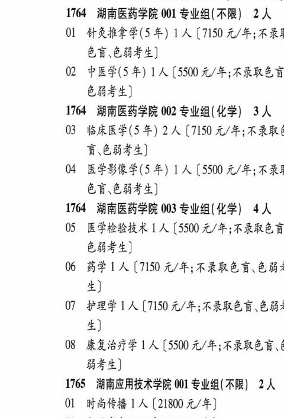

# 1764 湖南医药学院

- PDF页码：66
- 书内页码：115
- 专业组：3；专业条目：7

## 001专业组

- 选科要求：不限
- 招生计划：1 人
- 校验：sum-corrected

| 专业代码 | 专业名称 | 计划人数 | 学费（元/年） | 备注/完整OCR内容 |
|---|---|---:|---:|---|
| 02 | 中医学(5年) | 1 | 5500 | (5500 元/年;不录取色计 844) |

<details><summary>本专业组OCR原文</summary>

```text
1764 湖南医药学院 001 专业组(不限】 2 人
02 中医学(5年) 1 人(5500 元/年;不录取色计
844)
```
</details>

## 002专业组

- 选科要求：OCR未稳定识别
- 招生计划：3 人
- 校验：sum-corrected

| 专业代码 | 专业名称 | 计划人数 | 学费（元/年） | 备注/完整OCR内容 |
|---|---|---:|---:|---|
| 03 | 临床医学(5 年) | 2 | 7150 | 【7150 元/年;不录取\| 育、色弱考生] |
| 04 | 医学影像学(5 年) | 1 | 5500 | 【5500 元/年;不录 色盲.色弱考生] |

<details><summary>本专业组OCR原文</summary>

```text
1764 湖南医药学院 002 专业组(化学| 3A
03 临床医学(5 年) 2 人【7150 元/年;不录取|
育、色弱考生]
04 医学影像学(5 年) 1 人【5500 元/年;不录
色盲.色弱考生]
```
</details>

## 003专业组

- 选科要求：化学
- 招生计划：4 人
- 校验：review

| 专业代码 | 专业名称 | 计划人数 | 学费（元/年） | 备注/完整OCR内容 |
|---|---|---:|---:|---|
| 05 | 医学检验技术 | 1 | 5500 | 【5500 元/年;不录取色计 色弱考生] |
| 06 | 药学 | 1 | 7150 | 【7150 元/年;不录取色育、色能: 4) |
| 07 | PRE LA (7150 A/F; FRED EB? 4) |  |  | 07 PRE LA (7150 A/F; FRED EB? 4) |
| 08 | 康复治疗学 | 1 | 5500 | [5500 元/年;不录取色盲、 BA) |

<details><summary>本专业组OCR原文</summary>

```text
1764 湖南医药学院 003 专业组(化学) 4人
05 医学检验技术 1 人【5500 元/年;不录取色计
色弱考生]
06 药学 1 人【7150 元/年;不录取色育、色能:
4)
07 PRE LA (7150 A/F; FRED EB?
4)
08 康复治疗学 1 人[5500 元/年;不录取色盲、
BA)
```
</details>

## 附：院校完整OCR原文

```text
--- PDF第66页（书内第115页），第1栏 ---
1764 湖南医药学院 001 专业组(不限】 2 人
OL 针灸推拿学(5 年) 1 人【7150 元/年;不录
色盲.色弱考生]
02 中医学(5年) 1 人(5500 元/年;不录取色计
844)
1764 湖南医药学院 002 专业组(化学| 3A
03 临床医学(5 年) 2 人【7150 元/年;不录取|
育、色弱考生]
04 医学影像学(5 年) 1 人【5500 元/年;不录
色盲.色弱考生]
1764 湖南医药学院 003 专业组(化学) 4人
05 医学检验技术 1 人【5500 元/年;不录取色计
色弱考生]
06 药学 1 人【7150 元/年;不录取色育、色能:
4)
07 PRE LA (7150 A/F; FRED EB?
4)
08 康复治疗学 1 人[5500 元/年;不录取色盲、
BA)
```

## 源图

