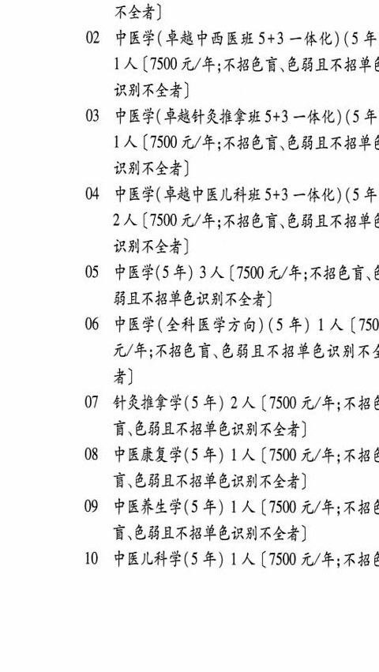
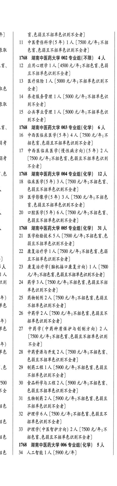
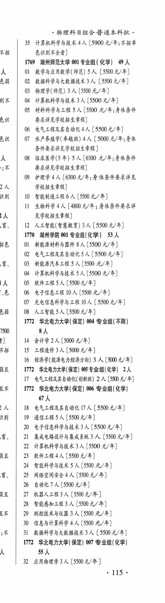

# 1768 湖南中医药大学

- PDF页码：66
- 书内页码：115
- 专业组：6；专业条目：27

## 001专业组

- 选科要求：不限
- 招生计划：15 人
- 校验：review

| 专业代码 | 专业名称 | 计划人数 | 学费（元/年） | 备注/完整OCR内容 |
|---|---|---:|---:|---|
| 02 | 中医学(卓越中西医班 +3 一体化) (5 年 1A ( |  | 1500 | 1500 元/年;不招色育、色弱且不招单 识别不全者] |
| 03 | 中医学(草越针灸推拿班5+3 一体化) (5 年 LA ( |  | 1500 | 1500 元/年;不招色育\色弱且不招单t 识别不全者] |
| 04 | 中医学(卓越中医儿科班 S+3 一体化) (5 年 2A ( |  | 1500 | 1500 元/年;不招色育\色弱且不招单人 识别不全者] |
| 05 | 中医学(5 年) | 3 | 7500 | 【7500 元/年;不招色盲、 弱且不招单色识别不全者] |
| 06 | 中医学(全科医学方向) (5 年) 1 ( |  | 750 | 750 元/年;不招色盲、色弱且不招音色识别不4 4) |
| 07 | 针灸推拿学(5 年) | 2 | 7500 | 【7500 元/年;不招 盲,色弱且不招单色识别不全者] |
| 08 | 中医康复学(5 年) | 1 | 7500 | 【7500 元/年;不招 讶色弱且不招音色识别不全者] |
| 09 | 中医养生学(5 年) | 1 | 7500 | 【7500 元/年;不招 育\色弱且不招音色识别不全者] |
| 10 | 中医儿科学(5 年) | 1 | 7500 | 【7500 元/年;不招 ) 盲\色弱且不招单色识别不全者] |
| 11 | 中医骨伤科学(5 年) ] 人 |  | 7500 | 7500 元/年;不招 RR EF EHARBSERAMASA) |

<details><summary>本专业组OCR原文</summary>

```text
1768 湖南中医药大学 001 专业组(不限) 15 人
OL 中医学(卓越中医班 S+3 一体化) (5 年) 1 /
[7500 元/年;不招色盲色弱且不招音色识和
不全者]
02 中医学(卓越中西医班 +3 一体化) (5 年
1A (1500 元/年;不招色育、色弱且不招单
识别不全者]
03 中医学(草越针灸推拿班5+3 一体化) (5 年
LA (1500 元/年;不招色育\色弱且不招单t
识别不全者]
04 中医学(卓越中医儿科班 S+3 一体化) (5 年
2A (1500 元/年;不招色育\色弱且不招单人
识别不全者]
05 中医学(5 年) 3 人【7500 元/年;不招色盲、
弱且不招单色识别不全者]
06 中医学(全科医学方向) (5 年) 1 (750
元/年;不招色盲、色弱且不招音色识别不4
4)
07 针灸推拿学(5 年) 2 人【7500 元/年;不招
盲,色弱且不招单色识别不全者]
08 中医康复学(5 年) 1 人【7500 元/年;不招
讶色弱且不招音色识别不全者]
09 中医养生学(5 年) 1 人【7500 元/年;不招
育\色弱且不招音色识别不全者]
10 中医儿科学(5 年) 1 人【7500 元/年;不招
)     盲\色弱且不招单色识别不全者]
ll 中医骨伤科学(5 年) ] 人【7500 元/年;不招
RR     EF EHARBSERAMASA)
```
</details>

## 002专业组

- 选科要求：不限
- 招生计划：4 人
- 校验：review

| 专业代码 | 专业名称 | 计划人数 | 学费（元/年） | 备注/完整OCR内容 |
|---|---|---:|---:|---|
| 13 | 医疗保险 ] 人 |  | 5000 | 5000 元/年;不招单色识别不 RB 24) |
| 14 | KEMSSR LA ( |  | 5000 | 5000 元/年;不招单色识 RAL 别不全者] |
| 15 | 公共事业管理 | 1 | 5000 | 【5000 元/年;不招单色识 别不全者] |

<details><summary>本专业组OCR原文</summary>

```text
1768 湖南中医药大学 002 专业组(不限) 4人
13 医疗保险 ] 人[5000 元/年;不招单色识别不
RB     24)
14 KEMSSR LA (5000 元/年;不招单色识
RAL     别不全者]
15 公共事业管理 1 人【5000 元/年;不招单色识
别不全者]
```
</details>

## 003专业组

- 选科要求：化学
- 招生计划：6 人
- 校验：ok

| 专业代码 | 专业名称 | 计划人数 | 学费（元/年） | 备注/完整OCR内容 |
|---|---|---:|---:|---|
| 16 | 中西医临床医学(5 年) | 4 | 7500 | 【7500 元/年;不 |
| 54 | 招色育、色弱且不招单色识别不全者 |  |  | 54 招色育、色弱且不招单色识别不全者] |
| 17 | 中西医临床医学(慢性病方向) (5 年) | 2 |  | ae (1500 4/4; FER CHAABEERAl 不全者] |

<details><summary>本专业组OCR原文</summary>

```text
言、   1768 湖南中医药大学 003 专业组(化学) 6人
16 中西医临床医学(5 年) 4 人【7500 元/年;不
54     招色育、色弱且不招单色识别不全者]
17 中西医临床医学(慢性病方向) (5 年) 2 人
ae     (1500 4/4; FER CHAABEERAl
不全者]
```
</details>

## 004专业组

- 选科要求：化学
- 招生计划：12 人
- 校验：review

| 专业代码 | 专业名称 | 计划人数 | 学费（元/年） | 备注/完整OCR内容 |
|---|---|---:|---:|---|
| 18 | 临床医学(5 年) 3 ( |  | 1500 | 1500 元/年;不招色盲、 色萌且不招单色识别不全者] |
| 19 | 医学影像学(5 年) | 3 | 7500 | 【7500 元/年;不招色 育、色弱且不招单色识别不全者] |
| 20 | 口腔医学(5年) | 6 | 7500 | 【7500 元/年;不招色言、 色弱且不招单色识别不全者] |

<details><summary>本专业组OCR原文</summary>

```text
4b   1768 湖南中医药大学 004 专业组(化学) 12 人
18 临床医学(5 年) 3 (1500 元/年;不招色盲、
色萌且不招单色识别不全者]
19 医学影像学(5 年) 3 人【7500 元/年;不招色
育、色弱且不招单色识别不全者]
20 口腔医学(5年) 6 人【7500 元/年;不招色言、
色弱且不招单色识别不全者]
```
</details>

## 005专业组

- 选科要求：化学
- 招生计划：31 人
- 校验：review

| 专业代码 | 专业名称 | 计划人数 | 学费（元/年） | 备注/完整OCR内容 |
|---|---|---:|---:|---|
| 21 | 医学检验技术 | 5 | 7500 | 【7500 元/年;不招色言\色 弱且不招单色识别不全者] |
| 22 | 康复治疗学 | 1 | 7500 | [7500 A/F; ABER EB ] 且不招单色识别不全者] 大 23 康复治疗学(脑机接口康复方向) 1A (7500 LA 元/年;不招色育\色弱且不招单色识别不全者] Ral 24 药学3人 (1500 A/F; ABER CHARB 单色识别不全者] 年) 25 药物制剂 2 人【7500 元/年;不招色言\色弱且 be 不招单色识别不全者] |
| 26 | 中药学 | 2 | 7500 | 【7500 元/年;不招色盲色弱且不 年) 招单色识别不全者] be 27 中药学(中药种质保护与创制方向) 2 人 (1500 元/年;不招色盲\色弱且不招单色识别 年) 不全者] £6 \| 28 中药资源与开发 2 人【7500 元/年;不招色言、 色弱且不招单色识别不全者] 、色 29 制药工程 A (590 t/4; ABER CBE 不招单色识别不全者] 500 \| 30 食品科学与工程2 人[5900 元/年;不招色育、 全 色丧且不招单色识别不全者] |
| 31 | 生物制药 | 2 | 5900 | 【5900 元/年;不招色盲.色弱且 a6, 不招单色识别不全者] |
| 32 | 护理学 | 6 | 7500 | 【7500 元/年;不招色育\色弱且不 8多 招单色识别不全者] |
| 33 | 护理学(中医智护方向) 2A ( |  | 7500 | 7500 元/年;不 BG, 招色盲色弱且不招单色识别不全者] |

<details><summary>本专业组OCR原文</summary>

```text
1768 湖南中医药大学 005 专业组(化学) 31 人
21 医学检验技术5 人【7500 元/年;不招色言\色
弱且不招单色识别不全者]
22 康复治疗学 1 人[7500 A/F; ABER EB
]      且不招单色识别不全者]
大    23 康复治疗学(脑机接口康复方向) 1A (7500
LA          元/年;不招色育\色弱且不招单色识别不全者]
Ral   24 药学3人 (1500 A/F; ABER CHARB
单色识别不全者]
年)   25 药物制剂 2 人【7500 元/年;不招色言\色弱且
be     不招单色识别不全者]
26 中药学 2 人【7500 元/年;不招色盲色弱且不
年)     招单色识别不全者]
be   27 中药学(中药种质保护与创制方向) 2 人
(1500 元/年;不招色盲\色弱且不招单色识别
年)     不全者]
£6 | 28 中药资源与开发 2 人【7500 元/年;不招色言、
色弱且不招单色识别不全者]
、色   29 制药工程 A (590 t/4; ABER CBE
不招单色识别不全者]
500 | 30 食品科学与工程2 人[5900 元/年;不招色育、
全     色丧且不招单色识别不全者]
31 生物制药 2 人【5900 元/年;不招色盲.色弱且
a6,     不招单色识别不全者]
32 护理学6 人【7500 元/年;不招色育\色弱且不
8多     招单色识别不全者]
33 护理学(中医智护方向) 2A (7500 元/年;不
BG,     招色盲色弱且不招单色识别不全者]
```
</details>

## 006专业组

- 选科要求：化学
- 招生计划：OCR未稳定识别 人
- 校验：review

| 专业代码 | 专业名称 | 计划人数 | 学费（元/年） | 备注/完整OCR内容 |
|---|---|---:|---:|---|
| 36 | 34 ALBA LA (5900 4/4) 物理科目组合普通本科批 |  |  | 36, 34 ALBA LA (5900 4/4) 物理科目组合普通本科批， |
| 35 | 计算机科学与技术 | 4 | 5900 | 【5900 元/年;不招音 1 色识别不全者] |

<details><summary>本专业组OCR原文</summary>

```text
1768 湖南中医药大学 006 专业组(化学) SA
36,   34 ALBA LA (5900 4/4)
物理科目组合普通本科批，
35 计算机科学与技术4 人【5900 元/年;不招音
1     色识别不全者]
```
</details>

## 附：院校完整OCR原文

```text
--- PDF第66页（书内第115页），第1栏 ---
1768 湖南中医药大学 001 专业组(不限) 15 人
OL 中医学(卓越中医班 S+3 一体化) (5 年) 1 /
[7500 元/年;不招色盲色弱且不招音色识和
不全者]
02 中医学(卓越中西医班 +3 一体化) (5 年
1A (1500 元/年;不招色育、色弱且不招单
识别不全者]
03 中医学(草越针灸推拿班5+3 一体化) (5 年
LA (1500 元/年;不招色育\色弱且不招单t
识别不全者]
04 中医学(卓越中医儿科班 S+3 一体化) (5 年
2A (1500 元/年;不招色育\色弱且不招单人
识别不全者]
05 中医学(5 年) 3 人【7500 元/年;不招色盲、
弱且不招单色识别不全者]
06 中医学(全科医学方向) (5 年) 1 (750
元/年;不招色盲、色弱且不招音色识别不4
4)
07 针灸推拿学(5 年) 2 人【7500 元/年;不招
盲,色弱且不招单色识别不全者]
08 中医康复学(5 年) 1 人【7500 元/年;不招
讶色弱且不招音色识别不全者]
09 中医养生学(5 年) 1 人【7500 元/年;不招
育\色弱且不招音色识别不全者]
10 中医儿科学(5 年) 1 人【7500 元/年;不招

--- PDF第66页（书内第115页），第2栏 ---
)     盲\色弱且不招单色识别不全者]
ll 中医骨伤科学(5 年) ] 人【7500 元/年;不招
RR     EF EHARBSERAMASA)
1768 湖南中医药大学 002 专业组(不限) 4人
By   12 应用心理学 1 人【4500 元/年;不招色盲色弱
且不招单色识别不全者]
13 医疗保险 ] 人[5000 元/年;不招单色识别不
RB     24)
14 KEMSSR LA (5000 元/年;不招单色识
RAL     别不全者]
15 公共事业管理 1 人【5000 元/年;不招单色识
别不全者]
言、   1768 湖南中医药大学 003 专业组(化学) 6人
16 中西医临床医学(5 年) 4 人【7500 元/年;不
54     招色育、色弱且不招单色识别不全者]
17 中西医临床医学(慢性病方向) (5 年) 2 人
ae     (1500 4/4; FER CHAABEERAl
不全者]
4b   1768 湖南中医药大学 004 专业组(化学) 12 人
18 临床医学(5 年) 3 (1500 元/年;不招色盲、
色萌且不招单色识别不全者]
19 医学影像学(5 年) 3 人【7500 元/年;不招色
育、色弱且不招单色识别不全者]
20 口腔医学(5年) 6 人【7500 元/年;不招色言、
色弱且不招单色识别不全者]
1768 湖南中医药大学 005 专业组(化学) 31 人
21 医学检验技术5 人【7500 元/年;不招色言\色
弱且不招单色识别不全者]
22 康复治疗学 1 人[7500 A/F; ABER EB
]      且不招单色识别不全者]
大    23 康复治疗学(脑机接口康复方向) 1A (7500
LA          元/年;不招色育\色弱且不招单色识别不全者]
Ral   24 药学3人 (1500 A/F; ABER CHARB
单色识别不全者]
年)   25 药物制剂 2 人【7500 元/年;不招色言\色弱且
be     不招单色识别不全者]
26 中药学 2 人【7500 元/年;不招色盲色弱且不
年)     招单色识别不全者]
be   27 中药学(中药种质保护与创制方向) 2 人
(1500 元/年;不招色盲\色弱且不招单色识别
年)     不全者]
£6 | 28 中药资源与开发 2 人【7500 元/年;不招色言、
色弱且不招单色识别不全者]
、色   29 制药工程 A (590 t/4; ABER CBE
不招单色识别不全者]
500 | 30 食品科学与工程2 人[5900 元/年;不招色育、
全     色丧且不招单色识别不全者]
31 生物制药 2 人【5900 元/年;不招色盲.色弱且
a6,     不招单色识别不全者]
32 护理学6 人【7500 元/年;不招色育\色弱且不
8多     招单色识别不全者]
33 护理学(中医智护方向) 2A (7500 元/年;不
BG,     招色盲色弱且不招单色识别不全者]
1768 湖南中医药大学 006 专业组(化学) SA
36,   34 ALBA LA (5900 4/4)

--- PDF第66页（书内第115页），第3栏 ---
物理科目组合普通本科批，
35 计算机科学与技术4 人【5900 元/年;不招音
1     色识别不全者]
```

## 源图



