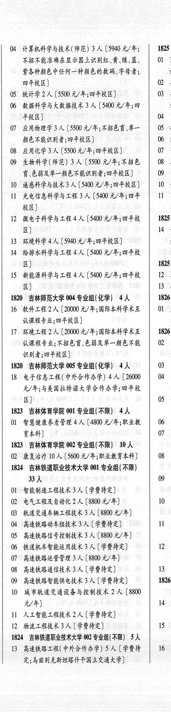
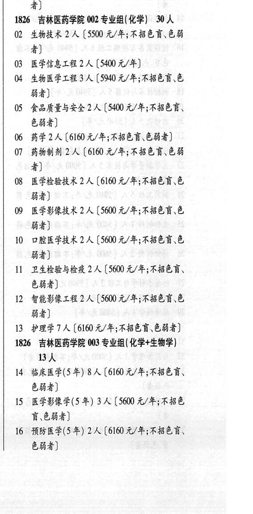
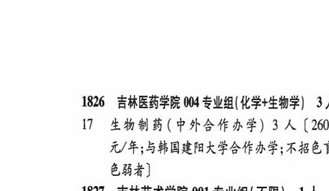

# 1826 吉林医药学院

- PDF页码：75, 76
- 书内页码：124, 125
- 专业组：5；专业条目：50

## 001专业组

- 选科要求：不限
- 招生计划：2 人
- 校验：ok

| 专业代码 | 专业名称 | 计划人数 | 学费（元/年） | 备注/完整OCR内容 |
|---|---|---:|---:|---|
| 01 | 应用心理学 | 2 | 5500 | 【5500元/年;不招色言、色能 者] |

<details><summary>本专业组OCR原文</summary>

```text
1826 吉林医药学院 001 专业组(不限) 2人
Ol 应用心理学2 人【5500元/年;不招色言、色能
者]
```
</details>

## 002专业组

- 选科要求：化学
- 招生计划：30 人
- 校验：review

| 专业代码 | 专业名称 | 计划人数 | 学费（元/年） | 备注/完整OCR内容 |
|---|---|---:|---:|---|
| 02 | ”生物技术 | 2 | 5500 | 【5500 元/年;不招色盲\色能 4) |
| 03 | 医学信息工程 | 2 |  | 【5400 4/4) |
| 04 | 生物医学工程 | 3 | 5940 | 【5940 元/年;不招色盲\色 84) |
| 05 | ”食品质量与安全 | 2 | 5400 | 【5400 元/年;不招色盲、 色弱者] |
| 06 | 药学 | 2 | 6160 | [6160元/年;不招色盲.色弱者] |
| 07 | 药物制剂 | 2 | 6160 | 【6160 元/年;不招色盲色弱 者] |
| 08 | 医学检验技术 | 2 | 6160 | 【6160 元/年;不招色盲、色 84) |
| 09 | 医学影像技术 2A ( |  | 5600 | 5600 元/年;不招色盲、色 84) |
| 10 | ORE PRA 2A (5600 4/4; FBERE 84) |  |  | 10 ORE PRA 2A (5600 4/4; FBERE 84) |
| 11 | 卫生检验与检疫 | 2 | 5600 | 【5600 元/年;不招色盲、 &84) |
| 12 | 智能影像工程 | 2 | 5600 | 【5600 元/年;不招色育色 84) |
| 13 | 护理学?人 |  | 6160 | 6160 元/年;不招色育、色弱者] |

<details><summary>本专业组OCR原文</summary>

```text
1826 吉林医药学院 002 专业组( 化学) 30 人
02 ”生物技术 2 人【5500 元/年;不招色盲\色能
4)
03 医学信息工程2人【5400 4/4)
04 生物医学工程 3 人【5940 元/年;不招色盲\色
84)
05 ”食品质量与安全2 人【5400 元/年;不招色盲、
色弱者]
06 药学2人[6160元/年;不招色盲.色弱者]
07 药物制剂 2 人【6160 元/年;不招色盲色弱
者]
08 医学检验技术 2 人【6160 元/年;不招色盲、色
84)
09 医学影像技术 2A (5600 元/年;不招色盲、色
84)
10 ORE PRA 2A (5600 4/4; FBERE
84)
11 卫生检验与检疫 2 人【5600 元/年;不招色盲、
&84)
12 智能影像工程 2 人【5600 元/年;不招色育色
84)
13 护理学?人【6160 元/年;不招色育、色弱者]
```
</details>

## 003专业组

- 选科要求：化学+生物学
- 招生计划：OCR未稳定识别 人
- 校验：review

| 专业代码 | 专业名称 | 计划人数 | 学费（元/年） | 备注/完整OCR内容 |
|---|---|---:|---:|---|
| 14 | 临床医学(5 4) 8A (6160 4/4; FBER, 色弱者 |  |  | 14 临床医学(5 4) 8A (6160 4/4; FBER, 色弱者] |
| 15 | 医学影像学(5 年) | 3 | 5600 | [5600 元/年;不招色 讶色弱者] |
| 16 | 预防医学(5年) | 2 | 6160 | 【6160 元/年;不招色盲、 684) |

<details><summary>本专业组OCR原文</summary>

```text
1826 吉林医药学院 003 专业组( 化学+生物学) BA
14 临床医学(5 4) 8A (6160 4/4; FBER,
色弱者]
15 医学影像学(5 年) 3 人[5600 元/年;不招色
讶色弱者]
16 预防医学(5年) 2 人【6160 元/年;不招色盲、
684)
```
</details>

## 004专业组

- 选科要求：化学
- 招生计划：4 人
- 校验：review

| 专业代码 | 专业名称 | 计划人数 | 学费（元/年） | 备注/完整OCR内容 |
|---|---|---:|---:|---|
| 16 | 软件工程 | 2 | 20000 | 【20000 元/年;国际本科学术互 lB 认课程专业;四平校区)] a |
| 17 | 环境工程 | 2 | 20000 | 【20000 元/年;国际本科学术互 1826 认课程专业;不招色盲.色弱及单一颜色不能 0 4 识别者;四平校区] a 1820 吉林师范大学 005 专业组(化学) 4人 03 & |
| 18 | 电子信息工程(中外合作办学) 4A (26000 \| 4 4 元/年;与美国拉特诺大学合作办学;四平校 g 区) 05 4 1823 吉林体育学院 001 专业组(不限) | 4 |  | 18 电子信息工程(中外合作办学) 4A (26000 \| 4 4 元/年;与美国拉特诺大学合作办学;四平校 g 区) 05 4 1823 吉林体育学院 001 专业组(不限) 4人 |
| 01 | 智慧健康养老管理 | 4 | 4800 | 【4800 元/年;职业教 \| 06 2 HAA) 07 3 1823 吉林体育学院 002 专业组(不限】 10 人 |
| 02 | 康复治疗 | 10 | 5600 | [5600 元/年;职业教育本科] 08 有 1824 ”吉林铁道职业技术大学 001 专业组(不限) |
| 33 | 人 0 & |  |  | 33人 0 & |
| 01 | 智能制造工程技术 | 3 | 学费待定 | [学费待定] Es |
| 02 | 电气工程及自动化 | 2 | 8800 | 【8800元/年] 10 上 |
| 03 | 轨道交通车辆工程技术 | 3 |  | 【8800 4/4) Es |
| 04 | 高速铁路动车组技术 | 3 |  | (FRAR) ee |
| 05 | 高速铁路信号控制技术 3A ( |  | 8800 | 8800 元/年] é |
| 06 | 铁道机车智能运用技术 3 A (FRAR) 12 4 |  |  | 06 铁道机车智能运用技术 3 A (FRAR) 12 4 |
| 07 | ”高速铁路运营管理 | 3 | 8800 | 【8800 元/年] |
| 08 | 高速铁路通信技术 | 3 | 学费待定 | 【学费待定] 13 4 |
| 09 | 高速铁路智能供电技术 | 3 | 学费待定 | 【学费待定] 1826 |
| 10 | 城市轨道交通设备与控制技术 | 2 | 8800 | 【8800 元/年] 14 攻 |
| 11 | 人工智能工程技术 | 2 | 学费待定 | 【学费待定] |
| 12 | 物流工程技术 | 3 | 学费待定 | 【学费待定] 15 £ 1824 吉林铁道职业技术大学 002 专业组(不限) SA |
| 13 | 高速铁路工程(中外合作办学) SA CERF 16 于 定;乌交别克斯坦塔什干国立交通大学] é 1825 吉林外国语大学 001 专业组(不限) | 23 |  | 13 高速铁路工程(中外合作办学) SA CERF 16 于 定;乌交别克斯坦塔什干国立交通大学] é 1825 吉林外国语大学 001 专业组(不限) 23 人 |
| 01 | 商务英语 | 2 | 25000 | 【25000 元/年;外语语种须为英 #) |
| 02 | 英语 | 2 | 25000 | 【25000 元/年;外语语种须为英语] |
| 03 | 英语(英德双语) (5 年) | 2 | 26000 | 【26000 元/年;德 语零起点;外语语种须为英语] |
| 04 | 日语 | 2 | 25000 | 【25000 元/年;零起点] |
| 05 | 德语 | 2 | 25000 | 【25000 元/年;零起点] |
| 06 | 法语 | 3 | 25000 | [25000元/年;零起点] |
| 07 | 葡萄牙语 | 2 | 25000 | 【25000 元/年] |
| 08 | 人力资源管理 | 2 |  | 【24000 4/4) |
| 09 | 电子商务 | 2 | 24000 | 【24000 元/年] |
| 10 | 金融学 | 2 | 24000 | [24000 元/年] |
| 11 | 国际经济与贸易 | 2 | 28000 | 【28000 元/年;数字贸易 实验班] 1825 ”吉林外国语大学 002 专业组(不限) 3 人 |
| 14 | 俄语(中外合作办学) | 3 | 36000 | 【36000 元/年;堆 起点;与俄罗斯托木斯克国立师范大学合作办 学,采取3+1 培养模式] 1825 吉林外国语大学 003 专业组(化学) 10 人 |
| 12 | ADH 4A (26000 4/4) |  |  | 12 ADH 4A (26000 4/4) |
| 13 | 数据科学与大数据技术 | 6 | 25000 | 【25000 元/年] |

<details><summary>本专业组OCR原文</summary>

```text
1820 “吉林师范大学 004 专业组(化学) 4人    1826
16 软件工程 2 人【20000 元/年;国际本科学术互   lB
认课程专业;四平校区)]             a
17 环境工程 2 人【20000 元/年;国际本科学术互   1826
认课程专业;不招色盲.色弱及单一颜色不能   0 4
识别者;四平校区]               a
1820 吉林师范大学 005 专业组(化学) 4人    03 &
18 电子信息工程(中外合作办学) 4A (26000 | 4 4
元/年;与美国拉特诺大学合作办学;四平校    g
区)                   05 4
1823 吉林体育学院 001 专业组(不限) 4人
Ol 智慧健康养老管理 4 人【4800 元/年;职业教 | 06 2
HAA)                07 3
1823 吉林体育学院 002 专业组(不限】 10 人
02 康复治疗 10 人[5600 元/年;职业教育本科]   08 有
1824 ”吉林铁道职业技术大学 001 专业组(不限)
33人                0 &
01 智能制造工程技术 3 人[学费待定]        Es
02 电气工程及自动化2 人【8800元/年]     10 上
03 轨道交通车辆工程技术3 人【8800 4/4)      Es
04 高速铁路动车组技术 3 人 (FRAR)     ee
05 高速铁路信号控制技术 3A (8800 元/年]      é
06 铁道机车智能运用技术 3 A (FRAR)     12 4
07 ”高速铁路运营管理 3 人【8800 元/年]
08 高速铁路通信技术 3 人【学费待定]      13 4
09 高速铁路智能供电技术 3 人【学费待定]     1826
10 城市轨道交通设备与控制技术 2 人【8800
元/年]                 14 攻
11 人工智能工程技术 2 人【学费待定]
12 物流工程技术 3 人【学费待定]        15 £
1824 吉林铁道职业技术大学 002 专业组(不限) SA
13 高速铁路工程(中外合作办学) SA CERF   16 于
定;乌交别克斯坦塔什干国立交通大学]       é
1825 吉林外国语大学 001 专业组(不限) 23 人
01 商务英语 2 人【25000 元/年;外语语种须为英
#)
02 英语 2 人【25000 元/年;外语语种须为英语]
03 英语(英德双语) (5 年) 2 人【26000 元/年;德
语零起点;外语语种须为英语]
04 日语2人【25000 元/年;零起点]
05 德语2 人【25000 元/年;零起点]
06 法语3 人[25000元/年;零起点]
07 葡萄牙语 2 人【25000 元/年]
08 人力资源管理 2 人【24000 4/4)
09 电子商务2 人【24000 元/年]
10 金融学2 人[24000 元/年]
11 国际经济与贸易 2 人【28000 元/年;数字贸易
实验班]
1825 ”吉林外国语大学 002 专业组(不限) 3 人
14 俄语(中外合作办学) 3 人【36000 元/年;堆
起点;与俄罗斯托木斯克国立师范大学合作办
学,采取3+1 培养模式]
1825 吉林外国语大学 003 专业组(化学) 10 人
12 ADH 4A (26000 4/4)
13 数据科学与大数据技术 6 人【25000 元/年]
```
</details>

## 004专业组

- 选科要求：OCR未稳定识别
- 招生计划：OCR未稳定识别 人
- 校验：review

| 专业代码 | 专业名称 | 计划人数 | 学费（元/年） | 备注/完整OCR内容 |
|---|---|---:|---:|---|
| 17 | 生物制药(中外合作办学) 3A ( |  | 260 | 260 元/年;与韩国建阳大学合作办学;不招色1 684) |

<details><summary>本专业组OCR原文</summary>

```text
1826 吉林医药学院 004 专业组(化学+生物学| 3,
17 生物制药(中外合作办学) 3A (260
元/年;与韩国建阳大学合作办学;不招色1
684)
```
</details>

## 附：院校完整OCR原文

```text
--- PDF第75页（书内第124页），第2栏 ---
1820 “吉林师范大学 004 专业组(化学) 4人    1826
16 软件工程 2 人【20000 元/年;国际本科学术互   lB
认课程专业;四平校区)]             a
17 环境工程 2 人【20000 元/年;国际本科学术互   1826
认课程专业;不招色盲.色弱及单一颜色不能   0 4
识别者;四平校区]               a
1820 吉林师范大学 005 专业组(化学) 4人    03 &
18 电子信息工程(中外合作办学) 4A (26000 | 4 4
元/年;与美国拉特诺大学合作办学;四平校    g
区)                   05 4
1823 吉林体育学院 001 专业组(不限) 4人
Ol 智慧健康养老管理 4 人【4800 元/年;职业教 | 06 2
HAA)                07 3
1823 吉林体育学院 002 专业组(不限】 10 人
02 康复治疗 10 人[5600 元/年;职业教育本科]   08 有
1824 ”吉林铁道职业技术大学 001 专业组(不限)
33人                0 &
01 智能制造工程技术 3 人[学费待定]        Es
02 电气工程及自动化2 人【8800元/年]     10 上
03 轨道交通车辆工程技术3 人【8800 4/4)      Es
04 高速铁路动车组技术 3 人 (FRAR)     ee
05 高速铁路信号控制技术 3A (8800 元/年]      é
06 铁道机车智能运用技术 3 A (FRAR)     12 4
07 ”高速铁路运营管理 3 人【8800 元/年]
08 高速铁路通信技术 3 人【学费待定]      13 4
09 高速铁路智能供电技术 3 人【学费待定]     1826
10 城市轨道交通设备与控制技术 2 人【8800
元/年]                 14 攻
11 人工智能工程技术 2 人【学费待定]
12 物流工程技术 3 人【学费待定]        15 £
1824 吉林铁道职业技术大学 002 专业组(不限) SA
13 高速铁路工程(中外合作办学) SA CERF   16 于
定;乌交别克斯坦塔什干国立交通大学]       é

--- PDF第75页（书内第124页），第3栏 ---
1825 吉林外国语大学 001 专业组(不限) 23 人
01 商务英语 2 人【25000 元/年;外语语种须为英
#)
02 英语 2 人【25000 元/年;外语语种须为英语]
03 英语(英德双语) (5 年) 2 人【26000 元/年;德
语零起点;外语语种须为英语]
04 日语2人【25000 元/年;零起点]
05 德语2 人【25000 元/年;零起点]
06 法语3 人[25000元/年;零起点]
07 葡萄牙语 2 人【25000 元/年]
08 人力资源管理 2 人【24000 4/4)
09 电子商务2 人【24000 元/年]
10 金融学2 人[24000 元/年]
11 国际经济与贸易 2 人【28000 元/年;数字贸易
实验班]
1825 ”吉林外国语大学 002 专业组(不限) 3 人
14 俄语(中外合作办学) 3 人【36000 元/年;堆
起点;与俄罗斯托木斯克国立师范大学合作办
学,采取3+1 培养模式]
1825 吉林外国语大学 003 专业组(化学) 10 人
12 ADH 4A (26000 4/4)
13 数据科学与大数据技术 6 人【25000 元/年]
1826 吉林医药学院 001 专业组(不限) 2人
Ol 应用心理学2 人【5500元/年;不招色言、色能
者]
1826 吉林医药学院 002 专业组( 化学) 30 人
02 ”生物技术 2 人【5500 元/年;不招色盲\色能
4)
03 医学信息工程2人【5400 4/4)
04 生物医学工程 3 人【5940 元/年;不招色盲\色
84)
05 ”食品质量与安全2 人【5400 元/年;不招色盲、
色弱者]
06 药学2人[6160元/年;不招色盲.色弱者]
07 药物制剂 2 人【6160 元/年;不招色盲色弱
者]
08 医学检验技术 2 人【6160 元/年;不招色盲、色
84)
09 医学影像技术 2A (5600 元/年;不招色盲、色
84)
10 ORE PRA 2A (5600 4/4; FBERE
84)
11 卫生检验与检疫 2 人【5600 元/年;不招色盲、
&84)
12 智能影像工程 2 人【5600 元/年;不招色育色
84)
13 护理学?人【6160 元/年;不招色育、色弱者]
1826 吉林医药学院 003 专业组( 化学+生物学)
BA
14 临床医学(5 4) 8A (6160 4/4; FBER,
色弱者]
15 医学影像学(5 年) 3 人[5600 元/年;不招色
讶色弱者]
16 预防医学(5年) 2 人【6160 元/年;不招色盲、
684)

--- PDF第76页（书内第125页），第1栏 ---
1826 吉林医药学院 004 专业组(化学+生物学| 3,
17 生物制药(中外合作办学) 3A (260
元/年;与韩国建阳大学合作办学;不招色1
684)
```

## 源图



