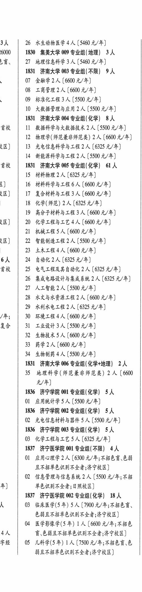
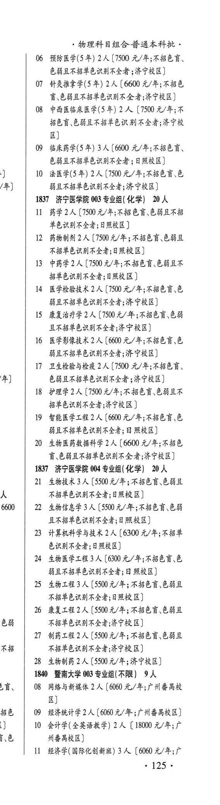

# 1837 济宁医学院

- PDF页码：76
- 书内页码：125
- 专业组：4；专业条目：25

## 001专业组

- 选科要求：不限
- 招生计划：4 人
- 校验：ok

| 专业代码 | 专业名称 | 计划人数 | 学费（元/年） | 备注/完整OCR内容 |
|---|---|---:|---:|---|
| 01 | 应用心理学 | 2 | 6300 | [6300 元/年;不招色盲、色弱 且不招单色识别不全者;济宁校区] |
| 02 | 信息管理与信息系统 | 2 | 5500 | 【5500 元/年;不招 年] 音色识别不全者;日照校区] |

<details><summary>本专业组OCR原文</summary>

```text
1837 济宁医学院 001 专业组(不限】 4人
01 应用心理学2 人[6300 元/年;不招色盲、色弱
且不招单色识别不全者;济宁校区]
02 信息管理与信息系统 2 人【5500 元/年;不招
年]     音色识别不全者;日照校区]
```
</details>

## 002专业组

- 选科要求：化学
- 招生计划：18 人
- 校验：review

| 专业代码 | 专业名称 | 计划人数 | 学费（元/年） | 备注/完整OCR内容 |
|---|---|---:|---:|---|
| 04 | 医学影像学(5 年) | 1 | 6600 | 【6600 元/年;不招色 4人 讶色弱且不招单色识别不全者;济宁校区] 字经 \| 05 儿科学(5年) 1 人[7500元/年;不招色盲、色 能且不招单色识别不全者;济宁校区] ,物理科目组合普通本科批， |
| 06 | 预防医学(5 年) | 2 | 7500 | [7500 元/年;不招色言、 色莘且不招单色识别不全者 ;济宁校区] |
| 07 | 针灸推拿学(5年) | 2 | 6600 | [6600 元/年;不招色 言\色弱且不招单色识别不全者;济宁校区] |
| 08 | 中西医临床医学(5 年) | 2 | 7500 | 【7500 元/年;不 招色盲,色弱且不招单色识别不全者;济宁校 B) |
| 09 | 临床药学(5 年) 3A ( |  | 66000 | 66000 元/年;不招色盲、 色弱且不招单色识别不全者 ; 日照校区] |
| 10 | 法医学(5年) 2A ( |  | 150 | 150 元/年;不招色盲、色 ] 弱且不招单色识别不全者;济宁校区] |

<details><summary>本专业组OCR原文</summary>

```text
1837 济宁医学院 002 专业组(化学) 18 人
04 医学影像学(5 年) 1 人【6600 元/年;不招色
4人    讶色弱且不招单色识别不全者;济宁校区]
字经 | 05 儿科学(5年) 1 人[7500元/年;不招色盲、色
能且不招单色识别不全者;济宁校区]
,物理科目组合普通本科批，
06 预防医学(5 年) 2 人[7500 元/年;不招色言、
色莘且不招单色识别不全者 ;济宁校区]
07 针灸推拿学(5年) 2人[6600 元/年;不招色
言\色弱且不招单色识别不全者;济宁校区]
08 中西医临床医学(5 年) 2 人【7500 元/年;不
招色盲,色弱且不招单色识别不全者;济宁校
B)
09 临床药学(5 年) 3A (66000 元/年;不招色盲、
色弱且不招单色识别不全者 ; 日照校区]
10 法医学(5年) 2A (150 元/年;不招色盲、色
]     弱且不招单色识别不全者;济宁校区]
```
</details>

## 003专业组

- 选科要求：化学
- 招生计划：20 人
- 校验：ok

| 专业代码 | 专业名称 | 计划人数 | 学费（元/年） | 备注/完整OCR内容 |
|---|---|---:|---:|---|
| 11 | 药学 | 2 |  | 【7500 4/4; 4B EH BHAA 单色识别不全者;日照校区] |
| 12 | 药物制剂 | 2 | 7500 | [7500元/年;不招色盲.色弱且 不招单色识别不全者;日照校区] |
| 13 | 中药学 | 2 | 7500 | 【7500 元/年;不招色育、色弱且不 招单色识别不全者;日照校区 ] |
| 14 | 医学检验技术 | 2 | 7500 | [7500 元/年;不招色育\色 弱且不招单色识别不全者;济宁校区] |
| 15 | 康复治疗学 | 2 | 7500 | 【7500 元/年;不招色育、色弱 且不招单色识别不全者;济宁校区] |
| 16 | 医学影像技术 | 2 | 6600 | 【6600 元/年;不招色育、色 能且不招单色识别不全者;济宁校区] |
| 17 | 卫生检验与检疫 | 2 | 7500 | [7500 元/年;不招色盲、 色弱且不招单色识别不全者 ; 济宁校区] |
| 18 | 护理学 | 2 | 7500 | 【7500 元/年;不招色育、色弱且不 招单色识别不全者;济宁校区 ] |
| 19 | 智能医学工程 | 2 | 6600 | 【6600 元/年;不招色育、色 能且不招单色识别不全者; ARAB) |
| 20 | 生物医药教据科学 | 2 | 6600 | 【6600 元/年;不招色 讶\色科且不招单色识别不全者;济宁校区] |

<details><summary>本专业组OCR原文</summary>

```text
1837 济宁医学院 003 专业组( 化学) 20 人
11 药学2人【7500 4/4; 4B EH BHAA
单色识别不全者;日照校区]
12 药物制剂2人[7500元/年;不招色盲.色弱且
不招单色识别不全者;日照校区]
13 中药学2 人【7500 元/年;不招色育、色弱且不
招单色识别不全者;日照校区 ]
14 医学检验技术 2 人 [7500 元/年;不招色育\色
弱且不招单色识别不全者;济宁校区]
15 康复治疗学2 人【7500 元/年;不招色育、色弱
且不招单色识别不全者;济宁校区]
16 医学影像技术 2 人【6600 元/年;不招色育、色
能且不招单色识别不全者;济宁校区]
17 卫生检验与检疫 2 人[7500 元/年;不招色盲、
色弱且不招单色识别不全者 ; 济宁校区]
18 护理学2 人【7500 元/年;不招色育、色弱且不
招单色识别不全者;济宁校区 ]
19 智能医学工程2 人【6600 元/年;不招色育、色
能且不招单色识别不全者; ARAB)
20 生物医药教据科学 2 人【6600 元/年;不招色
讶\色科且不招单色识别不全者;济宁校区]
```
</details>

## 004专业组

- 选科要求：化学
- 招生计划：17 人
- 校验：sum-corrected

| 专业代码 | 专业名称 | 计划人数 | 学费（元/年） | 备注/完整OCR内容 |
|---|---|---:|---:|---|
| 21 | 生物技术 | 3 | 5500 | [5500 A/F; RBED OBE 不招单色识别不全者;日照校区] 0 \| 22 生物信息学3人 (5500 元/年;不招色盲、色弱 且不招单色识别不全者:日照校区] |
| 23 | 计算机科学与技术 | 2 | 6300 | 【6300 元/年;不招单 色识别不全者;日照校区)] |
| 24 | 生物医学工程 | 3 | 6300 | 【6300 元/年;不招色言、色 弱且不招单色识别不全者; ARBRE) |
| 25 | 生物工程 | 3 |  | (5500 4/4; RHEE EBS 不招单色识别不全者;日照校区] |
| 26 | 康复工程 | 2 | 5500 | [5500元/年;不招色盲色弱且 i 不招单色识别不全者;济宁校区] |
| 27 | 制药工程 | 2 |  | 【5500 A/F; KBE EHD 4 不招单色识别不全者;济宁校区] |
| 28 | 生物制药 | 2 | 5500 | 【5500 元/年;济宁校区] |

<details><summary>本专业组OCR原文</summary>

```text
1837 济宁医学院 004 专业组( 化学) 20人
21 生物技术3 人[5500 A/F; RBED OBE
不招单色识别不全者;日照校区]
0 | 22 生物信息学3人 (5500 元/年;不招色盲、色弱
且不招单色识别不全者:日照校区]
23 计算机科学与技术 2 人【6300 元/年;不招单
色识别不全者;日照校区)]
24 生物医学工程 3 人【6300 元/年;不招色言、色
弱且不招单色识别不全者; ARBRE)
25 生物工程3人 (5500 4/4; RHEE EBS
不招单色识别不全者;日照校区]
26 康复工程2人[5500元/年;不招色盲色弱且
i     不招单色识别不全者;济宁校区]
27 制药工程2人【5500 A/F; KBE EHD
4     不招单色识别不全者;济宁校区]
28 生物制药 2 人【5500 元/年;济宁校区]
```
</details>

## 附：院校完整OCR原文

```text
--- PDF第76页（书内第125页），第2栏 ---
1837 济宁医学院 001 专业组(不限】 4人
01 应用心理学2 人[6300 元/年;不招色盲、色弱
且不招单色识别不全者;济宁校区]
02 信息管理与信息系统 2 人【5500 元/年;不招
年]     音色识别不全者;日照校区]
1837 济宁医学院 002 专业组(化学) 18 人
人    03 临床医学(5 年) 5 人【7900 元/年;不招色育、
色弱且不招单色识别不全者;济宁校区]
04 医学影像学(5 年) 1 人【6600 元/年;不招色
4人    讶色弱且不招单色识别不全者;济宁校区]
字经 | 05 儿科学(5年) 1 人[7500元/年;不招色盲、色
能且不招单色识别不全者;济宁校区]

--- PDF第76页（书内第125页），第3栏 ---
,物理科目组合普通本科批，
06 预防医学(5 年) 2 人[7500 元/年;不招色言、
色莘且不招单色识别不全者 ;济宁校区]
07 针灸推拿学(5年) 2人[6600 元/年;不招色
言\色弱且不招单色识别不全者;济宁校区]
08 中西医临床医学(5 年) 2 人【7500 元/年;不
招色盲,色弱且不招单色识别不全者;济宁校
B)
09 临床药学(5 年) 3A (66000 元/年;不招色盲、
色弱且不招单色识别不全者 ; 日照校区]
10 法医学(5年) 2A (150 元/年;不招色盲、色
]     弱且不招单色识别不全者;济宁校区]
1837 济宁医学院 003 专业组( 化学) 20 人
11 药学2人【7500 4/4; 4B EH BHAA
单色识别不全者;日照校区]
12 药物制剂2人[7500元/年;不招色盲.色弱且
不招单色识别不全者;日照校区]
13 中药学2 人【7500 元/年;不招色育、色弱且不
招单色识别不全者;日照校区 ]
14 医学检验技术 2 人 [7500 元/年;不招色育\色
弱且不招单色识别不全者;济宁校区]
15 康复治疗学2 人【7500 元/年;不招色育、色弱
且不招单色识别不全者;济宁校区]
16 医学影像技术 2 人【6600 元/年;不招色育、色
能且不招单色识别不全者;济宁校区]
17 卫生检验与检疫 2 人[7500 元/年;不招色盲、
色弱且不招单色识别不全者 ; 济宁校区]
18 护理学2 人【7500 元/年;不招色育、色弱且不
招单色识别不全者;济宁校区 ]
19 智能医学工程2 人【6600 元/年;不招色育、色
能且不招单色识别不全者; ARAB)
20 生物医药教据科学 2 人【6600 元/年;不招色
讶\色科且不招单色识别不全者;济宁校区]
1837 济宁医学院 004 专业组( 化学) 20人
21 生物技术3 人[5500 A/F; RBED OBE
不招单色识别不全者;日照校区]
0 | 22 生物信息学3人 (5500 元/年;不招色盲、色弱
且不招单色识别不全者:日照校区]
23 计算机科学与技术 2 人【6300 元/年;不招单
色识别不全者;日照校区)]
24 生物医学工程 3 人【6300 元/年;不招色言、色
弱且不招单色识别不全者; ARBRE)
25 生物工程3人 (5500 4/4; RHEE EBS
不招单色识别不全者;日照校区]
26 康复工程2人[5500元/年;不招色盲色弱且
i     不招单色识别不全者;济宁校区]
27 制药工程2人【5500 A/F; KBE EHD
4     不招单色识别不全者;济宁校区]
28 生物制药 2 人【5500 元/年;济宁校区]
```

## 源图


