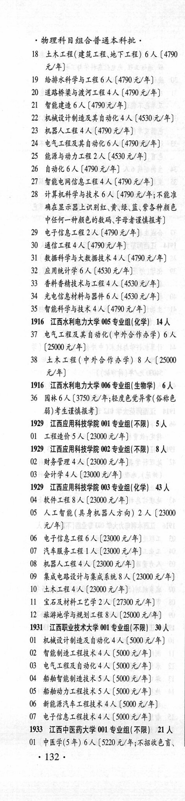
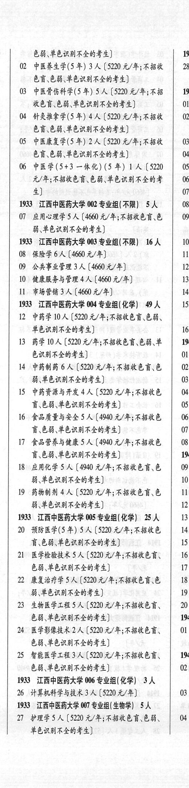
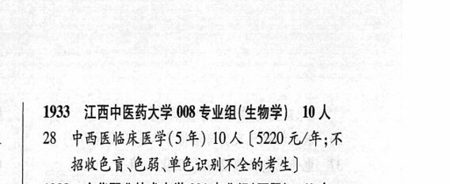

# 1933 江西中医药大学

- PDF页码：83
- 书内页码：132
- 专业组：8；专业条目：26

## 001专业组

- 选科要求：不限
- 招生计划：21 人
- 校验：review

| 专业代码 | 专业名称 | 计划人数 | 学费（元/年） | 备注/完整OCR内容 |
|---|---|---:|---:|---|
| 01 | 中医学(5年) | 6 | 5220 | 【5220 元/年;不招收色育、 132+ 色弱\单色识别不全的考生] 193 |
| 02 | 中医养生学(5 年) | 3 | 5220 | 【5220 元/年;不招收 \| 28 色盲.色弱\单色识别不全的考生] |
| 03 | ”中医骨伤科学(5 年) 5A ( |  | 5220 | 5220 元/年;不招 193 收色盲\色弱、单色识别不全的考生] 01 |
| 04 | 针灸推拿学(5 年) | 4 | 5220 | 【5220 元/年;不招收 02 色盲色弱单色识别不全的考生] |
| 05 | 中医康复学(5 年) | 2 | 5220 | 【5220 元/年;不招收 03 色盲色弱、单色识别不全的考生] 04 |
| 06 | 中医学(5+3 一体化) (5年) 1A (5220 \| 05 元/年;不招收色盲色弱`单色识别不全的考 06 生] 07 |  |  | 06 中医学(5+3 一体化) (5年) 1A (5220 \| 05 元/年;不招收色盲色弱`单色识别不全的考 06 生] 07 |

<details><summary>本专业组OCR原文</summary>

```text
1933 江西中医药大学 001 专业组(不限) 21 人
Ol 中医学(5年) 6 人【5220 元/年;不招收色育、
132+
色弱\单色识别不全的考生]          193
02 中医养生学(5 年) 3 人【5220 元/年;不招收 | 28
色盲.色弱\单色识别不全的考生]
03 ”中医骨伤科学(5 年) 5A (5220 元/年;不招   193
收色盲\色弱、单色识别不全的考生]       01
04 针灸推拿学(5 年) 4 人【5220 元/年;不招收   02
色盲色弱单色识别不全的考生]
05 中医康复学(5 年) 2 人【5220 元/年;不招收  03
色盲色弱、单色识别不全的考生]        04
06 中医学(5+3 一体化) (5年) 1A (5220 | 05
元/年;不招收色盲色弱`单色识别不全的考   06
生]                    07
```
</details>

## 002专业组

- 选科要求：不限
- 招生计划：5 人
- 校验：ok

| 专业代码 | 专业名称 | 计划人数 | 学费（元/年） | 备注/完整OCR内容 |
|---|---|---:|---:|---|
| 07 | 应用心理学 | 5 | 4660 | 【4660 元/年;不招收色育、色 09 能、单色识别不全的考生] |

<details><summary>本专业组OCR原文</summary>

```text
1933 江西中医药大学 002 专业组(不限) 5 人   08
07 应用心理学5 人【4660 元/年;不招收色育、色   09
能、单色识别不全的考生]
```
</details>

## 003专业组

- 选科要求：不限
- 招生计划：16 人
- 校验：ok

| 专业代码 | 专业名称 | 计划人数 | 学费（元/年） | 备注/完整OCR内容 |
|---|---|---:|---:|---|
| 08 | 保险学 | 6 |  | 【4660 4/4) u |
| 09 | 公共事业管理 | 3 | 4660 | 【4660元/年] 12 |
| 10 | 健康服务与管理 | 4 | 4660 | 【4660 元/年] 13 |
| 11 | 市场营销 | 3 | 4660 | 【4660 元/年] 14 |

<details><summary>本专业组OCR原文</summary>

```text
1933 江西中医药大学 003 专业组(不限】 16 人   10
08 保险学6人【4660 4/4)           u
09 公共事业管理 3 人【4660元/年]        12
10 健康服务与管理 4人【4660 元/年]       13
11 市场营销 3 人【4660 元/年]         14
```
</details>

## 004专业组

- 选科要求：化学
- 招生计划：49 人
- 校验：ok

| 专业代码 | 专业名称 | 计划人数 | 学费（元/年） | 备注/完整OCR内容 |
|---|---|---:|---:|---|
| 12 | 中药学 | 10 | 5220 | [5220 元/年;不招收色盲\色能、 单色识别不全的考生] 16 |
| 13 | 药学 | 10 | 5220 | (5220 元/年;不招收色盲色弱、单 194 色识别不全的考生] 01 |
| 14 | 中药制药 | 6 | 5220 | [5220 元/年;不招收色盲\色 \| 02 能、单色识别不全的考生] 03 |
| 15 | 中药资源与开发 | 4 | 5220 | 【5220 元/年;不招收色 04 盲、色弱、单色识别不全的考生] 05 |
| 16 | 食品质量与安全 | 5 | 4940 | 【4940 元/年;不招收色 \| 06 讶色弱\单色识别不全的考生] 07 |
| 17 | 食品营养与健康 | 5 | 4940 | 【4940 元/年;不招收色 \| 08 HER LERMAN) 194 |
| 18 | 应用化学 | 5 | 4940 | 【4940 元/年;不招收色盲\色 \| 09 能、单色识别不全的考生] 10 |
| 19 | 药物制剂 | 4 | 5220 | 【5220 元/年;不招收色盲、色 11 能、单色识别不全的考生] 12 |

<details><summary>本专业组OCR原文</summary>

```text
1933 江西中医药大学 004 专业组(化学) 49 人   15
12 中药学 10 人[5220 元/年;不招收色盲\色能、
单色识别不全的考生]            16
13 药学 10 人 (5220 元/年;不招收色盲色弱、单   194
色识别不全的考生]             01
14 中药制药 6 人[5220 元/年;不招收色盲\色 | 02
能、单色识别不全的考生]           03
15 中药资源与开发 4 人【5220 元/年;不招收色  04
盲、色弱、单色识别不全的考生]         05
16 食品质量与安全5 人【4940 元/年;不招收色 | 06
讶色弱\单色识别不全的考生]         07
17 食品营养与健康 5 人【4940 元/年;不招收色 | 08
HER LERMAN)         194
18 应用化学5 人【4940 元/年;不招收色盲\色 | 09
能、单色识别不全的考生]           10
19 药物制剂 4 人【5220 元/年;不招收色盲、色   11
能、单色识别不全的考生]           12
```
</details>

## 005专业组

- 选科要求：化学
- 招生计划：25 人
- 校验：review

| 专业代码 | 专业名称 | 计划人数 | 学费（元/年） | 备注/完整OCR内容 |
|---|---|---:|---:|---|
| 20 | 预防医学(5 年) SA ( |  | 5200 | 5200 元/年;不招收色 14 HEH SERMAAHFS) 15 |
| 21 | 医学检验技术5 A ( |  | 5220 | 5220 元/年;不招收色盲、 16 EB HERNAN FA) 17 |
| 22 | 康复治疗学 | 5 | 5220 | 【5220 元/年;不招收色盲\色 18 能、单色识别不全的考生] 19 |
| 23 | ”生物医学工程 A ( |  | 5220 | 5220 元/年;不招收色盲、 20 色弱.音色识别不全的考生] 194: |
| 24 | 医学影像技术 | 2 | 5220 | 【5220 元/年;不招收色盲、 01 色弱、单色识别不全的考生] |
| 25 | 智能医学工程 | 3 | 5220 | [5220 元/年;不招收色言、 194: 色弱、单色识别不全的考生] 02 |

<details><summary>本专业组OCR原文</summary>

```text
1933 江西中医药大学 005 专业组( 化学) 25 人   13
20 预防医学(5 年) SA (5200 元/年;不招收色   14
HEH SERMAAHFS)         15
21 医学检验技术5 A (5220 元/年;不招收色盲、  16
EB HERNAN FA)          17
22 康复治疗学 5人【5220 元/年;不招收色盲\色   18
能、单色识别不全的考生]           19
23 ”生物医学工程 A (5220 元/年;不招收色盲、   20
色弱.音色识别不全的考生]          194:
24 医学影像技术 2 人【5220 元/年;不招收色盲、   01
色弱、单色识别不全的考生]
25 智能医学工程 3人[5220 元/年;不招收色言、   194:
色弱、单色识别不全的考生]          02
```
</details>

## 006专业组

- 选科要求：化学
- 招生计划：3 人
- 校验：review

| 专业代码 | 专业名称 | 计划人数 | 学费（元/年） | 备注/完整OCR内容 |
|---|---|---:|---:|---|
|  | 结构化OCR未稳定切分，请查看下方原文及源图 |  |  |  |

<details><summary>本专业组OCR原文</summary>

```text
1933 江西中医药大学 006 专业组(化学) 3人
6 计算机科学与技术3 人5220元/年]      03
```
</details>

## 007专业组

- 选科要求：生物学
- 招生计划：5 人
- 校验：ok

| 专业代码 | 专业名称 | 计划人数 | 学费（元/年） | 备注/完整OCR内容 |
|---|---|---:|---:|---|
| 27 | 护理学 | 5 | 5220 | [5220 元/年;不招收色盲.色弱、 04 单色识别不全的考生] |

<details><summary>本专业组OCR原文</summary>

```text
1933 ”江西中医药大学 007 专业组(生物学) 5人
27 护理学5 人[5220 元/年;不招收色盲.色弱、   04
单色识别不全的考生]
```
</details>

## 008专业组

- 选科要求：OCR未稳定识别
- 招生计划：10 人
- 校验：review

| 专业代码 | 专业名称 | 计划人数 | 学费（元/年） | 备注/完整OCR内容 |
|---|---|---:|---:|---|
|  | 结构化OCR未稳定切分，请查看下方原文及源图 |  |  |  |

<details><summary>本专业组OCR原文</summary>

```text
| 1933 江西中医药大学 008 专业组(生物学| 10 人
| 28 中西医临床医学(5 年) 10 人【5220 元/年;不
招收色育、色有弱、单色识别不全的考生]
```
</details>

## 附：院校完整OCR原文

```text
--- PDF第83页（书内第132页），第1栏 ---
1933 江西中医药大学 001 专业组(不限) 21 人
Ol 中医学(5年) 6 人【5220 元/年;不招收色育、
132+

--- PDF第83页（书内第132页），第2栏 ---
色弱\单色识别不全的考生]          193
02 中医养生学(5 年) 3 人【5220 元/年;不招收 | 28
色盲.色弱\单色识别不全的考生]
03 ”中医骨伤科学(5 年) 5A (5220 元/年;不招   193
收色盲\色弱、单色识别不全的考生]       01
04 针灸推拿学(5 年) 4 人【5220 元/年;不招收   02
色盲色弱单色识别不全的考生]
05 中医康复学(5 年) 2 人【5220 元/年;不招收  03
色盲色弱、单色识别不全的考生]        04
06 中医学(5+3 一体化) (5年) 1A (5220 | 05
元/年;不招收色盲色弱`单色识别不全的考   06
生]                    07
1933 江西中医药大学 002 专业组(不限) 5 人   08
07 应用心理学5 人【4660 元/年;不招收色育、色   09
能、单色识别不全的考生]
1933 江西中医药大学 003 专业组(不限】 16 人   10
08 保险学6人【4660 4/4)           u
09 公共事业管理 3 人【4660元/年]        12
10 健康服务与管理 4人【4660 元/年]       13
11 市场营销 3 人【4660 元/年]         14
1933 江西中医药大学 004 专业组(化学) 49 人   15
12 中药学 10 人[5220 元/年;不招收色盲\色能、
单色识别不全的考生]            16
13 药学 10 人 (5220 元/年;不招收色盲色弱、单   194
色识别不全的考生]             01
14 中药制药 6 人[5220 元/年;不招收色盲\色 | 02
能、单色识别不全的考生]           03
15 中药资源与开发 4 人【5220 元/年;不招收色  04
盲、色弱、单色识别不全的考生]         05
16 食品质量与安全5 人【4940 元/年;不招收色 | 06
讶色弱\单色识别不全的考生]         07
17 食品营养与健康 5 人【4940 元/年;不招收色 | 08
HER LERMAN)         194
18 应用化学5 人【4940 元/年;不招收色盲\色 | 09
能、单色识别不全的考生]           10
19 药物制剂 4 人【5220 元/年;不招收色盲、色   11
能、单色识别不全的考生]           12
1933 江西中医药大学 005 专业组( 化学) 25 人   13
20 预防医学(5 年) SA (5200 元/年;不招收色   14
HEH SERMAAHFS)         15
21 医学检验技术5 A (5220 元/年;不招收色盲、  16
EB HERNAN FA)          17
22 康复治疗学 5人【5220 元/年;不招收色盲\色   18
能、单色识别不全的考生]           19
23 ”生物医学工程 A (5220 元/年;不招收色盲、   20
色弱.音色识别不全的考生]          194:
24 医学影像技术 2 人【5220 元/年;不招收色盲、   01
色弱、单色识别不全的考生]
25 智能医学工程 3人[5220 元/年;不招收色言、   194:
色弱、单色识别不全的考生]          02
1933 江西中医药大学 006 专业组(化学) 3人
6 计算机科学与技术3 人5220元/年]      03
1933 ”江西中医药大学 007 专业组(生物学) 5人
27 护理学5 人[5220 元/年;不招收色盲.色弱、   04
单色识别不全的考生]

--- PDF第83页（书内第132页），第3栏 ---
| 1933 江西中医药大学 008 专业组(生物学| 10 人
| 28 中西医临床医学(5 年) 10 人【5220 元/年;不
招收色育、色有弱、单色识别不全的考生]
```

## 源图



