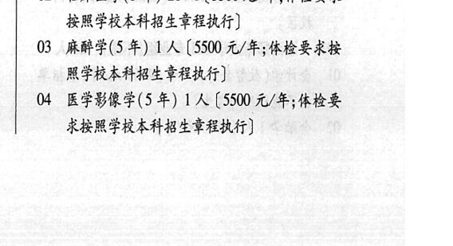
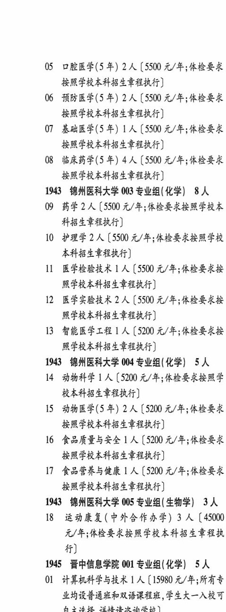

# 1943 锦州医科大学

- PDF页码：83, 84
- 书内页码：132, 133
- 专业组：5；专业条目：18

## 001专业组

- 选科要求：不限
- 招生计划：2 人
- 校验：ok

| 专业代码 | 专业名称 | 计划人数 | 学费（元/年） | 备注/完整OCR内容 |
|---|---|---:|---:|---|
| 01 | 健康服务与管理 | 2 |  | 【5200 A/F, ABER 按照学校本科招生章程执行] |

<details><summary>本专业组OCR原文</summary>

```text
1943 锦州医科大学 001 专业组(不限) 2人
01 健康服务与管理 2 人【5200 A/F, ABER
按照学校本科招生章程执行]
```
</details>

## 002专业组

- 选科要求：化学
- 招生计划：31 人
- 校验：review

| 专业代码 | 专业名称 | 计划人数 | 学费（元/年） | 备注/完整OCR内容 |
|---|---|---:|---:|---|
| 02 | 临床医学(5年) | 20 | 5500 | [5500 元/年;体检要求 按照学校本科招生章程执行] |
| 03 | 麻醉学(5 年) LA ( |  | 5500 | 5500 元/年;体检要求按 照学校本科招生章程执行] |
| 04 | 医学影像学(5 ) 1A ( |  | 5500 | 5500 元/年;体检要 求按照学校本科招生章程执行] |
| 05 | 口腔医学(5 年) 2A ( |  | 550 | 550 元/年;体检要求 按照学校本科招生章程执行] |
| 06 | 预防医学(5 年) | 2 | 5500 | [5500 元/年;体检要求 按照学校本科招生章程执行] |
| 07 | 基础医学(5 年) ! 人 |  | 5500 | 5500 元/年;体检要求 按照学校本科招生章程执行] |
| 08 | 临床药学(5 年) 4A ( |  | 5500 | 5500 元/年;体检要求 按照学校本科招生章程执行] |

<details><summary>本专业组OCR原文</summary>

```text
1943 锦州医科大学 002 专业组(化学) 31 人
02 临床医学(5年) 20 人[5500 元/年;体检要求
按照学校本科招生章程执行]
03 麻醉学(5 年) LA (5500 元/年;体检要求按
照学校本科招生章程执行]
04 医学影像学(5 ) 1A (5500 元/年;体检要
求按照学校本科招生章程执行]
05 口腔医学(5 年) 2A (550 元/年;体检要求
按照学校本科招生章程执行]
06 预防医学(5 年) 2 人[5500 元/年;体检要求
按照学校本科招生章程执行]
07 基础医学(5 年) ! 人【5500 元/年;体检要求
按照学校本科招生章程执行]
08 临床药学(5 年) 4A (5500 元/年;体检要求
按照学校本科招生章程执行]
```
</details>

## 003专业组

- 选科要求：化学
- 招生计划：8 人
- 校验：review

| 专业代码 | 专业名称 | 计划人数 | 学费（元/年） | 备注/完整OCR内容 |
|---|---|---:|---:|---|
| 09 | 药学 | 2 | 5500 | 【5500 元/年;体检要求按照学校本 科招生章程执行] |
| 10 | 护理学 | 2 | 5500 | 【5500 元/年;体检要求按照学校 本科招生章程执行] |
| 11 | 医学检验技术 ] 人 |  | 5500 | 5500 元/年;体检要求按 照学校本科招生章程执行] |
| 12 | 医学实验技术 | 2 | 5500 | 【5500 元/年;体检要求按 照学校本科招生章程执行] |
| 13 | 智能医学工程 ] 人 |  | 5200 | 5200 元/年;体检要求按 照学校本科招生章程执行] |

<details><summary>本专业组OCR原文</summary>

```text
1943 锦州医科大学 003 专业组(化学) 8 人
09 药学 2 人【5500 元/年;体检要求按照学校本
科招生章程执行]
10 护理学2 人【5500 元/年;体检要求按照学校
本科招生章程执行]
11 医学检验技术 ] 人【5500 元/年;体检要求按
照学校本科招生章程执行]
12 医学实验技术 2 人【5500 元/年;体检要求按
照学校本科招生章程执行]
13 智能医学工程 ] 人【5200 元/年;体检要求按
照学校本科招生章程执行]
```
</details>

## 004专业组

- 选科要求：化学
- 招生计划：OCR未稳定识别 人
- 校验：review

| 专业代码 | 专业名称 | 计划人数 | 学费（元/年） | 备注/完整OCR内容 |
|---|---|---:|---:|---|
| 14 | 动物科学 | 1 | 5200 | [5200 元/年;体检要求按照学 校本科招生章程执行] |
| 15 | 动物医学(5 年) 2A ( |  | 5200 | 5200 元/年;体检要求 按照学校本科招生章程执行] |
| 16 | 食品质量与安全 LA ( |  | 5200 | 5200 元/年;体检要求 按照学校本科招生章程执行] |
| 17 | 食品营养与健康 ] 人 |  | 5200 | 5200 元/年;体检要求 按照学校本科招生章程执行] |

<details><summary>本专业组OCR原文</summary>

```text
1943 锦州医科大学 004 专业组(化学) SA
14 动物科学 1 人[5200 元/年;体检要求按照学
校本科招生章程执行]
15 动物医学(5 年) 2A (5200 元/年;体检要求
按照学校本科招生章程执行]
16 食品质量与安全 LA (5200 元/年;体检要求
按照学校本科招生章程执行]
17 食品营养与健康 ] 人5200 元/年;体检要求
按照学校本科招生章程执行]
```
</details>

## 005专业组

- 选科要求：生物学
- 招生计划：3 人
- 校验：ok

| 专业代码 | 专业名称 | 计划人数 | 学费（元/年） | 备注/完整OCR内容 |
|---|---|---:|---:|---|
| 18 | 运动康复(中外合作办学) | 3 | 45000 | 【45000 元/年;体检要求按照学校本科招生章程执 行] |

<details><summary>本专业组OCR原文</summary>

```text
1943 锦州医科大学 005 专业组( 生物学) 3 人
18 运动康复(中外合作办学) 3 人【45000
元/年;体检要求按照学校本科招生章程执
行]
```
</details>

## 附：院校完整OCR原文

```text
--- PDF第83页（书内第132页），第3栏 ---
1943 锦州医科大学 001 专业组(不限) 2人
01 健康服务与管理 2 人【5200 A/F, ABER
按照学校本科招生章程执行]
1943 锦州医科大学 002 专业组(化学) 31 人
02 临床医学(5年) 20 人[5500 元/年;体检要求
按照学校本科招生章程执行]
03 麻醉学(5 年) LA (5500 元/年;体检要求按
照学校本科招生章程执行]
04 医学影像学(5 ) 1A (5500 元/年;体检要
求按照学校本科招生章程执行]

--- PDF第84页（书内第133页），第1栏 ---
05 口腔医学(5 年) 2A (550 元/年;体检要求
按照学校本科招生章程执行]
06 预防医学(5 年) 2 人[5500 元/年;体检要求
按照学校本科招生章程执行]
07 基础医学(5 年) ! 人【5500 元/年;体检要求
按照学校本科招生章程执行]
08 临床药学(5 年) 4A (5500 元/年;体检要求
按照学校本科招生章程执行]
1943 锦州医科大学 003 专业组(化学) 8 人
09 药学 2 人【5500 元/年;体检要求按照学校本
科招生章程执行]
10 护理学2 人【5500 元/年;体检要求按照学校
本科招生章程执行]
11 医学检验技术 ] 人【5500 元/年;体检要求按
照学校本科招生章程执行]
12 医学实验技术 2 人【5500 元/年;体检要求按
照学校本科招生章程执行]
13 智能医学工程 ] 人【5200 元/年;体检要求按
照学校本科招生章程执行]
1943 锦州医科大学 004 专业组(化学) SA
14 动物科学 1 人[5200 元/年;体检要求按照学
校本科招生章程执行]
15 动物医学(5 年) 2A (5200 元/年;体检要求
按照学校本科招生章程执行]
16 食品质量与安全 LA (5200 元/年;体检要求
按照学校本科招生章程执行]
17 食品营养与健康 ] 人5200 元/年;体检要求
按照学校本科招生章程执行]
1943 锦州医科大学 005 专业组( 生物学) 3 人
18 运动康复(中外合作办学) 3 人【45000
元/年;体检要求按照学校本科招生章程执
行]
```

## 源图


