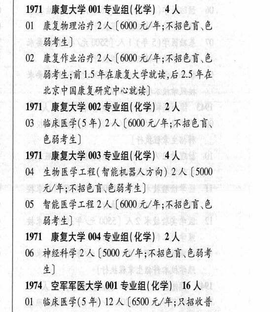

# 1971 康复大学

- PDF页码：85
- 书内页码：134
- 专业组：4；专业条目：8

## 001专业组

- 选科要求：化学
- 招生计划：4 人
- 校验：ok

| 专业代码 | 专业名称 | 计划人数 | 学费（元/年） | 备注/完整OCR内容 |
|---|---|---:|---:|---|
| 01 | 康复物理治疗 | 2 | 6000 | 【6000 元/年;不招色育、色 能考生] |
| 02 | 康复作业治疗 | 2 | 6000 | 【6000元/年;不招色育、色 BAL WIS 年在康复大学就读,后 2.5 年在 北京中国康复研究中心就读] |

<details><summary>本专业组OCR原文</summary>

```text
1971 康复大学 001 专业组(化学) 4人
Ol 康复物理治疗 2人【6000 元/年;不招色育、色
能考生]
02 康复作业治疗2人【6000元/年;不招色育、色
BAL WIS 年在康复大学就读,后 2.5 年在
北京中国康复研究中心就读]
```
</details>

## 002专业组

- 选科要求：化学
- 招生计划：2 人
- 校验：sum-corrected

| 专业代码 | 专业名称 | 计划人数 | 学费（元/年） | 备注/完整OCR内容 |
|---|---|---:|---:|---|
| 03 | 临床医学(5 年) | 2 | 6000 | 【6000元/年;不招色盲、 bHF4) |

<details><summary>本专业组OCR原文</summary>

```text
1971 康复大学 002 专业组(化学) 2A
03 临床医学(5 年) 2 人【6000元/年;不招色盲、
bHF4)
```
</details>

## 003专业组

- 选科要求：化学
- 招生计划：4 人
- 校验：ok

| 专业代码 | 专业名称 | 计划人数 | 学费（元/年） | 备注/完整OCR内容 |
|---|---|---:|---:|---|
| 04 | 生物医学工程(智能机器人方向) | 2 | 5000 | 【5000 元/年;不招色育\色弱考生] |
| 05 | 智能医学工程 | 2 | 6000 | [6000 元/年;不招色盲\色 能考生] |

<details><summary>本专业组OCR原文</summary>

```text
1971 康复大学 003 专业组(化学) 4人
04 生物医学工程(智能机器人方向) 2 人【5000
元/年;不招色育\色弱考生]
05 智能医学工程2人[6000 元/年;不招色盲\色
能考生]
```
</details>

## 004专业组

- 选科要求：化学
- 招生计划：2 人
- 校验：review

| 专业代码 | 专业名称 | 计划人数 | 学费（元/年） | 备注/完整OCR内容 |
|---|---|---:|---:|---|
| 06 | 神经科学 | 2 | 5000 | 【5000 元/年;不招色盲\色弱考 生] 19%74 空军军医大学 001 专业组( 化学) 16 人 |
| 01 | 临床医学(5 年) | 12 | 6500 | 【6500 元/年;只招收普 通高中应局毕业生,政治面狐须为共青团员或 PRER CR CHARTER) |
| 02 | 口腔医学(5 年) 4A (6500 4/4; RBKE 通高中应局毕业生,政治面貌须为共青团员或 中共党员;色盲、色弱者不予录取 |  |  | 02 口腔医学(5 年) 4A (6500 4/4; RBKE 通高中应局毕业生,政治面貌须为共青团员或 中共党员;色盲、色弱者不予录取] |

<details><summary>本专业组OCR原文</summary>

```text
1971 康复大学 004 专业组(化学) 2 人
06 神经科学2 人【5000 元/年;不招色盲\色弱考
生]
19%74 空军军医大学 001 专业组( 化学) 16 人
Ol 临床医学(5 年) 12 人【6500 元/年;只招收普
通高中应局毕业生,政治面狐须为共青团员或
PRER CR CHARTER)
02 口腔医学(5 年) 4A (6500 4/4; RBKE
通高中应局毕业生,政治面貌须为共青团员或
中共党员;色盲、色弱者不予录取]
```
</details>

## 附：院校完整OCR原文

```text
--- PDF第85页（书内第134页），第3栏 ---
1971 康复大学 001 专业组(化学) 4人
Ol 康复物理治疗 2人【6000 元/年;不招色育、色
能考生]
02 康复作业治疗2人【6000元/年;不招色育、色
BAL WIS 年在康复大学就读,后 2.5 年在
北京中国康复研究中心就读]
1971 康复大学 002 专业组(化学) 2A
03 临床医学(5 年) 2 人【6000元/年;不招色盲、
bHF4)
1971 康复大学 003 专业组(化学) 4人
04 生物医学工程(智能机器人方向) 2 人【5000
元/年;不招色育\色弱考生]
05 智能医学工程2人[6000 元/年;不招色盲\色
能考生]
1971 康复大学 004 专业组(化学) 2 人
06 神经科学2 人【5000 元/年;不招色盲\色弱考
生]
19%74 空军军医大学 001 专业组( 化学) 16 人
Ol 临床医学(5 年) 12 人【6500 元/年;只招收普
通高中应局毕业生,政治面狐须为共青团员或
PRER CR CHARTER)
02 口腔医学(5 年) 4A (6500 4/4; RBKE
通高中应局毕业生,政治面貌须为共青团员或
中共党员;色盲、色弱者不予录取]
```

## 源图

