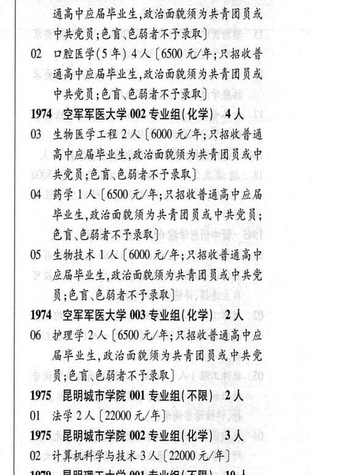

# 1974 空军军医大学

- PDF页码：85
- 书内页码：134
- 专业组：3；专业条目：6

## 001专业组

- 选科要求：化学
- 招生计划：16 人
- 校验：review

| 专业代码 | 专业名称 | 计划人数 | 学费（元/年） | 备注/完整OCR内容 |
|---|---|---:|---:|---|
| 01 | 临床医学(5 年) | 12 | 6500 | 【6500 元/年;只招收普 通高中应局毕业生,政治面狐须为共青团员或 PRER CR CHARTER) |
| 02 | 口腔医学(5 年) 4A (6500 4/4; RBKE 通高中应局毕业生,政治面貌须为共青团员或 中共党员;色盲、色弱者不予录取 |  |  | 02 口腔医学(5 年) 4A (6500 4/4; RBKE 通高中应局毕业生,政治面貌须为共青团员或 中共党员;色盲、色弱者不予录取] |

<details><summary>本专业组OCR原文</summary>

```text
19%74 空军军医大学 001 专业组( 化学) 16 人
Ol 临床医学(5 年) 12 人【6500 元/年;只招收普
通高中应局毕业生,政治面狐须为共青团员或
PRER CR CHARTER)
02 口腔医学(5 年) 4A (6500 4/4; RBKE
通高中应局毕业生,政治面貌须为共青团员或
中共党员;色盲、色弱者不予录取]
```
</details>

## 002专业组

- 选科要求：化学
- 招生计划：4 人
- 校验：review

| 专业代码 | 专业名称 | 计划人数 | 学费（元/年） | 备注/完整OCR内容 |
|---|---|---:|---:|---|
| 03 | 生物医学工程 | 2 | 6000 | 【6000 元/年;只招收普通 高中应局毕业生,政治面貌须为共青团员或中 共党员;色育、色弱者不子录取] |
| 04 | BELA ( |  | 650 | 650 元/年;只招收善通高中应局 毕业生,政治面狐须为共青团员或中共党员; 色育\色弱者不子录取] |
| 05 | 生物技术 工人 |  | 6000 | 6000 元/年;只招收普通高中 BHELE KEGRAAR ARR PRE 员;色讶色弱者不予录取] |

<details><summary>本专业组OCR原文</summary>

```text
1974 空军军医大学 002 专业组(化学) 4人
03 生物医学工程 2 人【6000 元/年;只招收普通
高中应局毕业生,政治面貌须为共青团员或中
共党员;色育、色弱者不子录取]
04 BELA (650 元/年;只招收善通高中应局
毕业生,政治面狐须为共青团员或中共党员;
色育\色弱者不子录取]
05 生物技术 工人【6000 元/年;只招收普通高中
BHELE KEGRAAR ARR PRE
员;色讶色弱者不予录取]
```
</details>

## 003专业组

- 选科要求：化学
- 招生计划：2 人
- 校验：ok

| 专业代码 | 专业名称 | 计划人数 | 学费（元/年） | 备注/完整OCR内容 |
|---|---|---:|---:|---|
| 06 | 护理学 | 2 | 6500 | 【6500 元/年;只招收普通高中应 局毕业生,政治面狐须为共青团员或中共党 RCRD CHARTER) |

<details><summary>本专业组OCR原文</summary>

```text
194 空军军医大学 003 专业组(化学) 2人
06 护理学 2人【6500 元/年;只招收普通高中应
局毕业生,政治面狐须为共青团员或中共党
RCRD CHARTER)
```
</details>

## 附：院校完整OCR原文

```text
--- PDF第85页（书内第134页），第3栏 ---
19%74 空军军医大学 001 专业组( 化学) 16 人
Ol 临床医学(5 年) 12 人【6500 元/年;只招收普
通高中应局毕业生,政治面狐须为共青团员或
PRER CR CHARTER)
02 口腔医学(5 年) 4A (6500 4/4; RBKE
通高中应局毕业生,政治面貌须为共青团员或
中共党员;色盲、色弱者不予录取]
1974 空军军医大学 002 专业组(化学) 4人
03 生物医学工程 2 人【6000 元/年;只招收普通
高中应局毕业生,政治面貌须为共青团员或中
共党员;色育、色弱者不子录取]
04 BELA (650 元/年;只招收善通高中应局
毕业生,政治面狐须为共青团员或中共党员;
色育\色弱者不子录取]
05 生物技术 工人【6000 元/年;只招收普通高中
BHELE KEGRAAR ARR PRE
员;色讶色弱者不予录取]
194 空军军医大学 003 专业组(化学) 2人
06 护理学 2人【6500 元/年;只招收普通高中应
局毕业生,政治面狐须为共青团员或中共党
RCRD CHARTER)
```

## 源图

