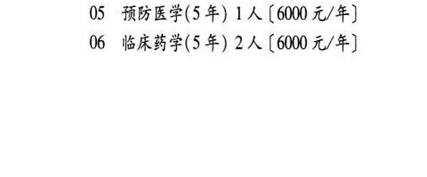
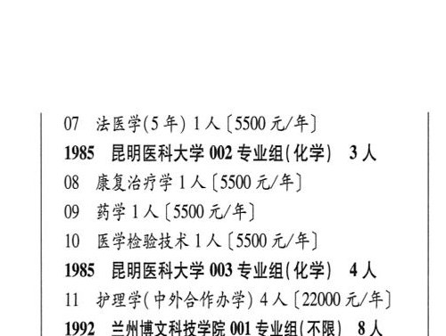

# 1985 昆明医科大学

- PDF页码：86
- 书内页码：135
- 专业组：3；专业条目：11

## 001专业组

- 选科要求：化学
- 招生计划：11 人
- 校验：review

| 专业代码 | 专业名称 | 计划人数 | 学费（元/年） | 备注/完整OCR内容 |
|---|---|---:|---:|---|
| 01 | 临床医学(5 年) 4A ( |  | 6000 | 6000 元/年] |
| 02 | 麻醉学(5年) 1A ( |  | 5500 | 5500 元/年] |
| 03 | ”医学影像学(5 年) | 1 | 5500 | 【5500 元/年] |
| 04 | 口腔医学(5年) 1A ( |  | 6000 | 6000 元/年] |
| 05 | 预防医学(5 年) | 1 | 6000 | 【6000 元/年] |
| 06 | 临床药学(5年) 2A (6000 4/4) |  |  | 06 临床药学(5年) 2A (6000 4/4) |
| 07 | 法医学(5 年) 1A ( |  | 5500 | 5500 元/年] |

<details><summary>本专业组OCR原文</summary>

```text
1985 昆明医科大学 001 专业组(化学) 11 人
Ol 临床医学(5 年) 4A (6000 元/年]
02 麻醉学(5年) 1A (5500 元/年]
03 ”医学影像学(5 年) 1 人【5500 元/年]
04 口腔医学(5年) 1A (6000 元/年]
05 预防医学(5 年) 1 人【6000 元/年]
06 临床药学(5年) 2A (6000 4/4)
07 法医学(5 年) 1A (5500 元/年]
```
</details>

## 002专业组

- 选科要求：化学
- 招生计划：3 人
- 校验：review

| 专业代码 | 专业名称 | 计划人数 | 学费（元/年） | 备注/完整OCR内容 |
|---|---|---:|---:|---|
| 08 | 康复治疗学 | 1 | 5500 | [5500 元/年] |
| 09 | BELA ( |  | 5500 | 5500 元/年] ( |
| 10 | 医学检验技术 1A (5500 4/4) |  |  | 10 医学检验技术 1A (5500 4/4) |

<details><summary>本专业组OCR原文</summary>

```text
1985 昆明医科大学 002 专业组(化学) 3 人    (
08 康复治疗学 1 人[5500 元/年]
09 BELA (5500 元/年]           (
10 医学检验技术 1A (5500 4/4)
```
</details>

## 003专业组

- 选科要求：化学
- 招生计划：4 人
- 校验：ok

| 专业代码 | 专业名称 | 计划人数 | 学费（元/年） | 备注/完整OCR内容 |
|---|---|---:|---:|---|
| 11 | 护理学( 中外合作办学) | 4 | 22000 | 【22000 元/年] |

<details><summary>本专业组OCR原文</summary>

```text
1985 昆明医科大学 003 专业组( 化学) 4人
11 护理学( 中外合作办学) 4 人【22000 元/年]
```
</details>

## 附：院校完整OCR原文

```text
--- PDF第86页（书内第135页），第1栏 ---
1985 昆明医科大学 001 专业组(化学) 11 人
Ol 临床医学(5 年) 4A (6000 元/年]
02 麻醉学(5年) 1A (5500 元/年]
03 ”医学影像学(5 年) 1 人【5500 元/年]
04 口腔医学(5年) 1A (6000 元/年]
05 预防医学(5 年) 1 人【6000 元/年]
06 临床药学(5年) 2A (6000 4/4)

--- PDF第86页（书内第135页），第2栏 ---
07 法医学(5 年) 1A (5500 元/年]
1985 昆明医科大学 002 专业组(化学) 3 人    (
08 康复治疗学 1 人[5500 元/年]
09 BELA (5500 元/年]           (
10 医学检验技术 1A (5500 4/4)
1985 昆明医科大学 003 专业组( 化学) 4人
11 护理学( 中外合作办学) 4 人【22000 元/年]
```

## 源图


