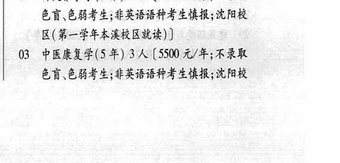
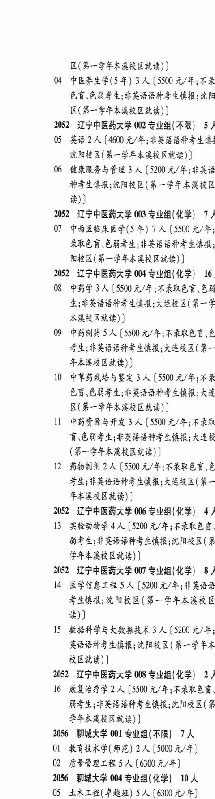

# 2052 辽宁中医药大学

- PDF页码：91, 92
- 书内页码：140, 141
- 专业组：7；专业条目：16

## 001专业组

- 选科要求：不限
- 招生计划：17 人
- 校验：review

| 专业代码 | 专业名称 | 计划人数 | 学费（元/年） | 备注/完整OCR内容 |
|---|---|---:|---:|---|
| 01 | 中医学(5年) | 7 | 5500 | [5500 元/年;不录取色盲、 色弱考生;非英语语种考生慎报;沈阳校区(第 一学年本省校区就读)] |
| 02 | 针灸推拿学(5年) 4 大 |  | 5500 | 5500 元/年;不录取 色盲色弱考生;非英语语种考生愤报;沈阳校 区(第一学年本演校区就读) |
| 03 | 中医康复学(5 年) 3A ( |  | 5500 | 5500 元/年;不录取 色盲色弱考生;非英语语种考生愤报;沈阳校 区(第一学年本溪校区就读) ] |
| 04 | 中医养生学(5年) | 3 | 5500 | 【5500 元/年;不录 色盲、色弱考生;非英语语种考生慎报;沈阳 区(第一学年本省校区就读) ] |

<details><summary>本专业组OCR原文</summary>

```text
2052 辽宁中医药大学 001 专业组(不限) 17 人
01 中医学(5年) 7 人[5500 元/年;不录取色盲、
色弱考生;非英语语种考生慎报;沈阳校区(第
一学年本省校区就读)]
02 针灸推拿学(5年) 4 大【5500 元/年;不录取
色盲色弱考生;非英语语种考生愤报;沈阳校
区(第一学年本演校区就读)
03 中医康复学(5 年) 3A (5500 元/年;不录取
色盲色弱考生;非英语语种考生愤报;沈阳校
区(第一学年本溪校区就读) ]
04 中医养生学(5年) 3 人【5500 元/年;不录
色盲、色弱考生;非英语语种考生慎报;沈阳
区(第一学年本省校区就读) ]
```
</details>

## 002专业组

- 选科要求：不限
- 招生计划：5 人
- 校验：sum-corrected

| 专业代码 | 专业名称 | 计划人数 | 学费（元/年） | 备注/完整OCR内容 |
|---|---|---:|---:|---|
| 05 | 英语 | 2 | 4600 | 【4600 元/年;非英语语种考生避 沈阳校区(第一学年本溪校区就读) ] |
| 06 | 健康服务与管理 | 3 | 5200 | 【5200 元/年;非英语 种考生愤报;沈阳校区(第一学年本溪校区 #)) |

<details><summary>本专业组OCR原文</summary>

```text
2052 辽宁中医药大学 002 专业组(不限) 5 /
05 英语2人【4600 元/年;非英语语种考生避
沈阳校区(第一学年本溪校区就读) ]
06 健康服务与管理 3 人【5200 元/年;非英语
种考生愤报;沈阳校区(第一学年本溪校区
#))
```
</details>

## 003专业组

- 选科要求：化学
- 招生计划：7 人
- 校验：sum-corrected

| 专业代码 | 专业名称 | 计划人数 | 学费（元/年） | 备注/完整OCR内容 |
|---|---|---:|---:|---|
| 07 | 中西医临床医学(5 年) | 7 | 5500 | 【5500 元/年; 录取色盲、色弱考生;非英语语种考生慎报; 阳校区(第一学年本溪校区就读) ] |

<details><summary>本专业组OCR原文</summary>

```text
2052 辽宁中医药大学 003 专业组(化学) 7)
07 中西医临床医学(5 年) 7 人【5500 元/年;
录取色盲、色弱考生;非英语语种考生慎报;
阳校区(第一学年本溪校区就读) ]
```
</details>

## 004专业组

- 选科要求：化学
- 招生计划：16 人
- 校验：sum-corrected

| 专业代码 | 专业名称 | 计划人数 | 学费（元/年） | 备注/完整OCR内容 |
|---|---|---:|---:|---|
| 08 | 中药学 | 3 | 5500 | 【5500 元/年;不录取色盲、色如 生;非英语语种考生慎报;大连校区(第一学 ABRERE)) |
| 09 | 中药制药 | 5 | 5500 | 【5500 元/年;不录取色盲色 考生;非英语语种考生导报;大连校区( 第一 年本溪校区就读) ] |
| 10 | 中草药栽培与鉴定 | 3 | 5500 | 【5500 元/年;不录 色盲色弱考生;非英语语种考生导报;大连 区(第一学年本溃校区就读) ] |
| 11 | 中药资源与开发 | 3 | 5500 | 【5500 元/年;不录取 讶色弱考生;非英语语种考生慎报;大连术 (第一学年本溪校区就读) ] |
| 12 | 药物制剂 | 2 | 5500 | 【5500 元/年;不录取色育、色 考生;非英语语种考生愤报;大连校区(第一 年本溪校区就读) ] |

<details><summary>本专业组OCR原文</summary>

```text
2052 辽宁中医药大学 004 专业组(化学) 16
08 中药学 3 人【5500 元/年;不录取色盲、色如
生;非英语语种考生慎报;大连校区(第一学
ABRERE))
09 中药制药 5 人【5500 元/年;不录取色盲色
考生;非英语语种考生导报;大连校区( 第一
年本溪校区就读) ]
10 中草药栽培与鉴定 3 人【5500 元/年;不录
色盲色弱考生;非英语语种考生导报;大连
区(第一学年本溃校区就读) ]
11 中药资源与开发 3 人【5500 元/年;不录取
讶色弱考生;非英语语种考生慎报;大连术
(第一学年本溪校区就读) ]
12 药物制剂 2 人【5500 元/年;不录取色育、色
考生;非英语语种考生愤报;大连校区(第一
年本溪校区就读) ]
```
</details>

## 006专业组

- 选科要求：化学
- 招生计划：OCR未稳定识别 人
- 校验：review

| 专业代码 | 专业名称 | 计划人数 | 学费（元/年） | 备注/完整OCR内容 |
|---|---|---:|---:|---|
| 13 | 实验动物学4 A ( |  | 5200 | 5200 元/年;不录取色言、 绚考生;非英语语种考生导报;沈阳校区(第 学年本溪校区就读) ] |

<details><summary>本专业组OCR原文</summary>

```text
2052 辽宁中医药大学 006 专业组(化学) 4)
13 实验动物学4 A (5200 元/年;不录取色言、
绚考生;非英语语种考生导报;沈阳校区(第
学年本溪校区就读) ]
```
</details>

## 007专业组

- 选科要求：化学
- 招生计划：8 人
- 校验：sum-corrected

| 专业代码 | 专业名称 | 计划人数 | 学费（元/年） | 备注/完整OCR内容 |
|---|---|---:|---:|---|
| 14 | 医学信息工程 | 5 | 5200 | [5200 元/年;非英语语 考生导报;沈阳校区(第一学年本溪校区 读)] |
| 15 | 数据科学与大数据技术 | 3 | 5200 | (5200 元/年; 英语语种考生慎报;沈阳校区(第一学年本 校区就读) ] |

<details><summary>本专业组OCR原文</summary>

```text
2052 辽宁中医药大学 007 专业组(化学) 8 /
14 医学信息工程 5 人[5200 元/年;非英语语
考生导报;沈阳校区(第一学年本溪校区
读)]
15 数据科学与大数据技术 3 人 (5200 元/年;
英语语种考生慎报;沈阳校区(第一学年本
校区就读) ]
```
</details>

## 008专业组

- 选科要求：化学
- 招生计划：2 人
- 校验：sum-corrected

| 专业代码 | 专业名称 | 计划人数 | 学费（元/年） | 备注/完整OCR内容 |
|---|---|---:|---:|---|
| 16 | 康复治疗学 | 2 | 5500 | [5500 元/年;不录取色言 绚考生;非英语语种考生导报;沈阳校区(第 学年本溪校区就读) ] |

<details><summary>本专业组OCR原文</summary>

```text
2052 辽宁中医药大学 008 专业组(化学) 2)
16 康复治疗学 2 人[5500 元/年;不录取色言
绚考生;非英语语种考生导报;沈阳校区(第
学年本溪校区就读) ]
```
</details>

## 附：院校完整OCR原文

```text
--- PDF第91页（书内第140页），第3栏 ---
2052 辽宁中医药大学 001 专业组(不限) 17 人
01 中医学(5年) 7 人[5500 元/年;不录取色盲、
色弱考生;非英语语种考生慎报;沈阳校区(第
一学年本省校区就读)]
02 针灸推拿学(5年) 4 大【5500 元/年;不录取
色盲色弱考生;非英语语种考生愤报;沈阳校
区(第一学年本演校区就读)
03 中医康复学(5 年) 3A (5500 元/年;不录取
色盲色弱考生;非英语语种考生愤报;沈阳校

--- PDF第92页（书内第141页），第1栏 ---
区(第一学年本溪校区就读) ]
04 中医养生学(5年) 3 人【5500 元/年;不录
色盲、色弱考生;非英语语种考生慎报;沈阳
区(第一学年本省校区就读) ]
2052 辽宁中医药大学 002 专业组(不限) 5 /
05 英语2人【4600 元/年;非英语语种考生避
沈阳校区(第一学年本溪校区就读) ]
06 健康服务与管理 3 人【5200 元/年;非英语
种考生愤报;沈阳校区(第一学年本溪校区
#))
2052 辽宁中医药大学 003 专业组(化学) 7)
07 中西医临床医学(5 年) 7 人【5500 元/年;
录取色盲、色弱考生;非英语语种考生慎报;
阳校区(第一学年本溪校区就读) ]
2052 辽宁中医药大学 004 专业组(化学) 16
08 中药学 3 人【5500 元/年;不录取色盲、色如
生;非英语语种考生慎报;大连校区(第一学
ABRERE))
09 中药制药 5 人【5500 元/年;不录取色盲色
考生;非英语语种考生导报;大连校区( 第一
年本溪校区就读) ]
10 中草药栽培与鉴定 3 人【5500 元/年;不录
色盲色弱考生;非英语语种考生导报;大连
区(第一学年本溃校区就读) ]
11 中药资源与开发 3 人【5500 元/年;不录取
讶色弱考生;非英语语种考生慎报;大连术
(第一学年本溪校区就读) ]
12 药物制剂 2 人【5500 元/年;不录取色育、色
考生;非英语语种考生愤报;大连校区(第一
年本溪校区就读) ]
2052 辽宁中医药大学 006 专业组(化学) 4)
13 实验动物学4 A (5200 元/年;不录取色言、
绚考生;非英语语种考生导报;沈阳校区(第
学年本溪校区就读) ]
2052 辽宁中医药大学 007 专业组(化学) 8 /
14 医学信息工程 5 人[5200 元/年;非英语语
考生导报;沈阳校区(第一学年本溪校区
读)]
15 数据科学与大数据技术 3 人 (5200 元/年;
英语语种考生慎报;沈阳校区(第一学年本
校区就读) ]
2052 辽宁中医药大学 008 专业组(化学) 2)
16 康复治疗学 2 人[5500 元/年;不录取色言
绚考生;非英语语种考生导报;沈阳校区(第
学年本溪校区就读) ]
```

## 源图


