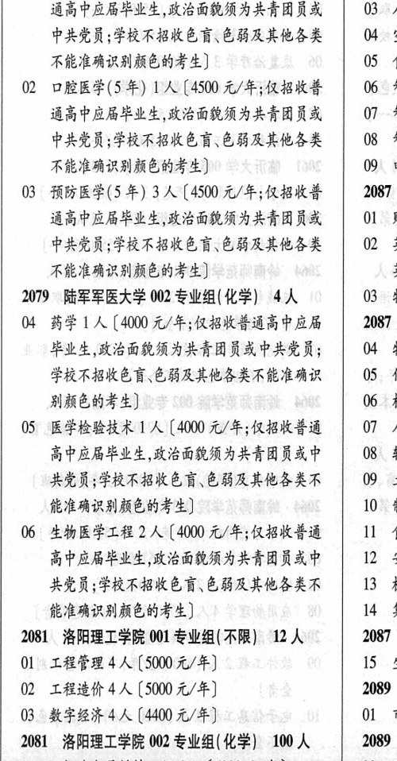

# 2079 陆军军医大学

- PDF页码：93
- 书内页码：142
- 专业组：2；专业条目：6

## 001专业组

- 选科要求：化学
- 招生计划：17 人
- 校验：review

| 专业代码 | 专业名称 | 计划人数 | 学费（元/年） | 备注/完整OCR内容 |
|---|---|---:|---:|---|
| 01 | 临床医学(5 年) | 13 | 4500 | 【4500 元/年;仅招收善 \| 02 化 通高中应局毕业生,政治面貌须为共青团员或 03 人 中共党员;学校不招收色育\色台及其他各类 4 空 不能准确识别颜色的考生] 05 食 |
| 02 | 口腔医学(5年) 1A |  | 4500 | 4500 元/年;仅招收普 06 # 通高中应局毕业生,政治面貌须为共青团员或 07 # 中共党员;学校不招收色育\色能及其他各类 08 ¥ 不能准确识别颜色的考生] 0 电 |
| 03 | 预防医学(5年) | 3 | 4500 | 【4500 元/年;仅招收善 \| 2087 通高中应局毕业生,政治面犁须为共青团员或 ol 对 中共党员;学校不招收色盲\色弱及其他各类 02 # 不能准确识别颜色的考生] 次 |

<details><summary>本专业组OCR原文</summary>

```text
2079 陆军军医大学 001 专业组(化学) 17 人   01 i
Ol 临床医学(5 年) 13 人【4500 元/年;仅招收善 | 02 化
通高中应局毕业生,政治面貌须为共青团员或   03 人
中共党员;学校不招收色育\色台及其他各类   4 空
不能准确识别颜色的考生]          05 食
02 口腔医学(5年) 1A [4500 元/年;仅招收普   06 #
通高中应局毕业生,政治面貌须为共青团员或   07 #
中共党员;学校不招收色育\色能及其他各类   08 ¥
不能准确识别颜色的考生]         0 电
03 预防医学(5年) 3 人【4500 元/年;仅招收善 | 2087
通高中应局毕业生,政治面犁须为共青团员或  ol 对
中共党员;学校不招收色盲\色弱及其他各类   02 #
不能准确识别颜色的考生]            次
```
</details>

## 002专业组

- 选科要求：化学
- 招生计划：4 人
- 校验：ok

| 专业代码 | 专业名称 | 计划人数 | 学费（元/年） | 备注/完整OCR内容 |
|---|---|---:|---:|---|
| 04 | 药学 | 1 | 4000 | [4000 元/年;仅招收善通高中应届 2087 毕业生,政治面狐须为共青团员或中共党员; 04 4 学校不招收色育\色弱及其他各类不能准确识 05 化 别颜色的考生] 06 机 |
| 05 | 医学检验技术 | 1 | 4000 | 【4000 元/年;仅招收普通 07 人 高中应届毕业生,政治面貌须为共青团员或中 08 # 共党员;学校不招收色盲、色弱及其他各类不 09 + 能准确识别颜色的考生] 10 4 |
| 06 | 生物医学工程 | 2 | 4000 | 【4000 元/年;仅招收普通 11 食 高中应局毕业生,政治面貌须为共青团员或中 12 & 共党员;学校不招收色盲、色弱及其他各类不 13 机 能准确识别颜色的考生] 14 集 |

<details><summary>本专业组OCR原文</summary>

```text
2079 陆军军医大学 002 专业组(化学) 4人    03 4
04 药学 1 人[4000 元/年;仅招收善通高中应届   2087
毕业生,政治面狐须为共青团员或中共党员;   04 4
学校不招收色育\色弱及其他各类不能准确识   05 化
别颜色的考生]               06 机
05 医学检验技术 1 人【4000 元/年;仅招收普通   07 人
高中应届毕业生,政治面貌须为共青团员或中   08 #
共党员;学校不招收色盲、色弱及其他各类不   09 +
能准确识别颜色的考生]           10 4
06 生物医学工程 2 人【4000 元/年;仅招收普通   11 食
高中应局毕业生,政治面貌须为共青团员或中   12 &
共党员;学校不招收色盲、色弱及其他各类不   13 机
能准确识别颜色的考生]          14 集
```
</details>

## 附：院校完整OCR原文

```text
--- PDF第93页（书内第142页），第2栏 ---
2079 陆军军医大学 001 专业组(化学) 17 人   01 i
Ol 临床医学(5 年) 13 人【4500 元/年;仅招收善 | 02 化
通高中应局毕业生,政治面貌须为共青团员或   03 人
中共党员;学校不招收色育\色台及其他各类   4 空
不能准确识别颜色的考生]          05 食
02 口腔医学(5年) 1A [4500 元/年;仅招收普   06 #
通高中应局毕业生,政治面貌须为共青团员或   07 #
中共党员;学校不招收色育\色能及其他各类   08 ¥
不能准确识别颜色的考生]         0 电
03 预防医学(5年) 3 人【4500 元/年;仅招收善 | 2087
通高中应局毕业生,政治面犁须为共青团员或  ol 对
中共党员;学校不招收色盲\色弱及其他各类   02 #
不能准确识别颜色的考生]            次
2079 陆军军医大学 002 专业组(化学) 4人    03 4
04 药学 1 人[4000 元/年;仅招收善通高中应届   2087
毕业生,政治面狐须为共青团员或中共党员;   04 4
学校不招收色育\色弱及其他各类不能准确识   05 化
别颜色的考生]               06 机
05 医学检验技术 1 人【4000 元/年;仅招收普通   07 人
高中应届毕业生,政治面貌须为共青团员或中   08 #
共党员;学校不招收色盲、色弱及其他各类不   09 +
能准确识别颜色的考生]           10 4
06 生物医学工程 2 人【4000 元/年;仅招收普通   11 食
高中应局毕业生,政治面貌须为共青团员或中   12 &
共党员;学校不招收色盲、色弱及其他各类不   13 机
能准确识别颜色的考生]          14 集
```

## 源图

