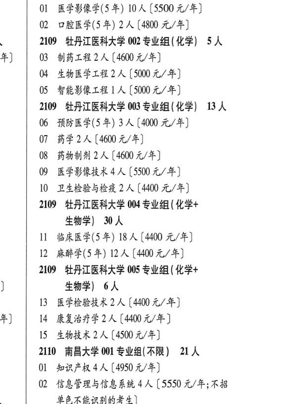

# 2109 牡丹江医科大学

- PDF页码：94
- 书内页码：143
- 专业组：5；专业条目：15

## 001专业组

- 选科要求：化学
- 招生计划：12 人
- 校验：review

| 专业代码 | 专业名称 | 计划人数 | 学费（元/年） | 备注/完整OCR内容 |
|---|---|---:|---:|---|
| 01 | 医学影像学(5 年) 10 ( |  | 5500 | 5500 元/年] |
| 02 | 口腔医学(5年) | 2 | 4800 | 【4800 元/年] |

<details><summary>本专业组OCR原文</summary>

```text
2109 牡丹江医科大学 001 专业组(化学) 12 人
Ol 医学影像学(5 年) 10 (5500 元/年]
02 口腔医学(5年) 2 人【4800 元/年]
```
</details>

## 002专业组

- 选科要求：化学
- 招生计划：OCR未稳定识别 人
- 校验：review

| 专业代码 | 专业名称 | 计划人数 | 学费（元/年） | 备注/完整OCR内容 |
|---|---|---:|---:|---|
| 03 | 制药工程 | 2 | 4600 | 【4600 元/年] |
| 04 | 生物医学工程 | 2 | 5000 | 【5000元/年] |
| 05 | 智能影像工程 ] 人 |  | 5000 | 5000元/年] |

<details><summary>本专业组OCR原文</summary>

```text
2109 牡丹江医科大学 002 专业组(化学) SA
03 制药工程2 人【4600 元/年]
04 生物医学工程2人【5000元/年]
05 智能影像工程 ] 人【5000元/年]
```
</details>

## 003专业组

- 选科要求：化学
- 招生计划：13 人
- 校验：ok

| 专业代码 | 专业名称 | 计划人数 | 学费（元/年） | 备注/完整OCR内容 |
|---|---|---:|---:|---|
| 06 | 预防医学(5年) | 3 | 4000 | [4000 元/年] |
| 07 | 药学 | 2 | 4600 | [4600 元/年] |
| 08 | 药物制剂 | 2 | 4600 | 【4600 元/年] |
| 09 | 医学影像技术 | 4 | 5500 | 【5500 元/年] |
| 10 | ”卫生检验与检疫 | 2 | 4400 | 【4400 元/年] |

<details><summary>本专业组OCR原文</summary>

```text
2109 牡丹江医科大学 003 专业组 (化学) 13 人
06 预防医学(5年) 3 人[4000 元/年]
07 药学2人[4600 元/年]
08 药物制剂2 人【4600 元/年]
09 医学影像技术4 人【5500 元/年]
10 ”卫生检验与检疫 2 人【4400 元/年]
```
</details>

## 004专业组

- 选科要求：OCR未稳定识别
- 招生计划：30 人
- 校验：ok

| 专业代码 | 专业名称 | 计划人数 | 学费（元/年） | 备注/完整OCR内容 |
|---|---|---:|---:|---|
| 11 | 临床医学(5年) | 18 | 4400 | 【4400 元/年] |
| 12 | 麻醉学(5年) | 12 | 4400 | 【4400 元/年] |

<details><summary>本专业组OCR原文</summary>

```text
2109 牡丹江医科大学 004 专业组 ( 化学+ 生物学| 30人
ll 临床医学(5年) 18 人【4400 元/年]
12 麻醉学(5年) 12 人【4400 元/年]
```
</details>

## 005专业组

- 选科要求：化学+生物学
- 招生计划：6 人
- 校验：ok

| 专业代码 | 专业名称 | 计划人数 | 学费（元/年） | 备注/完整OCR内容 |
|---|---|---:|---:|---|
| 13 | 医学检验技术 | 2 | 4400 | 【4400 元/年] |
| 14 | 康复治疗学 | 2 | 4400 | 【4400元/年] |
| 15 | 生物技术 | 2 | 4500 | 【4500 元/年] |

<details><summary>本专业组OCR原文</summary>

```text
2109 牡丹江医科大学 005 专业组 ( 化学+ 生物学) 6人
13 医学检验技术2 人【4400 元/年]
14 康复治疗学2人【4400元/年]
15 生物技术2 人【4500 元/年]
```
</details>

## 附：院校完整OCR原文

```text
--- PDF第94页（书内第143页），第3栏 ---
2109 牡丹江医科大学 001 专业组(化学) 12 人
Ol 医学影像学(5 年) 10 (5500 元/年]
02 口腔医学(5年) 2 人【4800 元/年]
2109 牡丹江医科大学 002 专业组(化学) SA
03 制药工程2 人【4600 元/年]
04 生物医学工程2人【5000元/年]
05 智能影像工程 ] 人【5000元/年]
2109 牡丹江医科大学 003 专业组 (化学) 13 人
06 预防医学(5年) 3 人[4000 元/年]
07 药学2人[4600 元/年]
08 药物制剂2 人【4600 元/年]
09 医学影像技术4 人【5500 元/年]
10 ”卫生检验与检疫 2 人【4400 元/年]
2109 牡丹江医科大学 004 专业组 ( 化学+
生物学| 30人
ll 临床医学(5年) 18 人【4400 元/年]
12 麻醉学(5年) 12 人【4400 元/年]
2109 牡丹江医科大学 005 专业组 ( 化学+
生物学) 6人
13 医学检验技术2 人【4400 元/年]
14 康复治疗学2人【4400元/年]
15 生物技术2 人【4500 元/年]
```

## 源图

