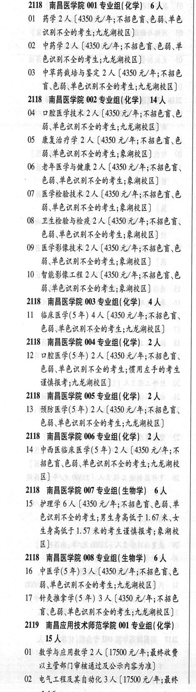

# 2118 南昌医学院

- PDF页码：97
- 书内页码：146
- 专业组：8；专业条目：17

## 001专业组

- 选科要求：化学
- 招生计划：6 人
- 校验：ok

| 专业代码 | 专业名称 | 计划人数 | 学费（元/年） | 备注/完整OCR内容 |
|---|---|---:|---:|---|
| 01 | 药学 | 2 | 4350 | [4350 元/年;不招色盲、色能、单色 识别不全的考生;九龙湖校区] |
| 02 | 中药学 | 2 | 4350 | 【4350 元/年;不招色盲.色弱、单 色识别不全的考生;九龙湖校区] |
| 03 | 中草药栽培与鉴定 | 2 | 4350 | 【4350 元/年;不招色 盲\色弱\单色识别不全的考生;九龙湖校区] |

<details><summary>本专业组OCR原文</summary>

```text
2118 南昌医学院 001 专业组(化学) 6人
01 药学2 人[4350 元/年;不招色盲、色能、单色
识别不全的考生;九龙湖校区]
02 中药学2人【4350 元/年;不招色盲.色弱、单
色识别不全的考生;九龙湖校区]
03 中草药栽培与鉴定 2 人【4350 元/年;不招色
盲\色弱\单色识别不全的考生;九龙湖校区]
```
</details>

## 002专业组

- 选科要求：化学
- 招生计划：14 人
- 校验：ok

| 专业代码 | 专业名称 | 计划人数 | 学费（元/年） | 备注/完整OCR内容 |
|---|---|---:|---:|---|
| 04 | 口腔医学技术 | 2 | 4350 | 【4350元/年;不招色言、色 能、单色识别不全的考生;九龙湖校区] |
| 05 | 康复治疗学 | 2 | 4350 | 【4350 元/年;不招色盲、色 能\单色识别不全的考生;象湖校区] |
| 06 | 老年医学与健康 | 2 | 4350 | 【4350元/年;不招色盲、 色弱、单色识别不全的考生;象湖校区] |
| 07 | “医学检验技术 | 2 | 4350 | 【4350 元/年;不招色育、色 弱单色识别不全的考生;象湖校区] |
| 08 | 卫生检验与检疫 | 2 | 4350 | 【4350 元/年;不招色言、 色能\单色识别不全的考生;象湖校区] |
| 09 | 医学影像技术 | 2 | 4350 | 【4350 元/年;不招色盲\色 能、单色识别不全的考生;象湖校区] |
| 10 | 智能影像工程 | 2 | 4350 | [4350元/年;不招色育、色 能、单色识别不全的考生;象湖校区] |

<details><summary>本专业组OCR原文</summary>

```text
2118 南昌医学院 002 专业组(化学) 14人
04 口腔医学技术2 人【4350元/年;不招色言、色
能、单色识别不全的考生;九龙湖校区]
05 康复治疗学 2 人【4350 元/年;不招色盲、色
能\单色识别不全的考生;象湖校区]
06 老年医学与健康 2 人【4350元/年;不招色盲、
色弱、单色识别不全的考生;象湖校区]
07 “医学检验技术 2 人【4350 元/年;不招色育、色
弱单色识别不全的考生;象湖校区]
08，卫生检验与检疫 2 人【4350 元/年;不招色言、
色能\单色识别不全的考生;象湖校区]
09 医学影像技术 2 人【4350 元/年;不招色盲\色
能、单色识别不全的考生;象湖校区]
10 智能影像工程 2 人[4350元/年;不招色育、色
能、单色识别不全的考生;象湖校区]
```
</details>

## 003专业组

- 选科要求：化学
- 招生计划：4 人
- 校验：ok

| 专业代码 | 专业名称 | 计划人数 | 学费（元/年） | 备注/完整OCR内容 |
|---|---|---:|---:|---|
| 11 | 临床医学(5 年) | 4 | 4350 | 【4350 元/年;不招色言、 色弱、单色识别不全的考生;九龙湖校区] |

<details><summary>本专业组OCR原文</summary>

```text
2118 南昌医学院 003 专业组(化学) 4人
11 临床医学(5 年) 4 人【4350 元/年;不招色言、
色弱、单色识别不全的考生;九龙湖校区]
```
</details>

## 004专业组

- 选科要求：化学
- 招生计划：2 人
- 校验：ok

| 专业代码 | 专业名称 | 计划人数 | 学费（元/年） | 备注/完整OCR内容 |
|---|---|---:|---:|---|
| 12 | 口腔医学(5年) | 2 | 4350 | 【4350元/年;不招色盲、 色弱、单色识别不全的考生;惯用左手的考生 谨慎报考;九龙湖校区] |

<details><summary>本专业组OCR原文</summary>

```text
2118 南昌医学院 004 专业组(化学) 2人
12 口腔医学(5年) 2 人【4350元/年;不招色盲、
色弱、单色识别不全的考生;惯用左手的考生
谨慎报考;九龙湖校区]
```
</details>

## 005专业组

- 选科要求：化学
- 招生计划：2 人
- 校验：ok

| 专业代码 | 专业名称 | 计划人数 | 学费（元/年） | 备注/完整OCR内容 |
|---|---|---:|---:|---|
| 13 | 预防医学(5 年) | 2 | 4350 | 【4350元/年;不招色言、 色能、单色识别不全的考生;九龙湖校区] |

<details><summary>本专业组OCR原文</summary>

```text
2118 南昌医学院 005 专业组(化学) 2人
13 预防医学(5 年) 2 人【4350元/年;不招色言、
色能、单色识别不全的考生;九龙湖校区]
```
</details>

## 006专业组

- 选科要求：化学
- 招生计划：2 人
- 校验：ok

| 专业代码 | 专业名称 | 计划人数 | 学费（元/年） | 备注/完整OCR内容 |
|---|---|---:|---:|---|
| 14 | 中西医临床医学(5 年) | 2 | 4350 | 【〔4350 元/年;不 招色盲色弱、单色识别不全的考生;九龙湖校 区] |

<details><summary>本专业组OCR原文</summary>

```text
2118 南昌医学院 006 专业组(化学) 2人
14 中西医临床医学(5 年) 2 人【〔4350 元/年;不
招色盲色弱、单色识别不全的考生;九龙湖校
区]
```
</details>

## 007专业组

- 选科要求：生物学
- 招生计划：6 人
- 校验：ok

| 专业代码 | 专业名称 | 计划人数 | 学费（元/年） | 备注/完整OCR内容 |
|---|---|---:|---:|---|
| 15 | 护理学 | 6 | 4350 | 【4350 元/年;不招色盲、色弱、单 色识别不全的考生;男生身高低于1.67 RK 生身高低于 1. 57 米的考生谨慎报考;象湖校 区)] |

<details><summary>本专业组OCR原文</summary>

```text
2118 南虽医学院 007 专业组( 生物学) 6 人
15 护理学6 人【4350 元/年;不招色盲、色弱、单
色识别不全的考生;男生身高低于1.67 RK
生身高低于 1. 57 米的考生谨慎报考;象湖校
区)]
```
</details>

## 008专业组

- 选科要求：生物学
- 招生计划：6 人
- 校验：review

| 专业代码 | 专业名称 | 计划人数 | 学费（元/年） | 备注/完整OCR内容 |
|---|---|---:|---:|---|
| 16 | 中医学(5年) 3A ( |  | 4350 | 4350 元/年;不招色育、色 弱,单色识别不全的考生;九龙湖校区] |
| 17 | 针灸推拿学(5 年) | 3 | 4350 | 【4350 元/年;不招色 盲\色弱\单色识别不全的考生;九龙湖校区] |

<details><summary>本专业组OCR原文</summary>

```text
2118 南昌医学院 008 专业组( 生物学) 6 人
16 中医学(5年) 3A (4350 元/年;不招色育、色
弱,单色识别不全的考生;九龙湖校区]
17 针灸推拿学(5 年) 3 人【4350 元/年;不招色
盲\色弱\单色识别不全的考生;九龙湖校区]
```
</details>

## 附：院校完整OCR原文

```text
--- PDF第97页（书内第146页），第1栏 ---
2118 南昌医学院 001 专业组(化学) 6人
01 药学2 人[4350 元/年;不招色盲、色能、单色
识别不全的考生;九龙湖校区]
02 中药学2人【4350 元/年;不招色盲.色弱、单
色识别不全的考生;九龙湖校区]
03 中草药栽培与鉴定 2 人【4350 元/年;不招色
盲\色弱\单色识别不全的考生;九龙湖校区]
2118 南昌医学院 002 专业组(化学) 14人
04 口腔医学技术2 人【4350元/年;不招色言、色
能、单色识别不全的考生;九龙湖校区]
05 康复治疗学 2 人【4350 元/年;不招色盲、色
能\单色识别不全的考生;象湖校区]
06 老年医学与健康 2 人【4350元/年;不招色盲、
色弱、单色识别不全的考生;象湖校区]
07 “医学检验技术 2 人【4350 元/年;不招色育、色
弱单色识别不全的考生;象湖校区]
08，卫生检验与检疫 2 人【4350 元/年;不招色言、
色能\单色识别不全的考生;象湖校区]
09 医学影像技术 2 人【4350 元/年;不招色盲\色
能、单色识别不全的考生;象湖校区]
10 智能影像工程 2 人[4350元/年;不招色育、色
能、单色识别不全的考生;象湖校区]
2118 南昌医学院 003 专业组(化学) 4人
11 临床医学(5 年) 4 人【4350 元/年;不招色言、
色弱、单色识别不全的考生;九龙湖校区]
2118 南昌医学院 004 专业组(化学) 2人
12 口腔医学(5年) 2 人【4350元/年;不招色盲、
色弱、单色识别不全的考生;惯用左手的考生
谨慎报考;九龙湖校区]
2118 南昌医学院 005 专业组(化学) 2人
13 预防医学(5 年) 2 人【4350元/年;不招色言、
色能、单色识别不全的考生;九龙湖校区]
2118 南昌医学院 006 专业组(化学) 2人
14 中西医临床医学(5 年) 2 人【〔4350 元/年;不
招色盲色弱、单色识别不全的考生;九龙湖校
区]
2118 南虽医学院 007 专业组( 生物学) 6 人
15 护理学6 人【4350 元/年;不招色盲、色弱、单
色识别不全的考生;男生身高低于1.67 RK
生身高低于 1. 57 米的考生谨慎报考;象湖校
区)]
2118 南昌医学院 008 专业组( 生物学) 6 人
16 中医学(5年) 3A (4350 元/年;不招色育、色
弱,单色识别不全的考生;九龙湖校区]
17 针灸推拿学(5 年) 3 人【4350 元/年;不招色
盲\色弱\单色识别不全的考生;九龙湖校区]
```

## 源图

