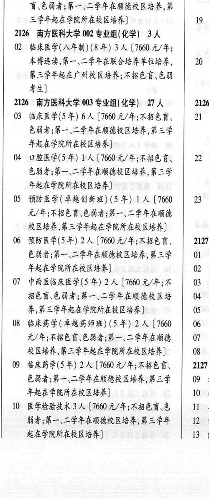
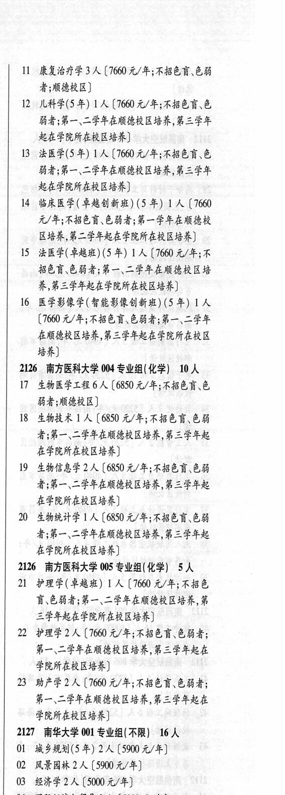

# 2126 南方医科大学

- PDF页码：97
- 书内页码：146
- 专业组：5；专业条目：21

## 001专业组

- 选科要求：不限
- 招生计划：2 人
- 校验：review

| 专业代码 | 专业名称 | 计划人数 | 学费（元/年） | 备注/完整OCR内容 |
|---|---|---:|---:|---|
|  | 结构化OCR未稳定切分，请查看下方原文及源图 |  |  |  |

<details><summary>本专业组OCR原文</summary>

```text
2126 南方医科大学 001 专业组(不限) 2 人    18 :
OL 针灸推拿学(5 年) 2 人【7660 元/年;不招色
讶\色弱者;第一、二学年在顺德校区培养第     J
三学年起在学院所在校区培养]        19 ，
```
</details>

## 002专业组

- 选科要求：化学
- 招生计划：3 人
- 校验：review

| 专业代码 | 专业名称 | 计划人数 | 学费（元/年） | 备注/完整OCR内容 |
|---|---|---:|---:|---|
|  | 结构化OCR未稳定切分，请查看下方原文及源图 |  |  |  |

<details><summary>本专业组OCR原文</summary>

```text
2126 南方医科大学 002 专业组(化学) 3人
0临床医学(入年制) (8 年) 3A (1660 元/年;     1
本博连读,第一、二学年在联合培养单位培养，   20
第三学年起在广州校区培养;不招色育、色弱     j
考生]                    1
```
</details>

## 003专业组

- 选科要求：化学
- 招生计划：27 人
- 校验：review

| 专业代码 | 专业名称 | 计划人数 | 学费（元/年） | 备注/完整OCR内容 |
|---|---|---:|---:|---|
| 03 | 临床医学(5 年) | 6 | 7660 | 【7660 元/年;不招色言、 21 ] 色弱者;第一、二学年在顺德校区培养,第三学 年起在学院所在校区培养] |
| 04 | 口腔医学(5年) T人 |  | 7660 | 7660 元/年;不招色盲 22 4 色弱者;第一、二学年在顺德校区培养,第三学 3 年起在学院所在校区培养] 和 |
| 05 | 预防医学(卓越创新班) (5年) | 1 |  | [7660 \| 23 3 元/年;不招色育\色弱者;第一、二学年在顺德 j 校区培养,第三学年起在学院所在校区培养] |
| 06 | 预防医学(5 年) 2A ( |  | 1660 | 1660 元/年;不招色言、 \| 2127 色弱者;第一、二学年在顺德校区培养,第三学 \| 01 3 年起在学院所在校区培养] 02 天 |
| 07 | 中西医临床医学(5年) | 2 | 7660 | 【7660 元/年;不 \| 03 多 招色盲\色弱者;第一\二学年在顺德校区培 \| 04 养,第三学年起在学院所在校区培养] 05 4 |
| 08 | 临床药学(卓越药师班) (5年) | 2 |  | 【7660 \| 06 :3 元/年;不招色盲\色弱者;第一、二学年在顺德 07 电 校区培养,第三学年起在学院所在校区培养] 08 3 |
| 09 | 临床药学(5 年) 2A ( |  | 1600 | 1600 元/年;不招色言、 2127 色弱者;第一、二学年在顺德校区培养,第三学 \| 09 书 年起在学院所在校区培养] 10 # |
| 10 | 医学检验技术 | 3 | 7660 | 【7660元/年;不招色盲色 \| 11 4 弱者;第一、二学年在顺德校区培养,第三学年 \| 12 4 起在学院所在校区培养] 13 ft |
| 11 | 康复治疗学 | 3 | 7660 | 【7660元/年;不招色盲.色弱 者;顺德校区] |
| 12 | 儿科学(5年) | 1 | 7660 | [7660 元/年;不招色盲\色 弱者;第一、二学年在顺德校区培养,第三学年 起在学院所在校区培养] |
| 13 | 法医学(5年) ! 人 |  | 7660 | 7660 元/年;不招色育\色 弱者;第一、二学年在顺德校区培养,第三学年 起在学院所在校区培养] |
| 14 | 临床医学( 卓越创新班) (5 年) | 1 | 7660 | 【7660 元/年;不招色盲、色弱者;第一学年在顺德校 区培养,第二学年起在学院所在校区培养] |
| 15 | 法医学(草越班) (5 年) | 1 | 7660 | 【7660 元/年;不 招色盲、色弱者;第一、二学年在顺德校区培 养,第三学年起在学院所在校区培养 |
| 16 | 医学影像学(智能影像创新班) (5 年) | 1 | 1660 | (1660 元/年;不招色盲、色弱者;第一、二学年 在顺德校区培养,第三学年起在学院所在校区 培养] |

<details><summary>本专业组OCR原文</summary>

```text
2126 南方医科大学 003 专业组(化学) 27 人    2126
03 临床医学(5 年) 6 人【7660 元/年;不招色言、   21 ]
色弱者;第一、二学年在顺德校区培养,第三学
年起在学院所在校区培养]
04 口腔医学(5年) T人【7660 元/年;不招色盲   22 4
色弱者;第一、二学年在顺德校区培养,第三学     3
年起在学院所在校区培养]            和
05 预防医学(卓越创新班) (5年) 1人[7660 | 23 3
元/年;不招色育\色弱者;第一、二学年在顺德     j
校区培养,第三学年起在学院所在校区培养]
06 预防医学(5 年) 2A (1660 元/年;不招色言、 | 2127
色弱者;第一、二学年在顺德校区培养,第三学 | 01 3
年起在学院所在校区培养]          02 天
07 中西医临床医学(5年) 2 人【7660 元/年;不 | 03 多
招色盲\色弱者;第一\二学年在顺德校区培 | 04
养,第三学年起在学院所在校区培养]      05 4
08 临床药学(卓越药师班) (5年) 2人【7660 | 06 :3
元/年;不招色盲\色弱者;第一、二学年在顺德   07 电
校区培养,第三学年起在学院所在校区培养]   08 3
09 临床药学(5 年) 2A (1600 元/年;不招色言、   2127
色弱者;第一、二学年在顺德校区培养,第三学 | 09 书
年起在学院所在校区培养]          10 #
10 医学检验技术 3 人【7660元/年;不招色盲色 | 11 4
弱者;第一、二学年在顺德校区培养,第三学年 | 12 4
起在学院所在校区培养]          13 ft
11 康复治疗学 3 人【7660元/年;不招色盲.色弱
者;顺德校区]
12 儿科学(5年) 1 人[7660 元/年;不招色盲\色
弱者;第一、二学年在顺德校区培养,第三学年
起在学院所在校区培养]
13 法医学(5年) ! 人[7660 元/年;不招色育\色
弱者;第一、二学年在顺德校区培养,第三学年
起在学院所在校区培养]
14 临床医学( 卓越创新班) (5 年) 1 人【7660
元/年;不招色盲、色弱者;第一学年在顺德校
区培养,第二学年起在学院所在校区培养]
15 法医学(草越班) (5 年) 1 人【7660 元/年;不
招色盲、色弱者;第一、二学年在顺德校区培
养,第三学年起在学院所在校区培养
16 医学影像学(智能影像创新班) (5 年) 1 人
(1660 元/年;不招色盲、色弱者;第一、二学年
在顺德校区培养,第三学年起在学院所在校区
培养]
```
</details>

## 004专业组

- 选科要求：化学
- 招生计划：10 人
- 校验：review

| 专业代码 | 专业名称 | 计划人数 | 学费（元/年） | 备注/完整OCR内容 |
|---|---|---:|---:|---|
| 17 | 生物医学工程 | 6 | 6850 | 【6850 元/年;不招色育\色 BA MERE) |
| 18 | 生物技术 人 |  | 6850 | 6850 元/年;不招色盲色弱 者;第一、二学年在顺德校区培养,第三学年起 在学院所在校区培养】 |
| 19 | 生物信息学 | 2 | 6850 | 【6850 元/年;不招色盲、色弱 者;第一、二学年在顺德校区培养,第三学年起 在学院所在校区培养] |
| 20 | 生物统计学 | 1 | 6850 | 【6850 元/年;不招色盲、色弱 者;第一、二学年在顺德校区培养,第三学年起 在学院所在校区培养] |

<details><summary>本专业组OCR原文</summary>

```text
2126 南方医科大学 004 专业组(化学) 10 人
17 生物医学工程6人【6850 元/年;不招色育\色
BA MERE)
18 生物技术 人【6850 元/年;不招色盲色弱
者;第一、二学年在顺德校区培养,第三学年起
在学院所在校区培养】
19 生物信息学2 人【6850 元/年;不招色盲、色弱
者;第一、二学年在顺德校区培养,第三学年起
在学院所在校区培养]
20 生物统计学 1 人【6850 元/年;不招色盲、色弱
者;第一、二学年在顺德校区培养,第三学年起
在学院所在校区培养]
```
</details>

## 005专业组

- 选科要求：化学
- 招生计划：5 人
- 校验：ok

| 专业代码 | 专业名称 | 计划人数 | 学费（元/年） | 备注/完整OCR内容 |
|---|---|---:|---:|---|
| 21 | 护理学(卓越班) | 1 | 7660 | 【7660 元/年;不招色 育\色弱者;第一、二学年在顺德校区培养,第 三学年起在学院所在校区培养] |
| 22 | 护理学 | 2 | 7660 | 【7660 元/年;不招色盲、色弱者; 第一、二学年在顺德校区培养,第三学年起在 学院所在校区培养] |
| 23 | 助产学 | 2 | 7660 | 【7660 元/年;不招色盲、色弱者; 第一、二学年在顺德校区培养,第三学年起在 学院所在校区培养] |

<details><summary>本专业组OCR原文</summary>

```text
2126 南方医科大学 005 专业组(化学) 5 人
21 护理学(卓越班) 1 人【7660 元/年;不招色
育\色弱者;第一、二学年在顺德校区培养,第
三学年起在学院所在校区培养]
22 护理学2 人【7660 元/年;不招色盲、色弱者;
第一、二学年在顺德校区培养,第三学年起在
学院所在校区培养]
23 助产学2 人【7660 元/年;不招色盲、色弱者;
第一、二学年在顺德校区培养,第三学年起在
学院所在校区培养]
```
</details>

## 附：院校完整OCR原文

```text
--- PDF第97页（书内第146页），第2栏 ---
2126 南方医科大学 001 专业组(不限) 2 人    18 :
OL 针灸推拿学(5 年) 2 人【7660 元/年;不招色
讶\色弱者;第一、二学年在顺德校区培养第     J
三学年起在学院所在校区培养]        19 ，
2126 南方医科大学 002 专业组(化学) 3人
0临床医学(入年制) (8 年) 3A (1660 元/年;     1
本博连读,第一、二学年在联合培养单位培养，   20
第三学年起在广州校区培养;不招色育、色弱     j
考生]                    1
2126 南方医科大学 003 专业组(化学) 27 人    2126
03 临床医学(5 年) 6 人【7660 元/年;不招色言、   21 ]
色弱者;第一、二学年在顺德校区培养,第三学
年起在学院所在校区培养]
04 口腔医学(5年) T人【7660 元/年;不招色盲   22 4
色弱者;第一、二学年在顺德校区培养,第三学     3
年起在学院所在校区培养]            和
05 预防医学(卓越创新班) (5年) 1人[7660 | 23 3
元/年;不招色育\色弱者;第一、二学年在顺德     j
校区培养,第三学年起在学院所在校区培养]
06 预防医学(5 年) 2A (1660 元/年;不招色言、 | 2127
色弱者;第一、二学年在顺德校区培养,第三学 | 01 3
年起在学院所在校区培养]          02 天
07 中西医临床医学(5年) 2 人【7660 元/年;不 | 03 多
招色盲\色弱者;第一\二学年在顺德校区培 | 04
养,第三学年起在学院所在校区培养]      05 4
08 临床药学(卓越药师班) (5年) 2人【7660 | 06 :3
元/年;不招色盲\色弱者;第一、二学年在顺德   07 电
校区培养,第三学年起在学院所在校区培养]   08 3
09 临床药学(5 年) 2A (1600 元/年;不招色言、   2127
色弱者;第一、二学年在顺德校区培养,第三学 | 09 书
年起在学院所在校区培养]          10 #
10 医学检验技术 3 人【7660元/年;不招色盲色 | 11 4
弱者;第一、二学年在顺德校区培养,第三学年 | 12 4
起在学院所在校区培养]          13 ft

--- PDF第97页（书内第146页），第3栏 ---
11 康复治疗学 3 人【7660元/年;不招色盲.色弱
者;顺德校区]
12 儿科学(5年) 1 人[7660 元/年;不招色盲\色
弱者;第一、二学年在顺德校区培养,第三学年
起在学院所在校区培养]
13 法医学(5年) ! 人[7660 元/年;不招色育\色
弱者;第一、二学年在顺德校区培养,第三学年
起在学院所在校区培养]
14 临床医学( 卓越创新班) (5 年) 1 人【7660
元/年;不招色盲、色弱者;第一学年在顺德校
区培养,第二学年起在学院所在校区培养]
15 法医学(草越班) (5 年) 1 人【7660 元/年;不
招色盲、色弱者;第一、二学年在顺德校区培
养,第三学年起在学院所在校区培养
16 医学影像学(智能影像创新班) (5 年) 1 人
(1660 元/年;不招色盲、色弱者;第一、二学年
在顺德校区培养,第三学年起在学院所在校区
培养]
2126 南方医科大学 004 专业组(化学) 10 人
17 生物医学工程6人【6850 元/年;不招色育\色
BA MERE)
18 生物技术 人【6850 元/年;不招色盲色弱
者;第一、二学年在顺德校区培养,第三学年起
在学院所在校区培养】
19 生物信息学2 人【6850 元/年;不招色盲、色弱
者;第一、二学年在顺德校区培养,第三学年起
在学院所在校区培养]
20 生物统计学 1 人【6850 元/年;不招色盲、色弱
者;第一、二学年在顺德校区培养,第三学年起
在学院所在校区培养]
2126 南方医科大学 005 专业组(化学) 5 人
21 护理学(卓越班) 1 人【7660 元/年;不招色
育\色弱者;第一、二学年在顺德校区培养,第
三学年起在学院所在校区培养]
22 护理学2 人【7660 元/年;不招色盲、色弱者;
第一、二学年在顺德校区培养,第三学年起在
学院所在校区培养]
23 助产学2 人【7660 元/年;不招色盲、色弱者;
第一、二学年在顺德校区培养,第三学年起在
学院所在校区培养]
```

## 源图


