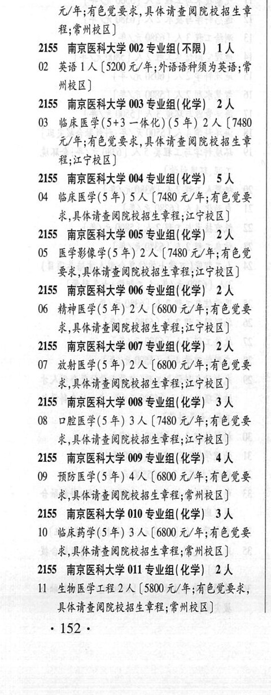
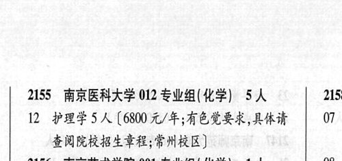

# 2155 南京医科大学

- PDF页码：103
- 书内页码：152
- 专业组：12；专业条目：11

## 001专业组

- 选科要求：不限
- 招生计划：OCR未稳定识别 人
- 校验：review

| 专业代码 | 专业名称 | 计划人数 | 学费（元/年） | 备注/完整OCR内容 |
|---|---|---:|---:|---|
| 01 | 公共事业管理( 卫生事业管理) 1A ( |  | 5200 | 5200 元/年;8有色觉要求,具体请查阅院校招生章 程;常州校区] |

<details><summary>本专业组OCR原文</summary>

```text
2155 南京医科大学 001 专业组(不限) 1A
Ol 公共事业管理( 卫生事业管理) 1A (5200
元/年;8有色觉要求,具体请查阅院校招生章
程;常州校区]
```
</details>

## 002专业组

- 选科要求：不限
- 招生计划：1 人
- 校验：sum-corrected

| 专业代码 | 专业名称 | 计划人数 | 学费（元/年） | 备注/完整OCR内容 |
|---|---|---:|---:|---|
| 02 | 英语 | 1 | 5200 | [5200 元/年;外语语种须为英语;党 HRB) |

<details><summary>本专业组OCR原文</summary>

```text
2155 南京医科大学 002 专业组(不限】 1A
02 英语1 人[5200 元/年;外语语种须为英语;党
HRB)
```
</details>

## 003专业组

- 选科要求：化学
- 招生计划：2 人
- 校验：ok

| 专业代码 | 专业名称 | 计划人数 | 学费（元/年） | 备注/完整OCR内容 |
|---|---|---:|---:|---|
| 03 | 临床医学(5+3 一体化) (5 年) | 2 | 7480 | 【7480 元/年;8有色觉要求,具体请查阅院校招生齐 程;江宁校区] |

<details><summary>本专业组OCR原文</summary>

```text
2155 南京医科大学 003 专业组(化学) 2人
03 临床医学(5+3 一体化) (5 年) 2 人【7480
元/年;8有色觉要求,具体请查阅院校招生齐
程;江宁校区]
```
</details>

## 004专业组

- 选科要求：化学
- 招生计划：5 人
- 校验：sum-corrected

| 专业代码 | 专业名称 | 计划人数 | 学费（元/年） | 备注/完整OCR内容 |
|---|---|---:|---:|---|
| 04 | 临床医学(5 年) | 5 | 7480 | 【7480 元/年;8有色觉要 求,具体请查阅院校招生章程;江宁校区] |

<details><summary>本专业组OCR原文</summary>

```text
2155 南京医科大学 004 专业组(化学) SA 求,具体请查阅院校招生章程;江宁校区]
04 临床医学(5 年) 5 人【7480 元/年;8有色觉要
求,具体请查阅院校招生章程;江宁校区]
```
</details>

## 005专业组

- 选科要求：化学
- 招生计划：2 人
- 校验：review

| 专业代码 | 专业名称 | 计划人数 | 学费（元/年） | 备注/完整OCR内容 |
|---|---|---:|---:|---|
| 05 | 医学影像学(5 年) 2A ( |  | 7480 | 7480 元/年;有色觉 要求,具体请查阅院校招生章程;江宁校区] |

<details><summary>本专业组OCR原文</summary>

```text
2155 ”南京医科大学 005 专业组(化学) 2人
05 医学影像学(5 年) 2A (7480 元/年;有色觉
要求,具体请查阅院校招生章程;江宁校区]
```
</details>

## 006专业组

- 选科要求：化学
- 招生计划：2 人
- 校验：ok

| 专业代码 | 专业名称 | 计划人数 | 学费（元/年） | 备注/完整OCR内容 |
|---|---|---:|---:|---|
| 06 | 精神医学(5 年) | 2 | 6800 | 【6800 元/年;有色觉要 求,具体请查阅院校招生章程;江宁校区] |

<details><summary>本专业组OCR原文</summary>

```text
2155 南京医科大学 006 专业组(化学) 2人
06 精神医学(5 年) 2 人【6800 元/年;有色觉要
求,具体请查阅院校招生章程;江宁校区]
```
</details>

## 007专业组

- 选科要求：化学
- 招生计划：2 人
- 校验：ok

| 专业代码 | 专业名称 | 计划人数 | 学费（元/年） | 备注/完整OCR内容 |
|---|---|---:|---:|---|
| 07 | 放射医学(5 年) | 2 | 6800 | 【6800 元/年;有色觉要 求,具体请查阅院校招生章程;江宁校区] |

<details><summary>本专业组OCR原文</summary>

```text
2155 南京医科大学 007 专业组(化学) 2人
07 放射医学(5 年) 2 人【6800 元/年;有色觉要
求,具体请查阅院校招生章程;江宁校区]
```
</details>

## 008专业组

- 选科要求：化学
- 招生计划：3 人
- 校验：review

| 专业代码 | 专业名称 | 计划人数 | 学费（元/年） | 备注/完整OCR内容 |
|---|---|---:|---:|---|
| 08 | 口腔医学(5 年) 3A ( |  | 7480 | 7480 元/年;有色觉要 求,具体请查阅院校招生章程;江宁校区] |

<details><summary>本专业组OCR原文</summary>

```text
2155 南京医科大学 008 专业组(化学) 3 人
08 口腔医学(5 年) 3A (7480 元/年;有色觉要
求,具体请查阅院校招生章程;江宁校区]
```
</details>

## 009专业组

- 选科要求：化学
- 招生计划：4 人
- 校验：ok

| 专业代码 | 专业名称 | 计划人数 | 学费（元/年） | 备注/完整OCR内容 |
|---|---|---:|---:|---|
| 09 | 预防医学(5 年) | 4 | 6800 | 【6800 元/年;有色觉要 求,具体请查阅院校招生章程;常州校区] |

<details><summary>本专业组OCR原文</summary>

```text
2155 南京医科大学 009 专业组(化学) 4人
09 预防医学(5 年) 4 人【6800 元/年;有色觉要
求,具体请查阅院校招生章程;常州校区]
```
</details>

## 010专业组

- 选科要求：化学
- 招生计划：3 人
- 校验：ok

| 专业代码 | 专业名称 | 计划人数 | 学费（元/年） | 备注/完整OCR内容 |
|---|---|---:|---:|---|
| 10 | 临床药学(5 年) | 3 | 6800 | 【6800 元/年;8有色觉要 求,具体请查阅院校招生章程;常州校区] |

<details><summary>本专业组OCR原文</summary>

```text
2155 南京医科大学 010 专业组(化学) 3人
10 临床药学(5 年) 3 人【6800 元/年;8有色觉要
求,具体请查阅院校招生章程;常州校区]
```
</details>

## 011专业组

- 选科要求：化学
- 招生计划：2 人
- 校验：review

| 专业代码 | 专业名称 | 计划人数 | 学费（元/年） | 备注/完整OCR内容 |
|---|---|---:|---:|---|
|  | 结构化OCR未稳定切分，请查看下方原文及源图 |  |  |  |

<details><summary>本专业组OCR原文</summary>

```text
2155 ”南京医科大学 011 专业组(化学) 2人
HM 生物医学工程 2人[5800 元/年;8有色党要求，
具体请查阅院校招生章程;常州校区]
152 .
```
</details>

## 012专业组

- 选科要求：化学
- 招生计划：5 人
- 校验：ok

| 专业代码 | 专业名称 | 计划人数 | 学费（元/年） | 备注/完整OCR内容 |
|---|---|---:|---:|---|
| 12 | 护理学 | 5 | 6800 | [6800元/年;有色党要求,具体请“\| 07 查阅院校招生章程;常州校区] |

<details><summary>本专业组OCR原文</summary>

```text
2155 南京医科大学 012 专业组(化学) 5人    2158
12 护理学5人[6800元/年;有色党要求,具体请“| 07
查阅院校招生章程;常州校区]
```
</details>

## 附：院校完整OCR原文

```text
--- PDF第103页（书内第152页），第1栏 ---
2155 南京医科大学 001 专业组(不限) 1A
Ol 公共事业管理( 卫生事业管理) 1A (5200
元/年;8有色觉要求,具体请查阅院校招生章
程;常州校区]
2155 南京医科大学 002 专业组(不限】 1A
02 英语1 人[5200 元/年;外语语种须为英语;党
HRB)
2155 南京医科大学 003 专业组(化学) 2人
03 临床医学(5+3 一体化) (5 年) 2 人【7480
元/年;8有色觉要求,具体请查阅院校招生齐
程;江宁校区]
2155 南京医科大学 004 专业组(化学) SA
04 临床医学(5 年) 5 人【7480 元/年;8有色觉要
求,具体请查阅院校招生章程;江宁校区]
2155 ”南京医科大学 005 专业组(化学) 2人
05 医学影像学(5 年) 2A (7480 元/年;有色觉
要求,具体请查阅院校招生章程;江宁校区]
2155 南京医科大学 006 专业组(化学) 2人
06 精神医学(5 年) 2 人【6800 元/年;有色觉要
求,具体请查阅院校招生章程;江宁校区]
2155 南京医科大学 007 专业组(化学) 2人
07 放射医学(5 年) 2 人【6800 元/年;有色觉要
求,具体请查阅院校招生章程;江宁校区]
2155 南京医科大学 008 专业组(化学) 3 人
08 口腔医学(5 年) 3A (7480 元/年;有色觉要
求,具体请查阅院校招生章程;江宁校区]
2155 南京医科大学 009 专业组(化学) 4人
09 预防医学(5 年) 4 人【6800 元/年;有色觉要
求,具体请查阅院校招生章程;常州校区]
2155 南京医科大学 010 专业组(化学) 3人
10 临床药学(5 年) 3 人【6800 元/年;8有色觉要
求,具体请查阅院校招生章程;常州校区]
2155 ”南京医科大学 011 专业组(化学) 2人
HM 生物医学工程 2人[5800 元/年;8有色党要求，
具体请查阅院校招生章程;常州校区]
152 .

--- PDF第103页（书内第152页），第2栏 ---
2155 南京医科大学 012 专业组(化学) 5人    2158
12 护理学5人[6800元/年;有色党要求,具体请“| 07
查阅院校招生章程;常州校区]
```

## 源图


